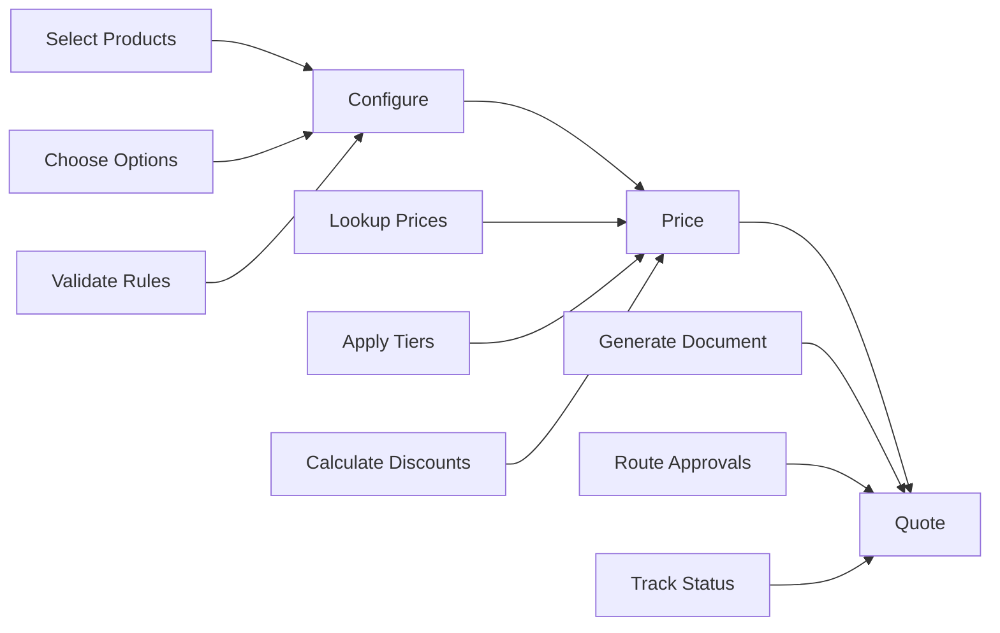
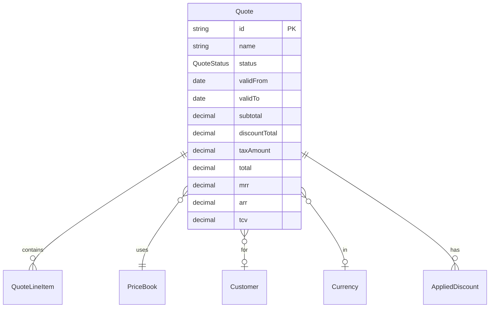
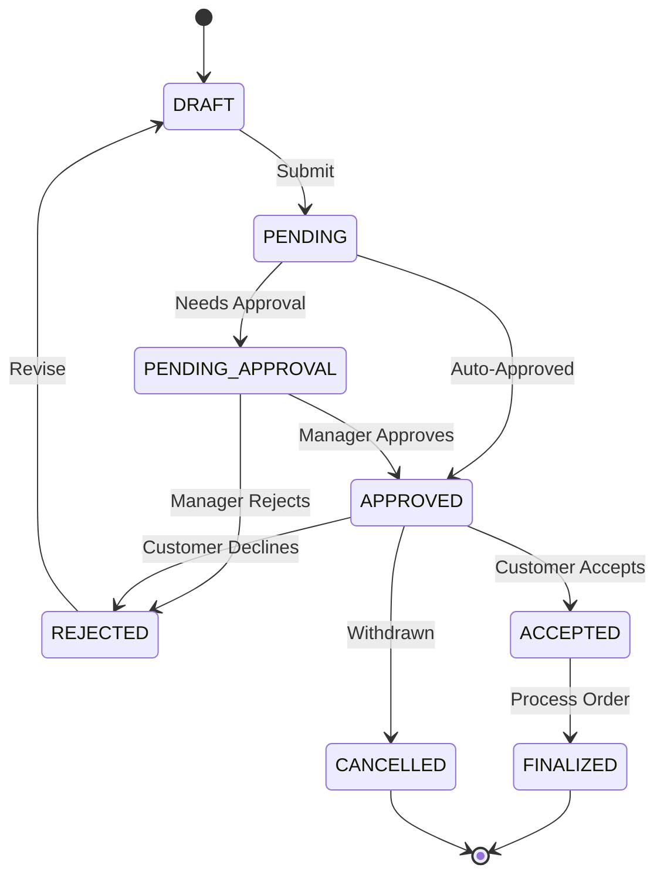

# Module 01: CPQ Foundations and Core Workflow

## Learning Objectives

By the end of this module, you will:
- Understand the end-to-end CPQ workflow: Configure -> Price -> Quote
- Navigate the quote status lifecycle
- Know how quotes connect to other CPQ entities
- Create and manage quotes in the PoC application

---

## The CPQ Workflow

CPQ systems orchestrate three distinct but interconnected processes:



### 1. Configure

**What happens:** Sales rep selects products and configures options.

**Key questions answered:**
- What products does the customer need?
- For configurable products, which options are selected?
- Are all selections valid per business rules?

**Example:** Customer wants a laptop. They select the base model, then configure RAM (32GB), storage (1TB SSD), and warranty (3-year extended).

### 2. Price

**What happens:** System calculates the total price based on selections.

**Key questions answered:**
- What is the list price for each item?
- Do any volume tiers apply?
- Are there promotional discounts?
- What taxes apply?

**Example:** The configured laptop base is $1,299. The 32GB RAM upgrade adds $200. The 1TB SSD adds $150. The 3-year warranty adds $199. Volume discount of 5% applies because customer is ordering 10 units. Sales tax of 8.25% is added.

### 3. Quote

**What happens:** System generates a formal proposal document.

**Key questions answered:**
- What information goes on the quote?
- Does the quote need approval before sending?
- How long is the quote valid?
- What happens after the customer responds?

**Example:** A professional PDF is generated showing all line items, pricing breakdown, terms and conditions, and validity period of 30 days.

---

## The Quote: Central Entity of CPQ

The **Quote** is the heart of any CPQ system. It's the container that holds everything:



### Quote Fields Explained

| Field | Type | Purpose |
|-------|------|---------|
| `id` | String | Unique identifier (auto-generated) |
| `name` | String | Human-readable quote name |
| `customerId` | String? | Optional link to customer record |
| `status` | Enum | Current state in the workflow |
| `priceBookId` | String | Which price book to use for pricing |
| `currencyId` | String? | Optional currency override |
| `validFrom` | DateTime | When the quote becomes valid |
| `validTo` | DateTime | When the quote expires |
| `subtotal` | Decimal | Sum of line item net prices |
| `discountTotal` | Decimal | Total discounts applied |
| `taxAmount` | Decimal | Calculated tax |
| `total` | Decimal | Final amount (subtotal - discounts + tax) |
| `baseAmount` | Decimal | Total converted to base currency |
| `oneTimeTotal` | Decimal | Sum of non-recurring charges |
| `mrr` | Decimal | Monthly Recurring Revenue |
| `arr` | Decimal | Annual Recurring Revenue (MRR x 12) |
| `tcv` | Decimal | Total Contract Value |
| `requiresApproval` | Boolean | Flag set by rules |
| `approvedBy` | String? | Who approved (if needed) |
| `approvedAt` | DateTime? | When approved |

### Revenue Metrics

CPQ systems track different revenue types:

| Metric | Calculation | Business Use |
|--------|-------------|--------------|
| **One-Time Total** | Sum of items with `ONE_TIME` billing | Immediate revenue recognition |
| **MRR** | Monthly equivalent of all recurring items | Subscription health metric |
| **ARR** | MRR x 12 | Annual planning metric |
| **TCV** | Total value over contract term | Deal size metric |

**Example:**
- Quote has a $10,000 one-time setup fee
- Plus $500/month subscription for 24 months
- MRR = $500
- ARR = $6,000
- TCV = $10,000 + ($500 x 24) = $22,000

---

## Quote Status Lifecycle

Quotes move through defined states. Understanding this lifecycle is critical for implementing CPQ workflows.



### Status Definitions

| Status | Meaning | Who Can Modify |
|--------|---------|----------------|
| `DRAFT` | Quote is being built | Sales Rep |
| `PENDING` | Submitted, awaiting processing | System |
| `PENDING_APPROVAL` | Needs manager review | Manager |
| `APPROVED` | Ready to send to customer | - |
| `REJECTED` | Declined (manager or customer) | - |
| `ACCEPTED` | Customer agreed | - |
| `FINALIZED` | Order processed | - |
| `CANCELLED` | Quote withdrawn | Sales Rep |

### When Approval is Required

The `requiresApproval` flag is set based on business rules:

- Discount exceeds threshold (e.g., > 20%)
- Margin below minimum (e.g., < 15%)
- Total exceeds amount (e.g., > $100,000)
- Non-standard terms requested

---

## Data Model: Quote Entity

Here's the complete Quote model from the PoC application:

```prisma
// From prisma/schema.prisma

model Quote {
  id               String      @id @default(cuid())
  name             String
  customerId       String?
  status           QuoteStatus @default(DRAFT)
  priceBookId      String
  currencyId       String?
  validFrom        DateTime    @default(now())
  validTo          DateTime
  subtotal         Decimal     @default(0) @db.Decimal(10, 2)
  discountTotal    Decimal     @default(0) @db.Decimal(10, 2)
  taxAmount        Decimal     @default(0) @db.Decimal(10, 2)
  taxBreakdown     Json?
  total            Decimal     @default(0) @db.Decimal(10, 2)
  baseAmount       Decimal     @default(0) @db.Decimal(10, 2)
  oneTimeTotal     Decimal     @default(0) @db.Decimal(10, 2)
  mrr              Decimal     @default(0) @db.Decimal(10, 2)
  arr              Decimal     @default(0) @db.Decimal(10, 2)
  tcv              Decimal     @default(0) @db.Decimal(10, 2)
  requiresApproval Boolean     @default(false)
  approvedBy       String?
  approvedAt       DateTime?
  createdAt        DateTime    @default(now())
  updatedAt        DateTime    @updatedAt

  customer           Customer?           @relation(...)
  priceBook          PriceBook           @relation(...)
  currency           Currency?           @relation(...)
  lineItems          QuoteLineItem[]
  appliedDiscounts   AppliedDiscount[]
  recommendationLogs RecommendationLog[]
}

enum QuoteStatus {
  DRAFT
  PENDING
  PENDING_APPROVAL
  APPROVED
  REJECTED
  ACCEPTED
  FINALIZED
  CANCELLED
}
```

### Key Design Decisions

1. **Optional Customer:** Quotes can be created without a customer for quick estimates
2. **Required Price Book:** Every quote must have a pricing source
3. **Calculated Fields:** Totals are stored for query performance (denormalized)
4. **Validity Period:** Built-in expiration tracking
5. **Audit Fields:** Track who approved and when

---

## Exercise 1: Create Your First Quote

### Step 1: Navigate to Quotes

Open the PoC application and go to `/quotes`.

### Step 2: Create a New Quote

1. Click **"New Quote"** button
2. Fill in the form:
   - **Name:** "My First Quote"
   - **Price Book:** Select the default price book
   - **Valid From:** Today
   - **Valid To:** 30 days from now
3. Click **Save**

### Step 3: Observe the Default State

Notice that:
- Status is automatically set to `DRAFT`
- Subtotal, total, etc. are all $0.00 (no line items yet)
- The quote has a generated ID

### Step 4: View Quote Details

Click on the quote to open the detail view. Note the structure:
- Header section with quote metadata
- Line items section (empty)
- Totals section

---

## Exercise 2: Explore Quote Status Transitions

### Step 1: Submit the Quote

With your quote open:
1. Find the "Submit" or status change action
2. Change status from `DRAFT` to `PENDING`
3. Observe the status badge change

### Step 2: Approve the Quote

1. Change status to `APPROVED`
2. Note: In a real system, this might require a different user role

### Step 3: Return to Draft

1. Create a new quote
2. Add any product (we'll cover this more in Module 06)
3. Submit it
4. Mark it as `REJECTED`
5. Return it to `DRAFT` status
6. This simulates the revision workflow

---

## Exercise 3: Understand Revenue Metrics

### Step 1: Create a Quote with Mixed Billing

1. Create a new quote
2. Add these products (if they exist, or create them):
   - A one-time product (e.g., "Setup Fee")
   - A monthly subscription product
3. Set quantities and observe totals

### Step 2: Review Revenue Breakdown

Look at the quote totals section:
- `oneTimeTotal` - Non-recurring charges
- `mrr` - Monthly recurring
- `arr` - Annual recurring (should be MRR x 12)
- `tcv` - Total contract value

### Step 3: Calculate Manually

Verify the calculations:
```
If you have:
- Setup Fee: $1,000 (one-time)
- Subscription: $100/month for 12 months

Then:
- oneTimeTotal = $1,000
- mrr = $100
- arr = $1,200
- tcv = $1,000 + $1,200 = $2,200
```

---

## Real-World Considerations

### Quote Validity Best Practices

| Industry | Typical Validity | Reason |
|----------|------------------|--------|
| Software | 30 days | Stable pricing |
| Manufacturing | 7-14 days | Material cost volatility |
| Services | 30-90 days | Labor rate stability |
| Commodities | 24-48 hours | Market fluctuation |

### Approval Workflow Patterns

**Simple Approval:**
```
Sales Rep -> Manager -> Customer
```

**Multi-Level Approval:**
```
Sales Rep -> Sales Manager -> Finance -> Legal -> Customer
```

**Amount-Based Routing:**
```
< $10K:   Auto-approve
$10K-50K: Manager
$50K-100K: Director
> $100K:  VP
```

---

## Checkpoint Questions

1. **What are the three steps in the CPQ workflow?**
   <details>
   <summary>Answer</summary>
   Configure (product selection and options), Price (calculate totals with tiers and discounts), Quote (generate proposal document)
   </details>

2. **What is the difference between MRR and ARR?**
   <details>
   <summary>Answer</summary>
   MRR = Monthly Recurring Revenue (monthly subscription value). ARR = Annual Recurring Revenue (MRR x 12, representing yearly value)
   </details>

3. **Why is `priceBookId` required but `customerId` optional on a Quote?**
   <details>
   <summary>Answer</summary>
   Every quote needs a pricing source (price book), but you might create "quick quotes" without an assigned customer for initial estimates
   </details>

4. **What status would a quote be in after a manager rejects a discount request?**
   <details>
   <summary>Answer</summary>
   REJECTED - the quote would need to go back to DRAFT for revision before resubmission
   </details>

5. **What does the `taxBreakdown` JSON field store?**
   <details>
   <summary>Answer</summary>
   An array of objects with { name, rate, amount } for each tax that was applied, providing transparency on tax calculations
   </details>

---

## Key Takeaways

1. **Quote is the central entity** - Everything in CPQ connects to or through the quote
2. **Status lifecycle controls workflow** - Status transitions enforce business process
3. **Revenue metrics provide insight** - MRR, ARR, TCV help with forecasting
4. **Validation happens at the right time** - Status changes trigger validation rules
5. **Audit trail is built-in** - Track who approved what and when

---

## Code References

For deeper understanding, explore these files:

| File | Content |
|------|---------|
| [prisma/schema.prisma](../../prisma/schema.prisma) | Quote model and QuoteStatus enum |
| [app/composables/useQuotes.ts](../../app/composables/useQuotes.ts) | Quote business logic |
| [app/pages/quotes/](../../app/pages/quotes/) | Quote UI pages |

---

## Next Steps

Now that you understand the quote workflow, we'll explore what goes INTO a quote - products. In the next module, we'll learn about the product catalog architecture.

**Next:** [Module 02: Product Catalog Architecture](02-product-catalog.md)
