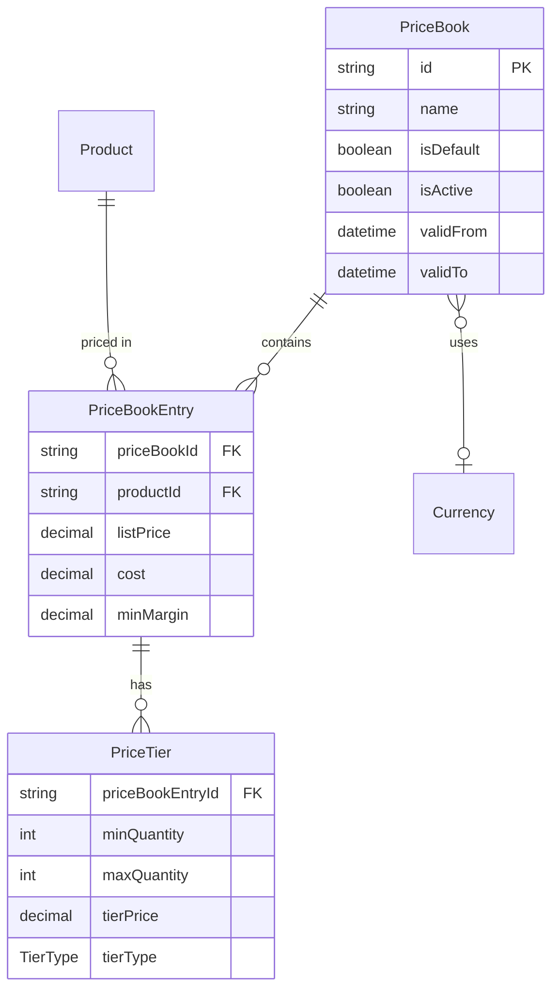
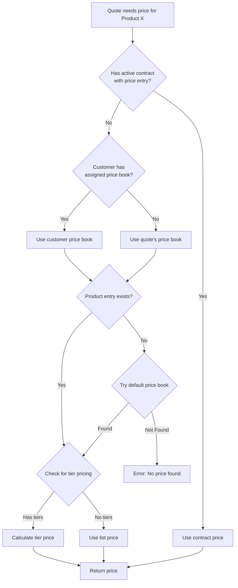

# Module 04: Price Book Architecture

## Learning Objectives

By the end of this module, you will:
- Design multi-price book strategies for different customer segments
- Implement volume-based price tiers
- Track cost and margin data for profitability analysis
- Manage currency assignments and validity periods

---

## Why Price Books Matter

A single product can have many different prices:

| Scenario | Price |
|----------|-------|
| Retail customer | $100 |
| Partner reseller | $80 |
| Enterprise customer | $70 |
| Government contract | $65 |
| European market | €90 |
| Promotional period | $85 |

**Price Books** organize these variations systematically.

---

## Price Book Architecture



---

## Price Book Model

```prisma
model PriceBook {
  id         String    @id @default(cuid())
  name       String
  currencyId String?   // Currency for this price book
  isDefault  Boolean   @default(false)
  isActive   Boolean   @default(true)
  validFrom  DateTime?
  validTo    DateTime?

  currency  Currency?
  entries   PriceBookEntry[]
  quotes    Quote[]
  customers Customer[]
}
```

### Key Fields

| Field | Purpose | Example |
|-------|---------|---------|
| `name` | Identifier for users | "US Retail 2024" |
| `currencyId` | Optional currency | USD, EUR, etc. |
| `isDefault` | Fallback price book | Only one can be true |
| `isActive` | Enable/disable | Inactive books not used |
| `validFrom/To` | Time-bound pricing | Q1 promotional prices |

### Default Price Book Rules

1. **Only one default** - System enforces single default
2. **Fallback behavior** - Used when no specific book assigned
3. **Always active** - Default should be active

---

## Price Book Entry

Each entry links a product to a price book with pricing details.

```prisma
model PriceBookEntry {
  id          String   @id @default(cuid())
  priceBookId String
  productId   String
  listPrice   Decimal  @db.Decimal(10, 2)
  cost        Decimal? @db.Decimal(10, 2)
  minMargin   Decimal? @db.Decimal(5, 2)

  priceBook  PriceBook
  product    Product
  priceTiers PriceTier[]

  @@unique([priceBookId, productId])  // One entry per product per book
}
```

### Fields Explained

| Field | Purpose | Business Use |
|-------|---------|--------------|
| `listPrice` | Base selling price | Starting point for quotes |
| `cost` | What you pay | Margin calculations |
| `minMargin` | Minimum acceptable margin % | Approval triggers |

### Margin Calculation

```
Margin % = ((listPrice - cost) / listPrice) × 100

Example:
- List Price: $100
- Cost: $60
- Margin: ((100 - 60) / 100) × 100 = 40%
```

If `minMargin` is set to 25% and a discount would reduce margin below this, the quote requires approval.

---

## Price Tiers (Volume Pricing)

Tiers enable quantity-based pricing:

```prisma
model PriceTier {
  id               String    @id @default(cuid())
  priceBookEntryId String
  minQuantity      Int
  maxQuantity      Int?      // null = unlimited
  tierPrice        Decimal   @db.Decimal(10, 2)
  tierType         TierType  @default(UNIT_PRICE)

  @@index([priceBookEntryId, minQuantity])
}

enum TierType {
  UNIT_PRICE   // Price per unit at this tier
  FLAT_PRICE   // Total price for this tier
}
```

### Tier Types Explained

#### UNIT_PRICE (Most Common)

Each unit costs the tier price.

| Quantity | Tier Price | Total |
|----------|------------|-------|
| 1-9 | $10/unit | Qty × $10 |
| 10-49 | $8/unit | Qty × $8 |
| 50+ | $6/unit | Qty × $6 |

**Example:** Order 25 units = 25 × $8 = $200

#### FLAT_PRICE (Less Common)

Fixed price for the entire tier regardless of quantity.

| Quantity | Flat Price | Total |
|----------|------------|-------|
| 1-10 | $100 | $100 |
| 11-50 | $400 | $400 |
| 51-100 | $700 | $700 |

**Example:** Order 25 units = $400 (flat)

**Use Case:** Software licenses sold in quantity bands.

---

## Price Resolution Logic

When a quote needs a price, the system follows this order:



### Priority Order

1. **Contract Price** - Highest priority (covered in Module 05)
2. **Customer Price Book** - Customer-specific pricing
3. **Quote Price Book** - Explicitly selected book
4. **Default Price Book** - Fallback

---

## Common Price Book Strategies

### Strategy 1: Customer Segmentation

| Price Book | Target | Discount from Retail |
|------------|--------|---------------------|
| Retail | End consumers | 0% (base) |
| SMB | Small business | 10% |
| Enterprise | Large business | 20% |
| Partner | Resellers | 30% |
| Government | Public sector | 25% |

### Strategy 2: Geographic Pricing

| Price Book | Region | Currency | Notes |
|------------|--------|----------|-------|
| US Standard | North America | USD | Base pricing |
| EMEA | Europe | EUR | VAT considerations |
| APAC | Asia Pacific | USD | Regional adjustments |
| LATAM | Latin America | USD | Market-specific |

### Strategy 3: Channel Pricing

| Price Book | Channel | Use Case |
|------------|---------|----------|
| Direct | Sales team | Full margin |
| Online | E-commerce | Self-service discount |
| Distributor | Wholesale | High volume, low margin |

### Strategy 4: Time-Based Pricing

| Price Book | Valid Period | Purpose |
|------------|--------------|---------|
| Standard 2024 | All year | Base pricing |
| Q1 Promotion | Jan 1 - Mar 31 | Seasonal discount |
| Black Friday | Nov 24-30 | Flash sale |

---

## Exercise 1: Create Price Books

### Step 1: Navigate to Price Books

Go to `/price-books` in the PoC application.

### Step 2: Create Retail Price Book (Default)

- **Name:** "Retail 2024"
- **Currency:** USD (or default)
- **Is Default:** Yes
- **Is Active:** Yes
- **Valid From:** January 1, 2024
- **Valid To:** December 31, 2024

### Step 3: Create Partner Price Book

- **Name:** "Partner 2024"
- **Currency:** USD
- **Is Default:** No
- **Is Active:** Yes

### Step 4: Create EMEA Price Book

- **Name:** "EMEA 2024"
- **Currency:** EUR (if available)
- **Is Default:** No
- **Is Active:** Yes

---

## Exercise 2: Add Price Book Entries

### Step 1: Add Products to Retail

For the products created in Module 02, add entries to "Retail 2024":

| Product | List Price | Cost | Min Margin |
|---------|------------|------|------------|
| RAM 16GB | $0 | $0 | - |
| RAM 32GB | $200 | $100 | 40% |
| RAM 64GB | $500 | $250 | 40% |
| SSD 256GB | $0 | $0 | - |
| SSD 512GB | $100 | $50 | 40% |
| SSD 1TB | $200 | $100 | 40% |
| Warranty 1Y | $0 | $0 | - |
| Warranty 3Y | $199 | $50 | 60% |

### Step 2: Add Products to Partner (20% off)

Add the same products to "Partner 2024" at 20% discount:

| Product | List Price | Cost | Min Margin |
|---------|------------|------|------------|
| RAM 32GB | $160 | $100 | 30% |
| RAM 64GB | $400 | $250 | 30% |
| SSD 512GB | $80 | $50 | 30% |
| SSD 1TB | $160 | $100 | 30% |
| Warranty 3Y | $159 | $50 | 50% |

---

## Exercise 3: Implement Volume Pricing

### Step 1: Create a Volume Product

Create a new product:
- **Name:** "USB-C Cable"
- **SKU:** "CABLE-USBC"
- **Type:** STANDALONE
- **Billing:** ONE_TIME

### Step 2: Add Base Price Entry

In "Retail 2024":
- **List Price:** $15
- **Cost:** $5

### Step 3: Add Price Tiers

Add tiers to the USB-C Cable entry:

| Min Qty | Max Qty | Tier Price | Type |
|---------|---------|------------|------|
| 1 | 9 | $15 | UNIT_PRICE |
| 10 | 49 | $12 | UNIT_PRICE |
| 50 | 99 | $10 | UNIT_PRICE |
| 100 | null | $8 | UNIT_PRICE |

### Step 4: Test in a Quote

1. Create a new quote using "Retail 2024"
2. Add USB-C Cable with quantity 5
3. Expected: 5 × $15 = $75
4. Change quantity to 25
5. Expected: 25 × $12 = $300
6. Change quantity to 150
7. Expected: 150 × $8 = $1,200

---

## Exercise 4: Test Price Book Switching

### Step 1: Create Two Quotes

1. Quote A: Use "Retail 2024" price book
2. Quote B: Use "Partner 2024" price book

### Step 2: Add Same Products

Add RAM 32GB to both quotes.

### Step 3: Compare Prices

- Quote A (Retail): $200
- Quote B (Partner): $160

This demonstrates how price book selection affects pricing.

---

## Real-World Considerations

### Price Book Maintenance

| Task | Frequency | Responsibility |
|------|-----------|----------------|
| Annual price update | Yearly | Product Management |
| Promotional pricing | As needed | Marketing |
| Cost updates | Quarterly | Finance |
| New product entry | Per launch | Product Management |

### Common Pitfalls

1. **Missing default** - Always have one default price book
2. **Expired validity** - Monitor `validTo` dates
3. **Missing entries** - Products without prices cause errors
4. **Tier gaps** - Ensure tier ranges don't have gaps

### Price Book Audit

Before go-live, verify:
- [ ] All products have entries in default book
- [ ] Costs are populated for margin tracking
- [ ] Tiers have no gaps or overlaps
- [ ] Validity dates are appropriate

---

## Checkpoint Questions

1. **Why would you have multiple price books instead of just one with discounts?**
   <details>
   <summary>Answer</summary>
   Price books enable systematic segmentation (customer type, region, channel), different currencies, time-based pricing, and cleaner maintenance than per-quote discounting.
   </details>

2. **What's the difference between UNIT_PRICE and FLAT_PRICE tier types?**
   <details>
   <summary>Answer</summary>
   UNIT_PRICE: Total = quantity × tier price. FLAT_PRICE: Total = tier price regardless of quantity within the tier range.
   </details>

3. **In what order are price sources checked?**
   <details>
   <summary>Answer</summary>
   Contract Price → Customer Price Book → Quote Price Book → Default Price Book
   </details>

4. **Why track `cost` on price book entries?**
   <details>
   <summary>Answer</summary>
   To calculate margins for profitability analysis and trigger approval rules when discounts would reduce margin below acceptable levels.
   </details>

5. **What happens if a product has no entry in any price book?**
   <details>
   <summary>Answer</summary>
   The system should return an error - products cannot be priced without a price book entry.
   </details>

---

## Key Takeaways

1. **Price books organize pricing by segment** - Customer type, region, channel, time period
2. **Entries link products to prices** - With cost and margin tracking
3. **Tiers enable volume pricing** - UNIT_PRICE for per-unit, FLAT_PRICE for bands
4. **Default provides fallback** - Always maintain an active default
5. **Resolution follows priority** - Contract → Customer Book → Quote Book → Default

---

## Code References

| File | Content |
|------|---------|
| [prisma/schema.prisma](../../prisma/schema.prisma) | PriceBook, PriceBookEntry, PriceTier models |
| [app/pages/price-books/](../../app/pages/price-books/) | Price book management UI |
| [app/composables/usePricing.ts](../../app/composables/usePricing.ts) | Pricing logic |
| [server/services/priceLookup.ts](../../server/services/priceLookup.ts) | Price resolution service |

---

## Next Steps

Now that you understand how products are priced, the next module covers customers and contracts - including how contract pricing overrides price books.

**Next:** [Module 05: Customers & Contracts](05-customers-contracts.md)
