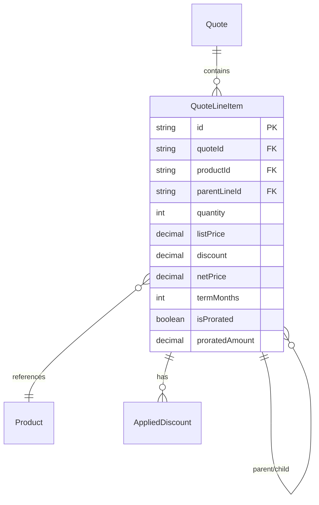
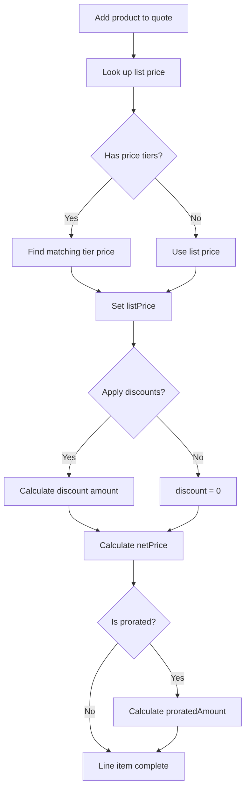
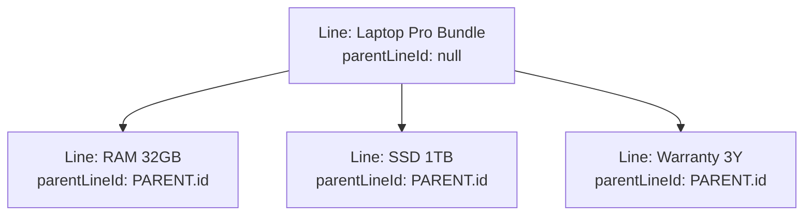

# Module 06: Quote Building & Line Items

## Learning Objectives

By the end of this module, you will:
- Build quotes with multiple line items
- Understand parent-child line relationships for bundles
- Calculate pricing totals correctly
- Work with subscription terms and proration

---

## Quote Line Item Structure

Line items are the products added to a quote. Each line item captures:
- Which product
- How many (quantity)
- At what price
- Any discounts applied



---

## Line Item Data Model

```prisma
model QuoteLineItem {
  id             String   @id @default(cuid())
  quoteId        String
  productId      String
  parentLineId   String?        // For bundle children
  quantity       Int      @default(1)
  listPrice      Decimal  @db.Decimal(10, 2)
  discount       Decimal  @default(0) @db.Decimal(10, 2)
  netPrice       Decimal  @db.Decimal(10, 2)
  termMonths     Int?           // Override default term
  isProrated     Boolean  @default(false)
  proratedAmount Decimal? @db.Decimal(10, 2)
  sortOrder      Int      @default(0)

  quote            Quote
  product          Product
  parentLine       QuoteLineItem?    @relation("LineItemChildren")
  childLines       QuoteLineItem[]   @relation("LineItemChildren")
  appliedDiscounts AppliedDiscount[]
}
```

### Field Explanations

| Field | Purpose | Example |
|-------|---------|---------|
| `listPrice` | Base price from price book | $100 |
| `discount` | Discount amount | $15 |
| `netPrice` | Final line total: qty × (list - discount) | $170 |
| `termMonths` | Override subscription term | 24 months |
| `isProrated` | Mid-cycle addition flag | true |
| `proratedAmount` | Adjusted amount for partial period | $42.50 |
| `sortOrder` | Display sequence | 1, 2, 3... |

---

## Pricing Calculation Flow



### Net Price Formula

```
netPrice = quantity × (listPrice - discount)
```

**Example:**
- Quantity: 2
- List Price: $100
- Discount: $15
- Net Price: 2 × ($100 - $15) = 2 × $85 = $170

---

## Bundle Line Items

When adding a bundle to a quote, the system creates:
1. **Parent line** - The bundle product (price typically $0)
2. **Child lines** - Selected options (with actual prices)

### Bundle Structure Example

```
Quote: Q-2024-00123
│
├── Line 1: Laptop Pro Bundle (parent)
│   ├── listPrice: $0
│   ├── netPrice: $0
│   └── Child lines:
│       ├── Line 1.1: RAM 32GB
│       │   ├── listPrice: $200
│       │   └── netPrice: $200
│       ├── Line 1.2: SSD 1TB
│       │   ├── listPrice: $200
│       │   └── netPrice: $200
│       └── Line 1.3: Warranty 3Y
│           ├── listPrice: $199
│           └── netPrice: $199
│
├── Line 2: USB-C Cable
│   ├── quantity: 5
│   ├── listPrice: $15
│   └── netPrice: $75
│
└── Quote Totals:
    ├── Subtotal: $674
    ├── Tax: $55.61 (8.25%)
    └── Total: $729.61
```

### Parent-Child Relationship



### Bundle Pricing Strategy

**Important:** In this PoC, bundle pricing works as follows:
- Bundle parent has listPrice = $0
- All pricing comes from the option products
- Quote subtotal = sum of all line netPrices
- This provides transparent, itemized pricing

---

## Quote Totals Calculation

The Quote model stores calculated totals:

```prisma
model Quote {
  // ... other fields
  subtotal         Decimal  // Sum of line item netPrices
  discountTotal    Decimal  // Sum of all discounts
  taxAmount        Decimal  // Calculated tax
  taxBreakdown     Json?    // [{ name, rate, amount }]
  total            Decimal  // subtotal - discountTotal + taxAmount
  baseAmount       Decimal  // total in base currency
  oneTimeTotal     Decimal  // Non-recurring charges
  mrr              Decimal  // Monthly Recurring Revenue
  arr              Decimal  // Annual Recurring Revenue
  tcv              Decimal  // Total Contract Value
}
```

### Calculation Formulas

```typescript
// Basic totals
subtotal = sum(lineItems.map(li => li.netPrice))
discountTotal = sum(lineItems.map(li => li.discount * li.quantity))
                + sum(quoteDiscounts.map(d => d.calculatedAmount))
taxAmount = calculateTax(subtotal - discountTotal, customer, lineItems)
total = subtotal + taxAmount  // Note: discounts already in netPrice

// Revenue metrics (for recurring items)
oneTimeTotal = sum(oneTimeItems.map(li => li.netPrice))
mrr = sum(recurringItems.map(li => normalizeToMonthly(li)))
arr = mrr * 12
tcv = oneTimeTotal + (mrr * contractTermMonths)
```

### MRR Normalization

Different billing frequencies need normalization:

```typescript
function normalizeToMonthly(lineItem: QuoteLineItem, product: Product): number {
  const netPrice = lineItem.netPrice;

  switch (product.billingFrequency) {
    case 'MONTHLY':
      return netPrice;
    case 'QUARTERLY':
      return netPrice / 3;
    case 'ANNUAL':
      return netPrice / 12;
    case 'CUSTOM':
      return netPrice / product.customBillingMonths;
    case 'ONE_TIME':
      return 0;  // Not recurring
  }
}
```

---

## Proration

Proration adjusts charges when services start mid-cycle.

### When to Prorate

- Customer adds service mid-month
- Contract renewal doesn't align with billing cycle
- Upgrade/downgrade mid-period

### Proration Calculation

```typescript
function calculateProration(
  fullPrice: number,
  startDate: Date,
  periodEndDate: Date,
  periodStartDate: Date
): number {
  const totalDays = daysBetween(periodStartDate, periodEndDate);
  const remainingDays = daysBetween(startDate, periodEndDate);
  return fullPrice * (remainingDays / totalDays);
}
```

**Example:**
- Monthly subscription: $100
- Period: January 1-31 (31 days)
- Start date: January 15 (17 days remaining)
- Prorated amount: $100 × (17/31) = $54.84

---

## Exercise 1: Build a Simple Quote

### Step 1: Create New Quote

Go to `/quotes` and create:
- **Name:** "Simple Quote Test"
- **Price Book:** Retail 2024
- **Customer:** (none)

### Step 2: Add Standalone Products

Add these products:
- USB-C Cable × 3
- Warranty 3Y × 1

### Step 3: Verify Calculations

Check that:
- Each line has correct listPrice
- netPrice = quantity × listPrice
- subtotal = sum of all netPrices

---

## Exercise 2: Build a Bundle Quote

### Step 1: Create Quote for Customer

Create a quote:
- **Name:** "Bundle Quote Test"
- **Customer:** Acme Corporation
- **Price Book:** Partner 2024

### Step 2: Add Bundle Product

Add "Laptop Pro Bundle" and configure:
- RAM: 32GB
- Storage: 1TB SSD
- Warranty: 3 Year

### Step 3: Observe Structure

After adding, observe:
- Parent line for the bundle
- Child lines for each selected option
- Parent netPrice = $0
- Child netPrices reflect Partner pricing (or contract pricing)

### Step 4: Check Total

Verify:
- Subtotal = sum of child line netPrices
- Contract pricing applied if active

---

## Exercise 3: Volume Pricing

### Step 1: Test Tier Boundaries

Using the USB-C Cable with tiers from Module 04:

| Quantity | Expected Price/Unit | Total |
|----------|---------------------|-------|
| 5 | $15 | $75 |
| 15 | $12 | $180 |
| 75 | $10 | $750 |
| 150 | $8 | $1,200 |

### Step 2: Change Quantities

Edit the line item quantity and observe:
- listPrice changes based on tier
- netPrice recalculates

---

## Exercise 4: Revenue Metrics

### Step 1: Create Mixed Quote

Create a quote with:
- Setup Fee (ONE_TIME): $1,000
- Basic Support (MONTHLY): $100/month
- Enterprise License (ANNUAL): $12,000/year

### Step 2: Observe Metrics

After saving/calculating:
- **oneTimeTotal:** $1,000
- **MRR:** $100 + ($12,000/12) = $1,100
- **ARR:** $1,100 × 12 = $13,200
- **TCV (12 months):** $1,000 + $13,200 = $14,200

---

## Real-World Patterns

### Line Item Display

Professional quotes typically group lines:

```
HARDWARE
  Laptop Pro Bundle           1    $0.00      $0.00
    - RAM 32GB                1  $160.00    $160.00
    - SSD 1TB                 1  $160.00    $160.00
    - Warranty 3Y             1  $127.00    $127.00
                                           --------
                            Hardware Total   $447.00

ACCESSORIES
  USB-C Cable                 5   $12.00     $60.00
  Monitor Stand               2   $75.00    $150.00
                                           --------
                          Accessories Total  $210.00

                                           ========
                               SUBTOTAL      $657.00
                               TAX (8.25%)    $54.20
                               TOTAL         $711.20
```

### Quantity Constraints

Some products have min/max quantities:

```typescript
interface QuantityConstraint {
  minQuantity: number;  // e.g., 5 (minimum order)
  maxQuantity: number;  // e.g., 1000 (inventory limit)
  increment: number;    // e.g., 5 (must order in multiples)
}

// Validation
function validateQuantity(qty: number, constraint: QuantityConstraint): boolean {
  return (
    qty >= constraint.minQuantity &&
    qty <= constraint.maxQuantity &&
    qty % constraint.increment === 0
  );
}
```

---

## Checkpoint Questions

1. **How does bundle pricing work in this PoC?**
   <details>
   <summary>Answer</summary>
   Bundle parent has $0 price. All pricing comes from selected options (child lines). Total bundle price = sum of option prices.
   </details>

2. **What's the formula for netPrice?**
   <details>
   <summary>Answer</summary>
   netPrice = quantity × (listPrice - discount)
   </details>

3. **How is MRR calculated for an annual $12,000 subscription?**
   <details>
   <summary>Answer</summary>
   MRR = Annual Price / 12 = $12,000 / 12 = $1,000
   </details>

4. **What's the purpose of parentLineId?**
   <details>
   <summary>Answer</summary>
   Links child lines to their parent bundle line, maintaining the configuration hierarchy and enabling grouped display.
   </details>

5. **When would you use proration?**
   <details>
   <summary>Answer</summary>
   When a service starts mid-billing-cycle (e.g., adding a subscription on the 15th of the month) to charge proportionally for the remaining period.
   </details>

---

## Key Takeaways

1. **Line items capture pricing details** - listPrice, discount, netPrice per product
2. **Bundles use parent-child relationships** - Parent is container, children are priced options
3. **Totals are calculated, not stored** - Recalculated when line items change
4. **Revenue metrics help forecasting** - MRR/ARR/TCV for subscription businesses
5. **Proration handles mid-cycle changes** - Fair billing for partial periods

---

## Code References

| File | Content |
|------|---------|
| [prisma/schema.prisma](../../prisma/schema.prisma) | Quote, QuoteLineItem models |
| [app/composables/useQuotes.ts](../../app/composables/useQuotes.ts) | Quote and line item logic |
| [app/pages/quotes/](../../app/pages/quotes/) | Quote editor UI |
| [server/services/quoteService.ts](../../server/services/quoteService.ts) | Quote calculation service |

---

## Next Steps

Now that you can build quotes, the next module covers the discount system - how to apply promotional pricing, volume discounts, and manage discount stacking.

**Next:** [Module 07: Discount Management](07-discounts.md)
