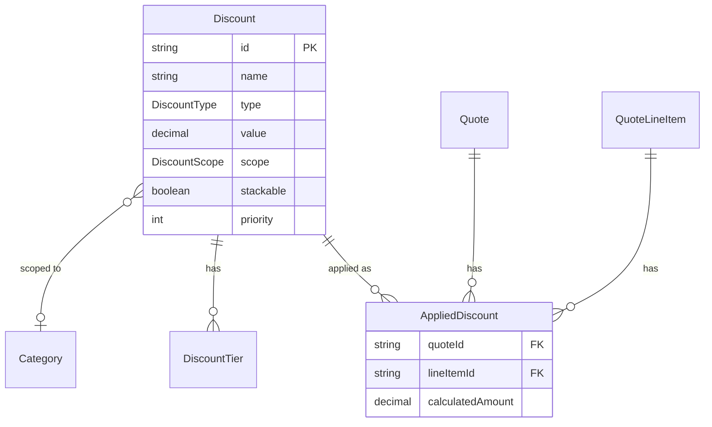
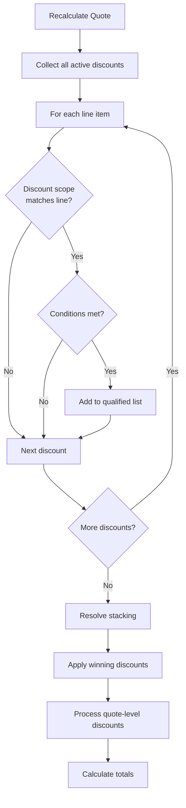

# Module 07: Discount Management

## Learning Objectives

By the end of this module, you will:
- Design discount structures (percentage vs fixed amount)
- Apply discounts at different scopes (line, quote, category)
- Implement tiered volume discounts
- Manage discount stacking and priority

---

## Why Discounts Are Complex

Discounts seem simple, but consider:

- "10% off everything" - Easy
- "10% off electronics, 15% off accessories" - Multiple scopes
- "$50 off orders over $500" - Conditional
- "Buy 10 get 15% off, buy 50 get 25% off" - Tiered
- "Can this 10% coupon combine with the loyalty discount?" - Stacking rules

CPQ systems need sophisticated discount engines to handle these scenarios.

---

## Discount Architecture



---

## Discount Model

```prisma
model Discount {
  id            String        @id @default(cuid())
  name          String
  description   String?
  type          DiscountType
  value         Decimal       @db.Decimal(10, 2)
  scope         DiscountScope
  categoryId    String?       // For PRODUCT_CATEGORY scope
  minQuantity   Int?
  maxQuantity   Int?
  minOrderValue Decimal?      @db.Decimal(10, 2)
  validFrom     DateTime?
  validTo       DateTime?
  isActive      Boolean       @default(true)
  stackable     Boolean       @default(false)
  priority      Int           @default(100)
  createdAt     DateTime      @default(now())
  updatedAt     DateTime      @updatedAt

  category         Category?
  tiers            DiscountTier[]
  appliedDiscounts AppliedDiscount[]
}
```

---

## Discount Types

### PERCENTAGE

Percentage off the price.

```typescript
calculatedAmount = basePrice × (value / 100)

// Example: 15% off $100
calculatedAmount = 100 × (15 / 100) = $15
```

### FIXED_AMOUNT

Fixed dollar amount off.

```typescript
calculatedAmount = min(value, basePrice)  // Can't discount more than price

// Example: $50 off $100
calculatedAmount = min(50, 100) = $50
```

---

## Discount Scopes

### LINE_ITEM

Applied to specific product line items.

**Use Cases:**
- Product-specific promotions
- Clearance items
- Sales rep discretionary

### QUOTE

Applied to the entire quote total.

**Use Cases:**
- Order-level promotions ("$100 off orders over $1000")
- Customer loyalty discounts
- First-time buyer offers

### PRODUCT_CATEGORY

Applied to all products in a category.

**Use Cases:**
- Category sales ("15% off all accessories")
- Seasonal promotions
- Inventory reduction

---

## Discount Conditions

### Quantity-Based

```prisma
minQuantity   Int?   // Minimum qty to qualify
maxQuantity   Int?   // Maximum qty (null = unlimited)
```

**Example:** "10% off when buying 5-10 units"
```json
{
  "type": "PERCENTAGE",
  "value": 10,
  "minQuantity": 5,
  "maxQuantity": 10
}
```

### Value-Based

```prisma
minOrderValue Decimal?   // Minimum order amount
```

**Example:** "$50 off orders over $500"
```json
{
  "type": "FIXED_AMOUNT",
  "value": 50,
  "scope": "QUOTE",
  "minOrderValue": 500
}
```

### Time-Based

```prisma
validFrom     DateTime?
validTo       DateTime?
```

**Example:** "Black Friday Sale - Nov 24-27"
```json
{
  "validFrom": "2024-11-24T00:00:00Z",
  "validTo": "2024-11-27T23:59:59Z"
}
```

---

## Tiered Discounts

For volume-based discount increases:

```prisma
model DiscountTier {
  id          String   @id @default(cuid())
  discountId  String
  tierNumber  Int
  minQuantity Int
  maxQuantity Int?
  value       Decimal  @db.Decimal(10, 2)

  @@index([discountId, tierNumber])
}
```

### Example: Volume Discount

| Tier | Quantity | Discount |
|------|----------|----------|
| 1 | 10-24 | 5% |
| 2 | 25-49 | 10% |
| 3 | 50-99 | 15% |
| 4 | 100+ | 20% |

```json
{
  "name": "Volume Buyer",
  "type": "PERCENTAGE",
  "value": 5,
  "scope": "LINE_ITEM",
  "tiers": [
    { "tierNumber": 1, "minQuantity": 10, "maxQuantity": 24, "value": 5 },
    { "tierNumber": 2, "minQuantity": 25, "maxQuantity": 49, "value": 10 },
    { "tierNumber": 3, "minQuantity": 50, "maxQuantity": 99, "value": 15 },
    { "tierNumber": 4, "minQuantity": 100, "maxQuantity": null, "value": 20 }
  ]
}
```

---

## Stacking and Priority

### The Stacking Problem

Customer has:
- 10% loyalty discount (stackable)
- 15% summer sale (stackable)
- 20% bulk order discount (non-stackable)

Which discounts apply?

### Stacking Rules

```prisma
stackable     Boolean       @default(false)
priority      Int           @default(100)  // Lower = higher priority
```

**Logic:**
1. Collect all applicable stackable discounts
2. Collect all applicable non-stackable discounts
3. Compare: Total of stackable vs Best non-stackable
4. Apply whichever is better for customer

### Example Resolution

```typescript
// Stackable discounts
loyalty = 10%      // stackable: true
summerSale = 15%   // stackable: true
totalStackable = 10 + 15 = 25%

// Non-stackable discounts
bulkOrder = 20%    // stackable: false

// Compare
if (totalStackable > bestNonStackable) {
  apply(loyalty, summerSale)  // 25%
} else {
  apply(bulkOrder)  // 20%
}

// Result: Apply stackable (25% > 20%)
```

### Priority Within Non-Stackable

When multiple non-stackable discounts qualify:

```typescript
// Both qualify for this line item
discount1 = { value: 15, priority: 50 }   // Lower priority wins
discount2 = { value: 20, priority: 100 }

// Apply discount1 because priority 50 < 100
```

---

## Applied Discounts

When a discount is applied, create a record:

```prisma
model AppliedDiscount {
  id               String       @id @default(cuid())
  quoteId          String
  lineItemId       String?      // null for quote-level
  discountId       String?      // null for manual discounts
  type             DiscountType
  value            Decimal      @db.Decimal(10, 2)
  calculatedAmount Decimal      @db.Decimal(10, 2)
  reason           String?
  appliedBy        String?
  appliedAt        DateTime     @default(now())
}
```

### Fields Explained

| Field | Purpose |
|-------|---------|
| `quoteId` | Which quote |
| `lineItemId` | Specific line (null = quote-level) |
| `discountId` | Reference to discount definition |
| `type` | PERCENTAGE or FIXED_AMOUNT |
| `value` | The discount rate/amount |
| `calculatedAmount` | Actual $ saved |
| `reason` | Manual discount justification |
| `appliedBy` | Who applied (for audit) |

---

## Discount Application Flow



---

## Exercise 1: Create Basic Discounts

### Step 1: Navigate to Discounts

Go to `/discounts` in the PoC application.

### Step 2: Create Percentage Discount

- **Name:** "Summer Sale 10%"
- **Type:** PERCENTAGE
- **Value:** 10
- **Scope:** QUOTE
- **Valid From:** June 1, 2024
- **Valid To:** August 31, 2024
- **Stackable:** Yes
- **Priority:** 100

### Step 3: Create Fixed Amount Discount

- **Name:** "$50 Off $500+"
- **Type:** FIXED_AMOUNT
- **Value:** 50
- **Scope:** QUOTE
- **Min Order Value:** 500
- **Stackable:** No
- **Priority:** 50

---

## Exercise 2: Create Category Discount

### Step 1: Create Category-Scoped Discount

- **Name:** "15% Off Accessories"
- **Type:** PERCENTAGE
- **Value:** 15
- **Scope:** PRODUCT_CATEGORY
- **Category:** Accessories (or your equivalent)
- **Stackable:** Yes

### Step 2: Test in Quote

1. Create a quote
2. Add products from the Accessories category
3. Add products from other categories
4. Verify discount only applies to Accessories

---

## Exercise 3: Create Tiered Volume Discount

### Step 1: Create Base Discount

- **Name:** "Volume Buyer Program"
- **Type:** PERCENTAGE
- **Value:** 5 (base)
- **Scope:** LINE_ITEM
- **Min Quantity:** 10
- **Stackable:** No

### Step 2: Add Tiers

| Tier | Min Qty | Max Qty | Value |
|------|---------|---------|-------|
| 1 | 10 | 24 | 5% |
| 2 | 25 | 49 | 10% |
| 3 | 50 | 99 | 15% |
| 4 | 100 | null | 20% |

### Step 3: Test Tier Boundaries

Create a quote and add a product:
- Qty 5: No discount (below min)
- Qty 15: 5% (tier 1)
- Qty 30: 10% (tier 2)
- Qty 75: 15% (tier 3)
- Qty 150: 20% (tier 4)

---

## Exercise 4: Test Stacking Behavior

### Step 1: Setup

Create three discounts:
1. "Loyalty 5%" - PERCENTAGE, QUOTE, stackable: true, priority: 100
2. "Promo 10%" - PERCENTAGE, QUOTE, stackable: true, priority: 100
3. "Big Spender 12%" - PERCENTAGE, QUOTE, stackable: false, priority: 50

### Step 2: Create Quote

Add products totaling $1,000.

### Step 3: Observe Behavior

Expected:
- Stackable total: 5% + 10% = 15% = $150
- Non-stackable best: 12% = $120

Result: Stackable wins ($150 > $120), so Loyalty and Promo applied.

### Step 4: Change Non-Stackable Value

Edit "Big Spender" to 20%.

Expected:
- Stackable total: 15% = $150
- Non-stackable best: 20% = $200

Result: Non-stackable wins ($200 > $150), so only Big Spender applied.

---

## Manual Discounts

Sales reps may need discretionary discounts:

```typescript
// Apply manual discount
const manualDiscount = {
  quoteId: quote.id,
  lineItemId: null,  // quote-level
  discountId: null,  // not from catalog
  type: 'PERCENTAGE',
  value: 5,
  calculatedAmount: subtotal * 0.05,
  reason: "Long-term customer relationship",
  appliedBy: currentUser.id
};
```

### Approval Triggers

Manual discounts often trigger approval:
- Above threshold (e.g., > 15%)
- Margin impact (below minimum)
- Total value (> $10,000)

---

## Real-World Patterns

### Discount Hierarchy

```
Company Policy Discounts (automatic)
├── Volume discounts (quantity-based)
├── Customer segment discounts (enterprise, SMB)
└── Contract discounts (negotiated)

Promotional Discounts (time-limited)
├── Seasonal sales
├── Product launches
└── Clearance events

Discretionary Discounts (approval required)
├── Competitive match
├── Relationship discount
└── Executive override
```

### Discount Audit Trail

```
Quote Q-2024-00456
├── Applied: Volume Buyer 15% on Line 1 ($150)
├── Applied: Summer Sale 10% on Quote ($340)
├── Rejected: Big Spender (stacking rules)
└── Manual: Relationship 5% by jsmith ($170)

Total Discounts: $660
```

---

## Checkpoint Questions

1. **What's the difference between PERCENTAGE and FIXED_AMOUNT discounts?**
   <details>
   <summary>Answer</summary>
   PERCENTAGE calculates as (price × rate/100). FIXED_AMOUNT is a flat dollar reduction, capped at the item price.
   </details>

2. **When would you use PRODUCT_CATEGORY scope?**
   <details>
   <summary>Answer</summary>
   When running promotions on specific product groups (e.g., "15% off all accessories") without creating discounts for each individual product.
   </details>

3. **How does the system decide between stackable and non-stackable discounts?**
   <details>
   <summary>Answer</summary>
   It compares total stackable discount amount vs best non-stackable amount, and applies whichever gives the customer more savings.
   </details>

4. **What does priority control?**
   <details>
   <summary>Answer</summary>
   When multiple non-stackable discounts qualify, lower priority number wins. It determines which single discount to apply.
   </details>

5. **Why would discountId be null on an AppliedDiscount?**
   <details>
   <summary>Answer</summary>
   For manual discounts that aren't from the discount catalog - sales rep entered a custom discount with a reason.
   </details>

---

## Key Takeaways

1. **Two discount types** - PERCENTAGE for relative, FIXED_AMOUNT for absolute
2. **Three scopes** - LINE_ITEM, QUOTE, PRODUCT_CATEGORY
3. **Tiers enable volume discounts** - Different rates at quantity thresholds
4. **Stacking rules prevent over-discounting** - Compare stackable total vs best non-stackable
5. **Applied discounts track history** - Audit trail of what was applied and why

---

## Code References

| File | Content |
|------|---------|
| [prisma/schema.prisma](../../prisma/schema.prisma) | Discount, DiscountTier, AppliedDiscount models |
| [app/pages/discounts/](../../app/pages/discounts/) | Discount management UI |
| [app/composables/useDiscounts.ts](../../app/composables/useDiscounts.ts) | Discount composable |
| [server/services/discountService.ts](../../server/services/discountService.ts) | Discount calculation logic |

---

## Next Steps

Now that you understand discounting, the next module covers the rules engine - the system for encoding business logic like configuration constraints and pricing adjustments.

**Next:** [Module 08: Rules Engine](08-rules-engine.md)
