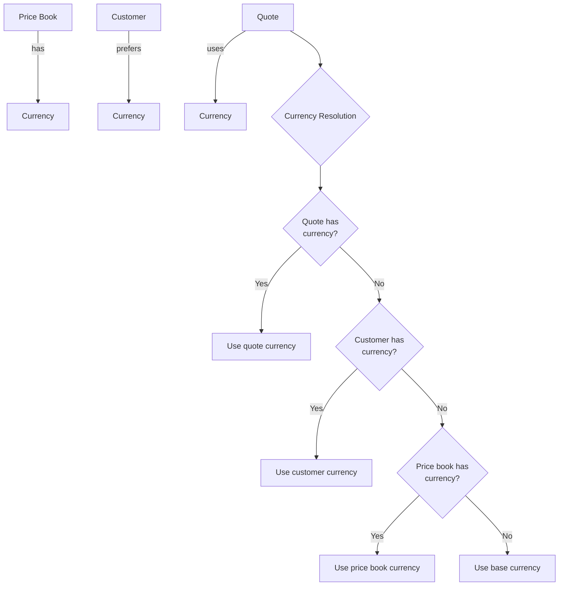
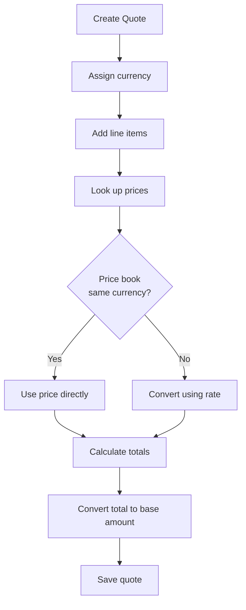

# Module 10: Multi-Currency Support

## Learning Objectives

By the end of this module, you will:
- Configure currencies and exchange rates
- Understand base currency conversion for reporting
- Manage currency assignments at various levels
- Handle exchange rate effective dates

---

## Why Multi-Currency Matters

Global businesses need to:
- Quote customers in their preferred currency
- Maintain price lists in regional currencies
- Report consolidated revenue in base currency
- Track exchange rate fluctuations

---

## Currency Model

```prisma
model Currency {
  id       String  @id @default(cuid())
  code     String  @unique  // ISO 4217: USD, EUR, GBP
  name     String
  symbol   String           // $, €, £
  isBase   Boolean @default(false)
  isActive Boolean @default(true)

  exchangeRates ExchangeRate[]
  priceBooks    PriceBook[]
  quotes        Quote[]
  customers     Customer[]
}
```

### Base Currency

One currency is designated as the "base" for:
- Consolidated reporting
- Exchange rate definitions (rates are TO base currency)
- Revenue analytics

```typescript
// Only one currency can be base
const baseCurrency = currencies.find(c => c.isBase);
// Typically USD for US companies, EUR for European
```

---

## Exchange Rate Model

```prisma
model ExchangeRate {
  id            String   @id @default(cuid())
  currencyId    String
  rate          Decimal  @db.Decimal(18, 8)  // High precision
  effectiveDate DateTime
  createdAt     DateTime @default(now())

  currency Currency

  @@index([currencyId, effectiveDate(sort: Desc)])
}
```

### Rate Definition

Rates are defined as "units of foreign currency per base currency":

```
If USD is base:
- EUR rate: 0.92 (1 USD = 0.92 EUR)
- GBP rate: 0.79 (1 USD = 0.79 GBP)

To convert USD to EUR:
EUR amount = USD amount × EUR rate
$1,000 USD = $1,000 × 0.92 = €920 EUR

To convert EUR to USD (base amount):
USD amount = EUR amount / EUR rate
€920 EUR = €920 / 0.92 = $1,000 USD
```

### Effective Dates

Exchange rates change over time:

```typescript
function getCurrentRate(currencyId: string): ExchangeRate | null {
  const now = new Date();

  return exchangeRates
    .filter(r => r.currencyId === currencyId && r.effectiveDate <= now)
    .sort((a, b) => b.effectiveDate - a.effectiveDate)[0];
}
```

---

## Currency Assignment Hierarchy



---

## Quote Currency Flow



### Base Amount Calculation

Every quote stores `baseAmount` for reporting:

```typescript
function calculateBaseAmount(total: number, quoteCurrency: Currency): number {
  if (quoteCurrency.isBase) {
    return total;  // Already in base currency
  }

  const rate = getCurrentRate(quoteCurrency.id);
  return total / rate.rate;  // Convert back to base
}

// Example: €920 quote total
// EUR rate to USD: 0.92
// Base amount = 920 / 0.92 = $1,000 USD
```

---

## Exercise 1: Configure Currencies

### Step 1: Navigate to Currencies

Go to `/currencies` in the PoC application.

### Step 2: Create Base Currency

- **Code:** USD
- **Name:** US Dollar
- **Symbol:** $
- **Is Base:** Yes

### Step 3: Create Additional Currencies

| Code | Name | Symbol | Is Base |
|------|------|--------|---------|
| EUR | Euro | € | No |
| GBP | British Pound | £ | No |
| CAD | Canadian Dollar | C$ | No |
| JPY | Japanese Yen | ¥ | No |

---

## Exercise 2: Set Exchange Rates

### Step 1: Add Current Rates

For each currency (except USD), add exchange rate:

| Currency | Rate | Effective Date |
|----------|------|----------------|
| EUR | 0.92 | Today |
| GBP | 0.79 | Today |
| CAD | 1.36 | Today |
| JPY | 149.50 | Today |

### Step 2: Add Historical Rate

Add a past rate for EUR:
- **Rate:** 0.95
- **Effective Date:** 30 days ago

This simulates rate changes over time.

---

## Exercise 3: Multi-Currency Price Book

### Step 1: Create EUR Price Book

- **Name:** "EMEA 2024"
- **Currency:** EUR
- **Is Default:** No

### Step 2: Add Product Prices in EUR

Add entries for key products:

| Product | EUR Price | USD Equivalent |
|---------|-----------|----------------|
| RAM 32GB | €180 | ~$196 |
| SSD 1TB | €175 | ~$190 |
| Warranty 3Y | €165 | ~$179 |

### Step 3: Assign to European Customer

1. Create customer "Acme Europe GmbH"
2. Set preferred currency: EUR
3. Assign price book: EMEA 2024

---

## Exercise 4: Quote in Foreign Currency

### Step 1: Create Quote for European Customer

1. Create new quote
2. Customer: "Acme Europe GmbH"
3. Currency should default to EUR

### Step 2: Add Products

Add products from the EMEA price book.

### Step 3: Verify Currency Handling

Observe:
- Prices display in EUR
- Totals calculated in EUR
- `baseAmount` shows USD equivalent

### Step 4: Check Base Amount

```
Quote Total: €1,000
Exchange Rate: 0.92
Base Amount: €1,000 / 0.92 = $1,087 USD
```

---

## Currency Display Formatting

Different currencies have different conventions:

| Currency | Format | Example |
|----------|--------|---------|
| USD | $1,234.56 | $1,234.56 |
| EUR | €1.234,56 | €1.234,56 |
| GBP | £1,234.56 | £1,234.56 |
| JPY | ¥1,235 | ¥1,235 (no decimals) |

```typescript
function formatCurrency(amount: number, currency: Currency): string {
  return new Intl.NumberFormat('en-US', {
    style: 'currency',
    currency: currency.code,
    minimumFractionDigits: currency.code === 'JPY' ? 0 : 2
  }).format(amount);
}
```

---

## Real-World Considerations

### Exchange Rate Sources

| Source | Use Case |
|--------|----------|
| Manual Entry | Simple, controlled updates |
| Central Bank | Official daily rates |
| API (XE, Fixer) | Real-time rates |
| ERP System | Corporate standard rates |

### Rate Timing

| Strategy | Description |
|----------|-------------|
| **Spot Rate** | Current rate at quote time |
| **Fixed Rate** | Locked rate for quote validity |
| **Average Rate** | Period average for reporting |

### Hedging Considerations

Large deals may need:
- Rate lock agreement
- Forward contract reference
- Currency fluctuation clause

---

## Checkpoint Questions

1. **What does "base currency" mean in CPQ?**
   <details>
   <summary>Answer</summary>
   The primary currency for consolidated reporting and analytics. All quotes are converted to base currency for comparison, regardless of transaction currency.
   </details>

2. **How is the exchange rate defined in this system?**
   <details>
   <summary>Answer</summary>
   As units of foreign currency per base currency unit. If USD is base and EUR rate is 0.92, then 1 USD = 0.92 EUR.
   </details>

3. **Why use effectiveDate on exchange rates?**
   <details>
   <summary>Answer</summary>
   Exchange rates change over time. The system finds the most recent rate that was effective on or before the quote date for accurate historical reporting.
   </details>

4. **What's the formula to convert from EUR to USD (base)?**
   <details>
   <summary>Answer</summary>
   USD = EUR / rate. If €920 and rate is 0.92, then USD = 920 / 0.92 = $1,000.
   </details>

5. **What happens if a price book has no currency assigned?**
   <details>
   <summary>Answer</summary>
   The prices are assumed to be in base currency. No conversion is needed when used.
   </details>

---

## Key Takeaways

1. **One base currency for reporting** - All quotes convert to base for analytics
2. **Exchange rates have effective dates** - Historical accuracy maintained
3. **Currency cascades from multiple sources** - Quote → Customer → Price Book → Base
4. **High precision for rates** - Decimal(18,8) prevents rounding errors
5. **Base amount enables comparison** - €1,000 and $1,087 quotes are comparable

---

## Code References

| File | Content |
|------|---------|
| [prisma/schema.prisma](../../prisma/schema.prisma) | Currency and ExchangeRate models |
| [app/pages/currencies/](../../app/pages/currencies/) | Currency management UI |
| [app/composables/useCurrencies.ts](../../app/composables/useCurrencies.ts) | Currencies composable |
| [server/services/currencyService.ts](../../server/services/currencyService.ts) | Conversion logic |

---

## Next Steps

Now that you understand pricing, taxes, and currency, the next module covers guided selling - helping sales reps find the right products through recommendations and questionnaires.

**Next:** [Module 11: Guided Selling & Recommendations](11-guided-selling.md)
