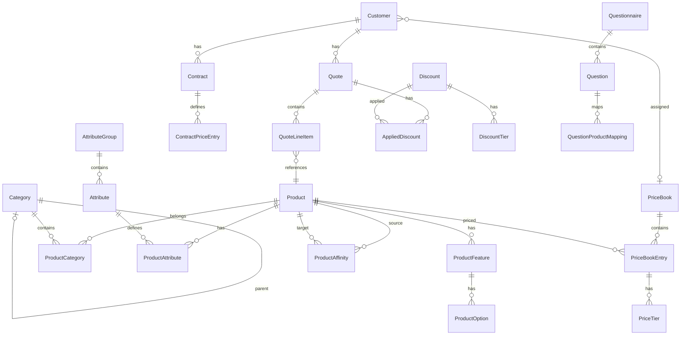

# Appendix: Data Models Reference

Complete reference for all 31 data models in the CPQ PoC.

---

## Product Domain

### Product

```prisma
model Product {
  id                  String           @id @default(cuid())
  name                String
  description         String?
  sku                 String           @unique
  type                ProductType      @default(STANDALONE)
  billingFrequency    BillingFrequency @default(ONE_TIME)
  customBillingMonths Int?
  defaultTermMonths   Int?
  isTaxable           Boolean          @default(true)
  isActive            Boolean          @default(true)
  unitOfMeasureId     String?
  createdAt           DateTime         @default(now())
}

enum ProductType {
  STANDALONE
  BUNDLE
}

enum BillingFrequency {
  ONE_TIME
  MONTHLY
  QUARTERLY
  ANNUAL
  CUSTOM
}
```

### ProductFeature

```prisma
model ProductFeature {
  id         String @id @default(cuid())
  productId  String
  name       String
  minOptions Int    @default(0)
  maxOptions Int    @default(1)
  sortOrder  Int    @default(0)
}
```

### ProductOption

```prisma
model ProductOption {
  id              String  @id @default(cuid())
  featureId       String
  optionProductId String
  isRequired      Boolean @default(false)
  isDefault       Boolean @default(false)
  minQty          Int     @default(1)
  maxQty          Int     @default(1)
  sortOrder       Int     @default(0)
}
```

### Category

```prisma
model Category {
  id          String    @id @default(cuid())
  name        String
  description String?
  parentId    String?
  isActive    Boolean   @default(true)
  sortOrder   Int       @default(0)
  createdAt   DateTime  @default(now())
  updatedAt   DateTime  @updatedAt
}
```

### ProductCategory

```prisma
model ProductCategory {
  id         String   @id @default(cuid())
  productId  String
  categoryId String
  createdAt  DateTime @default(now())

  @@unique([productId, categoryId])
}
```

### UnitOfMeasure

```prisma
model UnitOfMeasure {
  id               String   @id @default(cuid())
  name             String   @unique
  abbreviation     String   @unique
  baseUnitId       String?
  conversionFactor Decimal  @default(1) @db.Decimal(10, 4)
  isActive         Boolean  @default(true)
}
```

---

## Attribute Domain

### AttributeGroup

```prisma
model AttributeGroup {
  id        String   @id @default(cuid())
  name      String
  sortOrder Int      @default(0)
  createdAt DateTime @default(now())
  updatedAt DateTime @updatedAt
}
```

### Attribute

```prisma
model Attribute {
  id          String        @id @default(cuid())
  name        String
  code        String        @unique
  type        AttributeType
  groupId     String?
  options     Json?
  constraints Json?
  isRequired  Boolean       @default(false)
  sortOrder   Int           @default(0)
  createdAt   DateTime      @default(now())
  updatedAt   DateTime      @updatedAt
}

enum AttributeType {
  TEXT
  NUMBER
  BOOLEAN
  SELECT
  DATE
}
```

### ProductAttribute

```prisma
model ProductAttribute {
  id          String   @id @default(cuid())
  productId   String
  attributeId String
  value       Json
  createdAt   DateTime @default(now())
  updatedAt   DateTime @updatedAt

  @@unique([productId, attributeId])
}
```

### CategoryAttribute

```prisma
model CategoryAttribute {
  id         String   @id @default(cuid())
  categoryId String
  attributeId String
  createdAt  DateTime @default(now())

  @@unique([categoryId, attributeId])
}
```

---

## Customer Domain

### Customer

```prisma
model Customer {
  id                   String    @id @default(cuid())
  name                 String
  email                String?
  phone                String?
  company              String?
  street               String?
  city                 String?
  state                String?
  postalCode           String?
  country              String?
  priceBookId          String?
  currencyId           String?
  isTaxExempt          Boolean   @default(false)
  taxExemptReason      String?
  taxExemptCertificate String?
  taxExemptExpiry      DateTime?
  isActive             Boolean   @default(true)
  createdAt            DateTime  @default(now())
  updatedAt            DateTime  @updatedAt
}
```

### Contract

```prisma
model Contract {
  id              String         @id @default(cuid())
  name            String
  customerId      String
  startDate       DateTime
  endDate         DateTime
  status          ContractStatus @default(DRAFT)
  discountPercent Decimal?       @db.Decimal(5, 2)
  createdAt       DateTime       @default(now())
  updatedAt       DateTime       @updatedAt

  @@index([customerId])
  @@index([status])
}

enum ContractStatus {
  DRAFT
  ACTIVE
  EXPIRED
}
```

### ContractPriceEntry

```prisma
model ContractPriceEntry {
  id         String  @id @default(cuid())
  contractId String
  productId  String
  fixedPrice Decimal @db.Decimal(10, 2)

  @@unique([contractId, productId])
}
```

---

## Pricing Domain

### Currency

```prisma
model Currency {
  id       String  @id @default(cuid())
  code     String  @unique
  name     String
  symbol   String
  isBase   Boolean @default(false)
  isActive Boolean @default(true)
}
```

### ExchangeRate

```prisma
model ExchangeRate {
  id            String   @id @default(cuid())
  currencyId    String
  rate          Decimal  @db.Decimal(18, 8)
  effectiveDate DateTime
  createdAt     DateTime @default(now())

  @@index([currencyId, effectiveDate(sort: Desc)])
}
```

### PriceBook

```prisma
model PriceBook {
  id         String    @id @default(cuid())
  name       String
  currencyId String?
  isDefault  Boolean   @default(false)
  isActive   Boolean   @default(true)
  validFrom  DateTime?
  validTo    DateTime?
}
```

### PriceBookEntry

```prisma
model PriceBookEntry {
  id          String   @id @default(cuid())
  priceBookId String
  productId   String
  listPrice   Decimal  @db.Decimal(10, 2)
  cost        Decimal? @db.Decimal(10, 2)
  minMargin   Decimal? @db.Decimal(5, 2)

  @@unique([priceBookId, productId])
}
```

### PriceTier

```prisma
model PriceTier {
  id               String   @id @default(cuid())
  priceBookEntryId String
  minQuantity      Int
  maxQuantity      Int?
  tierPrice        Decimal  @db.Decimal(10, 2)
  tierType         TierType @default(UNIT_PRICE)

  @@index([priceBookEntryId, minQuantity])
}

enum TierType {
  UNIT_PRICE
  FLAT_PRICE
}
```

---

## Quote Domain

### Quote

```prisma
model Quote {
  id               String      @id @default(cuid())
  name             String
  customerId       String?
  status           QuoteStatus @default(DRAFT)
  priceBookId      String
  currencyId       String?
  validFrom        DateTime    @default(now())
  validTo          DateTime
  subtotal         Decimal     @default(0) @db.Decimal(10, 2)
  discountTotal    Decimal     @default(0) @db.Decimal(10, 2)
  taxAmount        Decimal     @default(0) @db.Decimal(10, 2)
  taxBreakdown     Json?
  total            Decimal     @default(0) @db.Decimal(10, 2)
  baseAmount       Decimal     @default(0) @db.Decimal(10, 2)
  oneTimeTotal     Decimal     @default(0) @db.Decimal(10, 2)
  mrr              Decimal     @default(0) @db.Decimal(10, 2)
  arr              Decimal     @default(0) @db.Decimal(10, 2)
  tcv              Decimal     @default(0) @db.Decimal(10, 2)
  requiresApproval Boolean     @default(false)
  approvedBy       String?
  approvedAt       DateTime?
  createdAt        DateTime    @default(now())
  updatedAt        DateTime    @updatedAt
}

enum QuoteStatus {
  DRAFT
  PENDING
  PENDING_APPROVAL
  APPROVED
  REJECTED
  ACCEPTED
  FINALIZED
  CANCELLED
}
```

### QuoteLineItem

```prisma
model QuoteLineItem {
  id             String   @id @default(cuid())
  quoteId        String
  productId      String
  parentLineId   String?
  quantity       Int      @default(1)
  listPrice      Decimal  @db.Decimal(10, 2)
  discount       Decimal  @default(0) @db.Decimal(10, 2)
  netPrice       Decimal  @db.Decimal(10, 2)
  termMonths     Int?
  isProrated     Boolean  @default(false)
  proratedAmount Decimal? @db.Decimal(10, 2)
  sortOrder      Int      @default(0)
}
```

### QuoteLayout

```prisma
model QuoteLayout {
  id            String   @id @default(cuid())
  entityId      String   @default("default")
  name          String
  description   String?
  isTemplate    Boolean  @default(false)
  sections      Json
  summaryConfig Json
  theme         Json
  createdAt     DateTime @default(now())
  updatedAt     DateTime @updatedAt

  @@index([entityId])
  @@index([isTemplate])
}
```

---

## Discount Domain

### Discount

```prisma
model Discount {
  id            String        @id @default(cuid())
  name          String
  description   String?
  type          DiscountType
  value         Decimal       @db.Decimal(10, 2)
  scope         DiscountScope
  categoryId    String?
  minQuantity   Int?
  maxQuantity   Int?
  minOrderValue Decimal?      @db.Decimal(10, 2)
  validFrom     DateTime?
  validTo       DateTime?
  isActive      Boolean       @default(true)
  stackable     Boolean       @default(false)
  priority      Int           @default(100)
  createdAt     DateTime      @default(now())
  updatedAt     DateTime      @updatedAt
}

enum DiscountType {
  PERCENTAGE
  FIXED_AMOUNT
}

enum DiscountScope {
  LINE_ITEM
  QUOTE
  PRODUCT_CATEGORY
}
```

### DiscountTier

```prisma
model DiscountTier {
  id          String  @id @default(cuid())
  discountId  String
  tierNumber  Int
  minQuantity Int
  maxQuantity Int?
  value       Decimal @db.Decimal(10, 2)

  @@index([discountId, tierNumber])
}
```

### AppliedDiscount

```prisma
model AppliedDiscount {
  id               String       @id @default(cuid())
  quoteId          String
  lineItemId       String?
  discountId       String?
  type             DiscountType
  value            Decimal      @db.Decimal(10, 2)
  calculatedAmount Decimal      @db.Decimal(10, 2)
  reason           String?
  appliedBy        String?
  appliedAt        DateTime     @default(now())

  @@index([quoteId])
}
```

---

## Tax Domain

### TaxRate

```prisma
model TaxRate {
  id         String    @id @default(cuid())
  name       String
  rate       Decimal   @db.Decimal(5, 4)
  country    String
  state      String?
  categoryId String?
  validFrom  DateTime?
  validTo    DateTime?
  isActive   Boolean   @default(true)
  createdAt  DateTime  @default(now())
  updatedAt  DateTime  @updatedAt

  @@index([country, state])
  @@index([isActive])
}
```

---

## Rules Domain

### Rule

```prisma
model Rule {
  id          String      @id @default(cuid())
  name        String
  description String?
  type        RuleType
  trigger     RuleTrigger
  priority    Int         @default(100)
  condition   Json
  action      Json
  isActive    Boolean     @default(true)
  createdAt   DateTime    @default(now())
  updatedAt   DateTime    @updatedAt
}

enum RuleType {
  CONFIGURATION
  PRICING
}

enum RuleTrigger {
  ON_PRODUCT_ADD
  ON_QUANTITY_CHANGE
  ON_QUOTE_SAVE
  ON_FINALIZE
}
```

---

## Guided Selling Domain

### ProductAffinity

```prisma
model ProductAffinity {
  id                     String           @id @default(cuid())
  sourceProductId        String?
  targetProductId        String?
  sourceCategoryId       String?
  targetCategoryId       String?
  type                   AffinityType
  priority               Int              @default(100)
  conditions             Json?
  sourceBillingFrequency BillingFrequency?
  targetBillingFrequency BillingFrequency?
  isActive               Boolean          @default(true)
  createdAt              DateTime         @default(now())
  updatedAt              DateTime         @updatedAt

  @@index([sourceProductId])
  @@index([targetProductId])
  @@index([type])
}

enum AffinityType {
  CROSS_SELL
  UPSELL
  ACCESSORY
  REQUIRED
  FREQUENTLY_BOUGHT
  SUBSCRIPTION_ADDON
}
```

### Questionnaire

```prisma
model Questionnaire {
  id          String   @id @default(cuid())
  name        String
  description String?
  isActive    Boolean  @default(true)
  createdAt   DateTime @default(now())
  updatedAt   DateTime @updatedAt
}
```

### Question

```prisma
model Question {
  id              String       @id @default(cuid())
  questionnaireId String
  text            String
  type            QuestionType
  options         Json
  sortOrder       Int          @default(0)
  branchLogic     Json?
  createdAt       DateTime     @default(now())
  updatedAt       DateTime     @updatedAt

  @@index([questionnaireId])
}

enum QuestionType {
  SINGLE_CHOICE
  MULTIPLE_CHOICE
  RANGE
  YES_NO
}
```

### QuestionProductMapping

```prisma
model QuestionProductMapping {
  id          String @id @default(cuid())
  questionId  String
  productId   String
  answerValue String
  score       Int    @default(100)

  @@index([questionId])
  @@index([productId])
}
```

### RecommendationLog

```prisma
model RecommendationLog {
  id        String               @id @default(cuid())
  quoteId   String
  productId String
  source    RecommendationSource
  action    RecommendationAction
  metadata  Json?
  createdAt DateTime             @default(now())

  @@index([quoteId])
  @@index([productId])
  @@index([createdAt])
}

enum RecommendationSource {
  RULE_BASED
  AI_GENERATED
  QUESTIONNAIRE
  MANUAL
}

enum RecommendationAction {
  SHOWN
  ACCEPTED
  DISMISSED
}
```

---

## Entity Relationship Diagram



---

## Source File

All models are defined in:

```
prisma/schema.prisma
```

Generated TypeScript types are in:

```
app/generated/prisma/
```
