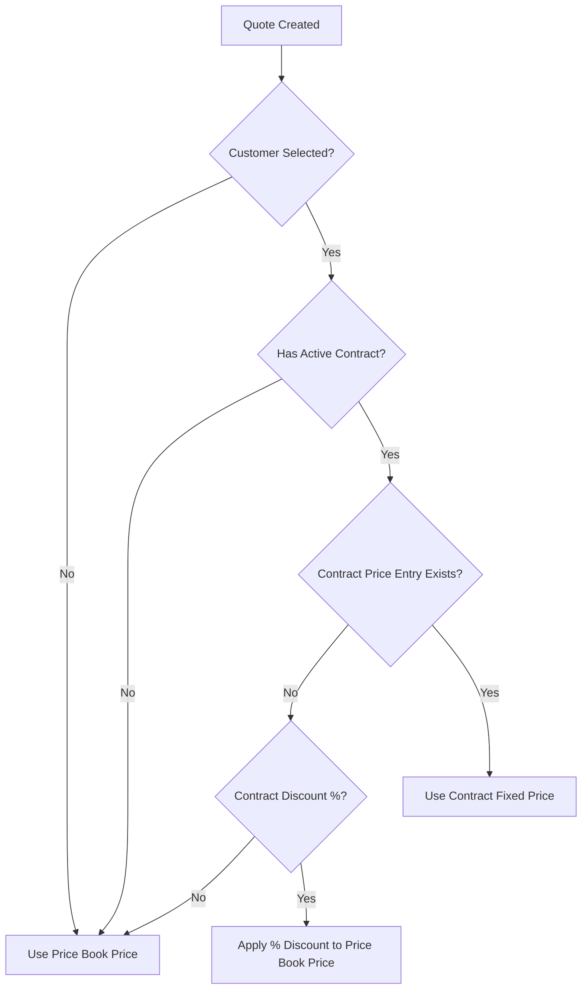
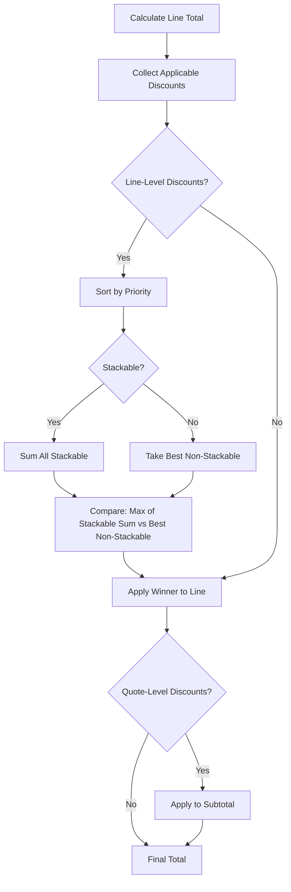

# Design: Enhance Learn Page Completeness

## Architecture Overview

The enhanced Learn page will be organized into logical sections with progressive disclosure. Users can quickly scan high-level concepts or dive deep into specific areas.

### Page Structure with Table of Contents

```
/learn
├── [Sticky Table of Contents - Left Sidebar or Top Bar]
│
├── CPQ Workflow Overview (existing, enhanced with Vue Flow)
├── Data Model (collapsible)
│   ├── Interactive ER Diagram (Vue Flow - zoom/pan/click)
│   ├── Hierarchy View (enhanced - all entity groups)
│   └── Database Schema (existing - Prisma ERD)
├── Business Logic (collapsible)
│   ├── Pricing Calculations
│   ├── Discount Stacking
│   ├── Contract Pricing
│   ├── Tax Calculation
│   └── Subscription Metrics
├── Formula Reference (collapsible)
├── Worked Example (collapsible, interactive stepper)
├── Glossary (collapsible, searchable)
├── Enum Reference (collapsible)
├── Relationship Cards (collapsible)
└── Quick Tips (existing, enhanced)
```

---

## Visualization Library Research & Recommendations

### Library Comparison for Interactive Diagrams

| Library | Best For | Interactivity | Vue 3 Support | License | Recommendation |
|---------|----------|---------------|---------------|---------|----------------|
| **[Vue Flow](https://vueflow.dev/)** | Flowcharts, node graphs, ER diagrams | Excellent (zoom, pan, drag, minimap) | Native | MIT | **Primary choice for ER & Flow diagrams** |
| **[Mermaid](https://mermaid.js.org/)** | Text-based diagrams, quick documentation | Limited (static SVG) | Via wrapper | MIT | Good for simple diagrams, backup option |
| **[D3.js](https://d3js.org/)** | Custom complex visualizations | Full control | Via integration | BSD | Overkill for our needs |
| **[GoJS](https://gojs.net/)** | Enterprise diagramming | Excellent | Yes | Commercial | Too expensive for POC |
| **ApexCharts** (current) | Data charts, treemaps | Medium | Native | MIT | Keep for hierarchy treemap |

### Recommended Library Strategy

1. **Vue Flow** - For ER diagrams and workflow diagrams
   - Native Vue 3 with Composition API
   - Built-in zoom, pan, minimap, controls
   - Custom node components for entity boxes
   - Draggable nodes for exploration
   - Click handlers for entity details
   - Built on D3 for interactions

2. **Mermaid** - For simple flowcharts in business logic cards
   - Text-based syntax (easy to maintain)
   - Good for decision flowcharts
   - Use `nuxt-mermaid-string` for integration

3. **ApexCharts** - Keep for hierarchy treemap (existing)
   - Already integrated
   - Good for the tree visualization

### Vue Flow Implementation Details

**Key Features to Use:**
- **Zoom & Pan**: Built-in, touch-friendly
- **Minimap**: For navigating large ER diagram
- **Controls**: Zoom in/out, fit view, lock
- **Custom Nodes**: Entity boxes with attributes
- **Custom Edges**: Relationship lines with labels
- **Click Events**: Open entity details panel

**Example Entity Node:**
```vue
<script setup>
import { Handle, Position } from '@vue-flow/core'

defineProps<{
  data: {
    name: string
    domain: string
    color: string
    attributes: string[]
  }
}>()
</script>

<template>
  <div
    class="entity-node rounded-lg border-2 shadow-lg p-3 min-w-[160px]"
    :style="{ borderColor: data.color, backgroundColor: `${data.color}10` }"
  >
    <div class="font-bold text-sm" :style="{ color: data.color }">
      {{ data.name }}
    </div>
    <div class="text-xs text-gray-500 mt-1">
      {{ data.attributes.slice(0, 3).join(', ') }}
      <span v-if="data.attributes.length > 3">...</span>
    </div>
    <Handle type="source" :position="Position.Right" />
    <Handle type="target" :position="Position.Left" />
  </div>
</template>
```

---

## Table of Contents Design

### Option A: Sticky Left Sidebar (Desktop)

```
┌─────────────────┬──────────────────────────────────────────────┐
│ Table of        │                                              │
│ Contents        │  Main Content Area                           │
│                 │                                              │
│ ○ Workflow      │  ┌────────────────────────────────────────┐  │
│ ● Data Model    │  │ Data Model                         [-] │  │
│   ├ ER Diagram  │  │                                        │  │
│   ├ Hierarchy   │  │  [Interactive ER Diagram]              │  │
│   └ Schema      │  │                                        │  │
│ ○ Business Logic│  └────────────────────────────────────────┘  │
│ ○ Formulas      │                                              │
│ ○ Example       │                                              │
│ ○ Glossary      │                                              │
│ ○ Enums         │                                              │
│ ○ Relationships │                                              │
│ ○ Tips          │                                              │
└─────────────────┴──────────────────────────────────────────────┘
```

### Option B: Sticky Top Bar (All Viewports)

```
┌──────────────────────────────────────────────────────────────────┐
│ Workflow | Data Model | Logic | Formulas | Example | Glossary... │
├──────────────────────────────────────────────────────────────────┤
│                                                                  │
│  Main Content Area with Collapsible Sections                     │
│                                                                  │
└──────────────────────────────────────────────────────────────────┘
```

### Recommended: Hybrid Approach

- **Desktop (≥1280px)**: Sticky left sidebar with nested navigation
- **Tablet (768-1279px)**: Sticky top bar with horizontal scroll
- **Mobile (<768px)**: Hamburger menu with slide-out TOC

---

## Collapsible Sections Design

Each major section will be a collapsible card using Nuxt UI's `UCard` with custom expand/collapse behavior.

### Section Component Structure

```vue
<script setup>
const props = defineProps<{
  id: string
  title: string
  icon: string
  defaultOpen?: boolean
}>()

const isOpen = ref(props.defaultOpen ?? true)
</script>

<template>
  <section :id="id" class="scroll-mt-20">
    <UCard>
      <template #header>
        <button
          class="w-full flex items-center justify-between"
          @click="isOpen = !isOpen"
        >
          <div class="flex items-center gap-2">
            <UIcon :name="icon" class="w-5 h-5" />
            <h2 class="text-lg font-semibold">{{ title }}</h2>
          </div>
          <UIcon
            :name="isOpen ? 'i-heroicons-chevron-up' : 'i-heroicons-chevron-down'"
            class="w-5 h-5 transition-transform"
          />
        </button>
      </template>

      <Transition
        enter-active-class="transition-all duration-200 ease-out"
        leave-active-class="transition-all duration-200 ease-in"
        enter-from-class="opacity-0 max-h-0"
        enter-to-class="opacity-100 max-h-[2000px]"
        leave-from-class="opacity-100 max-h-[2000px]"
        leave-to-class="opacity-0 max-h-0"
      >
        <div v-show="isOpen" class="overflow-hidden">
          <slot />
        </div>
      </Transition>
    </UCard>
  </section>
</template>
```

### Expand All / Collapse All

```vue
<div class="flex gap-2 mb-4">
  <UButton size="sm" variant="ghost" @click="expandAll">
    <UIcon name="i-heroicons-arrows-pointing-out" />
    Expand All
  </UButton>
  <UButton size="sm" variant="ghost" @click="collapseAll">
    <UIcon name="i-heroicons-arrows-pointing-in" />
    Collapse All
  </UButton>
</div>
```

---

## Interactive ER Diagram with Vue Flow

### Node Types

1. **EntityNode**: Main entity box (e.g., Product, Quote)
2. **JunctionNode**: Junction table indicator (smaller, different style)
3. **EnumNode**: Enum reference (dashed border)

### Edge Types

1. **OneToMany**: Solid line with crow's foot
2. **ManyToOne**: Solid line with single mark
3. **ManyToMany**: Dashed line through junction

### Interaction Features

| Feature | Implementation |
|---------|----------------|
| **Zoom** | Built-in Vue Flow zoom (mouse wheel, pinch) |
| **Pan** | Built-in drag to pan |
| **Minimap** | `<MiniMap />` component in corner |
| **Fit View** | "Fit" button to reset zoom |
| **Node Click** | Opens detail panel showing entity attributes |
| **Edge Hover** | Shows relationship tooltip |
| **Domain Filter** | Toggle buttons to show/hide domain groups |
| **Search** | Filter nodes by name |

### Entity Detail Panel

When user clicks an entity node:

```
┌─────────────────────────────────────┐
│ Product                         [×] │
├─────────────────────────────────────┤
│ Domain: Products (Blue)             │
│                                     │
│ Attributes:                         │
│ • id: String (PK)                   │
│ • name: String                      │
│ • sku: String (unique)              │
│ • type: ProductType                 │
│ • billingFrequency: BillingFreq     │
│ • ...                               │
│                                     │
│ Relationships:                      │
│ → ProductFeature (1:N)              │
│ → PriceBookEntry (1:N)              │
│ → QuoteLineItem (1:N)               │
│ ← Category (N:N via ProductCategory)│
│                                     │
│ [View in Glossary]                  │
└─────────────────────────────────────┘
```

---

## Interactive Workflow Diagram (Vue Flow)

Replace current static flow diagram with interactive Vue Flow version:

### Features
- **Clickable Steps**: Click to see step details
- **Animated Paths**: Show flow direction with animated edges
- **Branch Highlighting**: Hover to highlight approval vs auto-approve paths
- **Status Badges**: Show quote status at each step

---

## Component Architecture (Updated)

```
learn.vue
├── LearnTableOfContents.vue (NEW - sticky navigation)
├── LearnCollapsibleSection.vue (NEW - reusable wrapper)
│
├── Section: Workflow
│   └── LearnCPQFlowDiagram.vue (ENHANCED - Vue Flow)
│
├── Section: Data Model
│   ├── LearnERDiagram.vue (NEW - Vue Flow interactive)
│   │   ├── EntityNode.vue (custom node)
│   │   ├── EntityDetailPanel.vue (side panel)
│   │   └── DiagramControls.vue (zoom, filter, search)
│   ├── LearnEntityHierarchy.vue (enhanced - ApexCharts treemap)
│   └── LearnPrismaERD.vue (existing)
│
├── Section: Business Logic
│   └── LearnBusinessLogic.vue (NEW - accordion with Mermaid flowcharts)
│
├── Section: Formulas
│   └── LearnFormulaReference.vue (NEW)
│
├── Section: Worked Example
│   └── LearnWorkedExample.vue (NEW - interactive stepper)
│
├── Section: Glossary
│   └── Existing glossary (enhanced with new terms)
│
├── Section: Enums
│   └── LearnEnumReference.vue (NEW)
│
├── Section: Relationships
│   └── LearnRelationshipCards.vue (NEW - Mermaid flowcharts)
│
└── Section: Tips
    └── Existing tips (enhanced)
```

---

## Entity Grouping Strategy

The 31 models will be organized into color-coded domains:

| Domain | Color | Models |
|--------|-------|--------|
| **Currency** | Emerald (#10b981) | Currency, ExchangeRate |
| **Units** | Slate (#64748b) | UnitOfMeasure |
| **Products** | Blue (#3b82f6) | Product, ProductFeature, ProductOption, ProductCategory, ProductAttribute |
| **Categories** | Green (#22c55e) | Category, CategoryAttribute |
| **Attributes** | Cyan (#06b6d4) | AttributeGroup, Attribute |
| **Customers** | Purple (#8b5cf6) | Customer, Contract, ContractPriceEntry |
| **Pricing** | Teal (#14b8a6) | PriceBook, PriceBookEntry, PriceTier |
| **Quotes** | Amber (#f59e0b) | Quote, QuoteLineItem, AppliedDiscount |
| **Rules** | Pink (#ec4899) | Rule |
| **Discounts** | Red (#ef4444) | Discount, DiscountTier |
| **Tax** | Orange (#f97316) | TaxRate |
| **Guided Selling** | Indigo (#6366f1) | ProductAffinity, Questionnaire, Question, QuestionProductMapping, RecommendationLog |

---

## Business Logic Cards with Mermaid

Use Mermaid for decision flowcharts within business logic cards:

### Contract Pricing Override Flowchart



### Discount Stacking Flowchart



---

## Glossary Term Structure

### New Guided Selling Group Terms

```typescript
interface GlossaryTerm {
  term: string
  group: 'guided-selling' | ... // Add new group
  definition: string
  example: string
  relatedTerms: string[]
  confusedWith?: string
  distinction?: string
}
```

(See spec delta for full term definitions)

---

## Worked Example with Interactive Stepper

Replace static diagram with an interactive stepper component:

```vue
<script setup>
const currentStep = ref(0)
const steps = [
  { title: 'Setup', data: { customer: 'Acme Corp', priceBook: 'Partner (EUR)' } },
  { title: 'Add Product', data: { product: 'Laptop Pro Bundle', sku: 'LAP-PRO' } },
  // ... more steps
]
</script>

<template>
  <div class="flex gap-8">
    <!-- Stepper Navigation -->
    <div class="w-48 flex-shrink-0">
      <div v-for="(step, i) in steps" :key="i" class="relative">
        <button
          :class="[
            'w-full text-left p-3 rounded',
            i === currentStep ? 'bg-primary-100 text-primary-700' : 'hover:bg-gray-50'
          ]"
          @click="currentStep = i"
        >
          <div class="flex items-center gap-2">
            <div
              :class="[
                'w-6 h-6 rounded-full flex items-center justify-center text-xs font-bold',
                i < currentStep ? 'bg-green-500 text-white' :
                i === currentStep ? 'bg-primary-500 text-white' : 'bg-gray-200'
              ]"
            >
              {{ i + 1 }}
            </div>
            {{ step.title }}
          </div>
        </button>
        <!-- Connector line -->
        <div v-if="i < steps.length - 1" class="absolute left-6 top-12 w-0.5 h-4 bg-gray-200" />
      </div>
    </div>

    <!-- Step Content -->
    <div class="flex-1 bg-gray-50 rounded-lg p-6">
      <Transition name="fade" mode="out-in">
        <div :key="currentStep">
          <h3 class="text-lg font-semibold mb-4">{{ steps[currentStep].title }}</h3>
          <!-- Dynamic content based on step -->
          <LearnExampleStepContent :step="steps[currentStep]" />
        </div>
      </Transition>
    </div>
  </div>
</template>
```

---

## Performance Considerations

1. **Lazy Load Heavy Components**: Vue Flow only loaded when section is open
2. **Virtual Scrolling**: For glossary terms if list grows large
3. **Code Splitting**: Each section component in separate chunk
4. **Mermaid SSR**: Use `nuxt-mermaid-string` for SSR compatibility

---

## New Dependencies to Add

```json
{
  "devDependencies": {
    "@vue-flow/core": "^1.48.1",
    "@vue-flow/minimap": "^1.5.4",
    "@vue-flow/controls": "^1.1.2",
    "@vue-storefront/nuxt-mermaid": "^1.0.0"
  }
}
```

> **Note:** Using `@vue-storefront/nuxt-mermaid` instead of `nuxt-mermaid-string` as it's actively maintained and designed for Nuxt 3. The Vue Flow packages are the latest stable releases as of January 2026.

---

## Accessibility

1. All diagrams have text alternatives
2. Interactive elements are keyboard accessible
3. Color coding supplemented with patterns/labels
4. Proper heading hierarchy
5. Screen reader announcements for expandable sections
6. Focus management for TOC navigation

---

## Testing Strategy

1. **Visual regression**: Screenshot comparison for diagrams
2. **Content accuracy**: Automated check that glossary terms match schema models
3. **Navigation**: E2E test for section navigation and TOC
4. **Responsiveness**: Test on mobile, tablet, desktop viewports
5. **Interactivity**: Test zoom, pan, click handlers in Vue Flow diagrams
