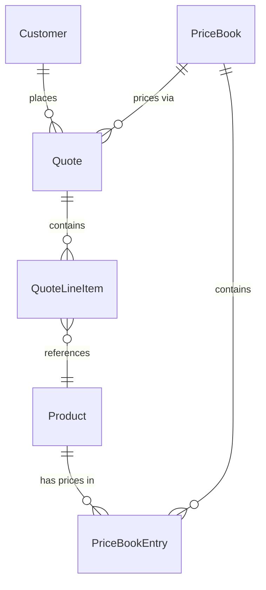
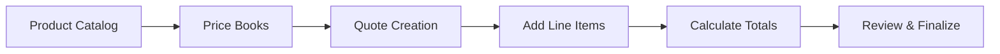
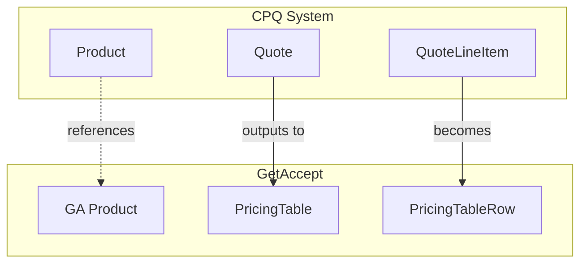

# Change: Enhance Roadmap Page Visualization

## Why
The current roadmap page provides basic phase information but lacks:
1. **Detailed phase content** - Each phase needs richer descriptions, goals, and key deliverables
2. **Entity relationship visualization** - Users need to see how entities connect within and across phases
3. **Interactive strategy exploration** - Users should be able to select an integration strategy and see how it affects the entire roadmap (patterns, decisions, entity design)
4. **Visual charts** - Better understanding through ApexCharts (metrics) and Mermaid (diagrams)

Additionally, Phase 3's "isComplex" marker should be removed - it's not more complex than other phases, just subject to upcoming GA Contract Management changes that will be documented in the phase details.

## What Changes

### 1. Remove Phase 3 "isComplex" Flag
- Remove `isComplex` property from Phase type and Phase 3 definition
- Remove warning indicator from PhaseBadge component
- Document upcoming GA changes in Phase 3's expanded details instead

### 2. Enhanced Phase Information
- Add `details`, `goals`, `keyDeliverables`, and `upcomingChanges` to Phase type
- Each phase card becomes expandable to show:
  - Detailed description and goals
  - List of key deliverables
  - Timeline notes / upcoming changes (for Phase 3: GA Contract Management evolution)

### 3. Entity Relationship Diagrams
Add three types of visual diagrams:

**a) Data Model Relations (Mermaid ER diagrams)**
- Show Prisma schema relations per phase
- Foreign keys, one-to-many, many-to-many relationships
- Example: Product → PriceBookEntry, Quote → QuoteLineItem → Product

**b) Domain Flow Diagrams (Mermaid flowcharts)**
- Show business flow per phase
- Example Phase 1: Product Catalog → Price Books → Quote Creation → Line Items → Totals

**c) GA Integration Mapping (Mermaid diagrams)**
- Show how CPQ entities map to GetAccept entities
- Arrows indicating: reference, outputs-to, extends, new

### 4. Interactive Strategy Selection
When a user clicks an Integration Strategy option (A/B/C):
- The selected strategy is highlighted
- **Extensibility Patterns section** updates to show strategy-specific guidance
- **Decisions Needed section** updates to show relevant decisions for that strategy
- **Entity information** updates to show how entities would be designed under that strategy
- A "Reset" button clears the selection

### 5. Visual Charts (ApexCharts)
- **Entity Distribution Chart**: Donut/pie chart showing entity count per phase
- **Phase Timeline**: Horizontal bar chart showing phase progression and dependencies

## Impact
- **Affected files**:
  - `app/config/phases.ts` - Expanded Phase type, remove isComplex
  - `app/components/PhaseBadge.vue` - Remove warning indicator logic
  - `app/pages/learn/roadmap.vue` - Major enhancements
  - `app/composables/usePhase.ts` - Add strategy-filtered data functions
- **New components**:
  - `app/components/roadmap/PhaseDetailCard.vue` - Expandable phase card
  - `app/components/roadmap/EntityRelationsDiagram.vue` - Mermaid wrapper for relations
  - `app/components/roadmap/StrategySelector.vue` - Interactive strategy picker
  - `app/components/roadmap/PhaseMetricsChart.vue` - ApexCharts visualizations
- **No breaking changes** to existing functionality

## Data Structure Changes

### Phase Type Extension
```typescript
interface Phase {
  number: number
  id: string
  name: string
  description: string  // Short description (existing)
  color: string
  bgColor: string
  borderColor: string
  // NEW fields:
  details: string         // Long-form description
  goals: string[]         // Key goals for this phase
  keyDeliverables: string[] // What gets built
  upcomingChanges?: string  // Notes about future changes (e.g., GA evolution)
}
```

### Strategy-Filtered Content
```typescript
interface StrategyContent {
  extensibilityPatterns: ExtensibilityPattern[]
  decisions: Decision[]
  entityNotes: Record<string, string>  // entity name → strategy-specific note
}

// Function to get filtered content
function getContentForStrategy(strategyId: 'extend' | 'reference' | 'hybrid'): StrategyContent
```

## Mermaid Diagram Examples

### Data Model (Phase 1)


### Domain Flow (Phase 1)


### GA Integration

