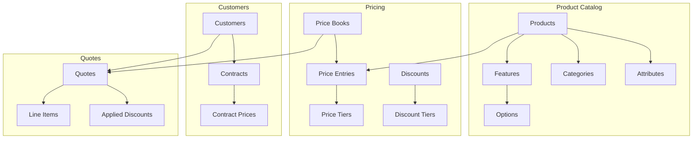

# Module 00: Introduction to CPQ

## Learning Objectives

By the end of this module, you will:

- Understand what CPQ software does and why businesses need it
- Know the key stakeholders who use CPQ systems
- Recognize common CPQ use cases across industries
- Have a high-level understanding of the PoC application architecture

---

## What is CPQ?

**CPQ** stands for **Configure, Price, Quote** - three interconnected processes that transform how businesses sell complex products and services.

### The Problem CPQ Solves

Imagine you're selling enterprise software with:

- 50 different modules (CRM, ERP, HR, Finance, etc.)
- 3 deployment options (Cloud, On-Premise, Hybrid)
- Volume-based pricing that changes at 10, 50, and 100 users
- Different price lists for SMB, Enterprise, and Government customers
- Regional pricing in 5 currencies
- Bundle discounts when customers buy 3+ modules together
- Configuration rules (e.g., "HR module requires Core Platform")

A sales rep trying to create a quote manually would need to:

1. Check which modules work together
2. Look up the correct price list for this customer type
3. Calculate volume discounts
4. Apply any promotional offers
5. Convert to the customer's currency
6. Ensure the configuration is valid
7. Get approval if the discount exceeds their authority

**This process is error-prone, slow, and inconsistent.**

### How CPQ Helps

CPQ software automates these three steps:

| Step          | Manual Process                          | With CPQ                                           |
| ------------- | --------------------------------------- | -------------------------------------------------- |
| **Configure** | Sales rep remembers compatibility rules | System enforces valid configurations automatically |
| **Price**     | Spreadsheet lookups, calculator math    | Real-time price calculation with all rules applied |
| **Quote**     | Copy/paste into Word doc                | Professional, accurate quotes generated instantly  |

### Business Impact

Organizations implementing CPQ typically see:

- **65% reduction** in quote generation time
- **27% improvement** in win rates
- **105% increase** in average deal size (due to better upselling)
- **33% decrease** in quote errors

---

## The CPQ Market

### Major CPQ Vendors

| Vendor               | Target Market          | Notable Features     |
| -------------------- | ---------------------- | -------------------- |
| **Salesforce CPQ**   | Enterprise, mid-market | Deep CRM integration |
| **Oracle CPQ Cloud** | Enterprise             | Manufacturing focus  |
| **SAP CPQ**          | Enterprise             | ERP integration      |
| **DealHub**          | Mid-market             | User-friendly UI     |
| **PandaDoc**         | SMB                    | Document focus       |
| **Conga (Apttus)**   | Enterprise             | Contract lifecycle   |

### Industry Adoption

CPQ is most common in industries with complex product offerings:

1. **Manufacturing** - Configurable products with thousands of options
2. **Technology/SaaS** - Subscription pricing with user tiers
3. **Telecommunications** - Service bundles with equipment
4. **Financial Services** - Complex pricing structures
5. **Healthcare** - Equipment and service combinations

---

## Key Stakeholders

### Sales Representatives

- **Goal:** Close deals faster with accurate quotes
- **CPQ Benefits:** Guided selling, instant pricing, professional proposals

### Sales Operations

- **Goal:** Standardize processes and improve forecast accuracy
- **CPQ Benefits:** Consistent pricing, approval workflows, analytics

### Finance

- **Goal:** Ensure pricing compliance and revenue recognition
- **CPQ Benefits:** Margin controls, discount limits, audit trails

### Product Management

- **Goal:** Control how products are configured and priced
- **CPQ Benefits:** Rule management, price book maintenance

### Customers

- **Goal:** Receive accurate, clear proposals quickly
- **CPQ Benefits:** Professional quotes, self-service configuration

---

## The CPQ Data Model (High-Level)

Before diving into specific modules, let's understand how CPQ data is organized:



### Core Entities

| Entity         | Purpose               | Example                  |
| -------------- | --------------------- | ------------------------ |
| **Product**    | What you sell         | "Enterprise CRM License" |
| **Price Book** | Collection of prices  | "2024 US Dollar Retail"  |
| **Customer**   | Who you sell to       | "Acme Corporation"       |
| **Quote**      | The proposal document | "Q-2024-00123"           |
| **Discount**   | Promotional pricing   | "Summer Sale 15% Off"    |
| **Rule**       | Business logic        | "GPU requires 750W PSU"  |

---

## About This PoC Application

### Technology Stack

| Layer         | Technology        | Purpose         |
| ------------- | ----------------- | --------------- |
| Frontend      | Vue 3 + Nuxt 4    | UI framework    |
| UI Components | Nuxt UI v4        | Design system   |
| Database      | PostgreSQL (Neon) | Data storage    |
| ORM           | Prisma            | Database access |
| Tables        | TanStack Table    | Data grids      |

### Data Model Scope

This PoC implements **31 data models** covering:

- **Product Management:** Products, Features, Options, Categories, Attributes
- **Pricing:** Price Books, Entries, Tiers, Discounts
- **Quoting:** Quotes, Line Items, Applied Discounts
- **Rules:** Configuration rules, Pricing rules
- **Customers:** Customer records, Contracts
- **Tax:** Tax rates, Exemptions
- **Currency:** Multi-currency support, Exchange rates
- **Guided Selling:** Product affinities, Questionnaires

### What's Implemented vs. Production CPQ

| Capability            | This PoC                   | Production CPQ                |
| --------------------- | -------------------------- | ----------------------------- |
| Product configuration | Basic bundles              | Complex BOM explosion         |
| Pricing               | Multi-tier, multi-currency | Real-time third-party pricing |
| Approvals             | Simple flags               | Full workflow engine          |
| Documents             | Quote preview              | PDF generation, e-signature   |
| Integration           | Standalone                 | CRM, ERP, billing systems     |

---

## How This Course Is Organized

### Progressive Complexity

```
Beginner          Intermediate          Advanced
    |                   |                   |
    v                   v                   v
Products ──► Price Books ──► Rules Engine
Categories    Customers      Guided Selling
Attributes    Contracts      Architecture
              Quotes
              Discounts
              Tax
              Currency
```

### Each Module Structure

1. **Theory** - Business context and real-world applications
2. **Data Models** - Entity definitions with diagrams
3. **Exercises** - Hands-on practice in the PoC app
4. **Checkpoints** - Questions to verify understanding

---

## Exercise: Explore the PoC Application

Before proceeding to Module 01, familiarize yourself with the application.

### Step 1: Start the Application

```bash
cd /path/to/cpq
npm run dev
```

Open `http://localhost:3000` in your browser.

### Step 2: Navigate the Main Areas

Visit each of these pages and note what you see:

| Page        | What to Look For             |
| ----------- | ---------------------------- |
| `/products` | How products are listed      |
| `/quotes`   | Quote list and status badges |
| `/categories` | Category hierarchy structure |

### Step 3: Create Your First Record

1. Go to `/products`
2. Click "New Product"
3. Create a simple product:
   - Name: "Test Product"
   - SKU: "TEST-001"
   - Type: STANDALONE
   - Billing Frequency: ONE_TIME
4. Save and observe the product in the list

### Step 4: Explore the Database Schema

Open the Prisma schema file to see all data models:

```
prisma/schema.prisma
```

Count the number of `model` definitions. You should find 31 models.

---

## Checkpoint Questions

Before proceeding, ensure you can answer:

1. **What does CPQ stand for, and what problem does each letter solve?**
   <details>
   <summary>Answer</summary>
   Configure (valid product combinations), Price (accurate pricing calculation), Quote (professional proposal generation)
   </details>

2. **Name three industries where CPQ is commonly used and why.**
   <details>
   <summary>Answer</summary>
   Manufacturing (configurable products), SaaS (subscription tiers), Telecom (service bundles). All have complex pricing that's error-prone when done manually.
   </details>

3. **What are the four main stakeholders who benefit from CPQ?**
   <details>
   <summary>Answer</summary>
   Sales Reps (faster quotes), Sales Ops (process standardization), Finance (pricing compliance), Product Management (rule control)
   </details>

4. **In this PoC, how many data models are implemented?**
   <details>
   <summary>Answer</summary>
   31 models defined in prisma/schema.prisma
   </details>

---

## Next Steps

You now understand what CPQ is and why it matters. In the next module, we'll dive into the core CPQ workflow and the Quote entity that ties everything together.

**Next:** [Module 01: CPQ Foundations](01-cpq-foundations.md)
