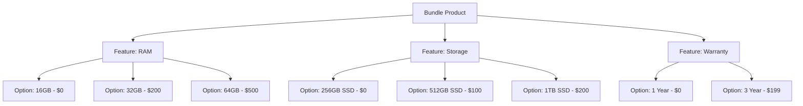
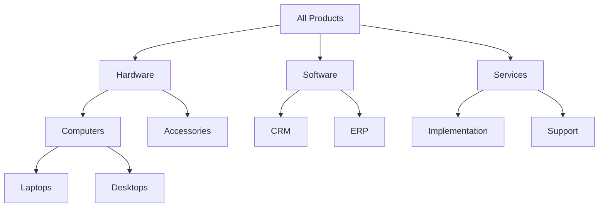

# Module 02: Product Catalog Architecture

## Learning Objectives

By the end of this module, you will:
- Distinguish between STANDALONE and BUNDLE product types
- Understand the Product -> Feature -> Option hierarchy for bundles
- Apply billing frequencies for subscription and one-time products
- Organize products using hierarchical categories

---

## Why Product Architecture Matters

The product catalog is the foundation of CPQ. How you model products determines:
- What customers can purchase
- How products are configured
- How pricing is structured
- What reports you can generate

### Two Fundamental Decisions

When adding any product to your catalog, you must answer:

1. **Is this a simple product or configurable?**
   - STANDALONE: Sold as-is (e.g., "USB Cable")
   - BUNDLE: Requires configuration (e.g., "Custom Laptop")

2. **How is this billed?**
   - ONE_TIME: Single charge (e.g., "Setup Fee")
   - MONTHLY/QUARTERLY/ANNUAL: Recurring (e.g., "Software License")
   - CUSTOM: Non-standard period (e.g., "18-month contract")

---

## Product Types

### STANDALONE Products

**Definition:** Products sold without configuration choices.

**Characteristics:**
- Fixed specifications
- Single SKU
- Can be added directly to quotes
- May still have attributes (for filtering/display)

**Examples:**
- Accessories (cables, adapters)
- Standard licenses
- Professional services (fixed scope)
- Setup fees

### BUNDLE Products

**Definition:** Products requiring configuration through feature/option selection.

**Characteristics:**
- Parent product with $0 base price (typically)
- Features represent configuration "questions"
- Options represent possible "answers"
- Total price = sum of selected option prices

**Examples:**
- Configurable hardware (laptops, servers)
- Software packages (core + add-ons)
- Service bundles (bronze/silver/gold)

---

## The Bundle Hierarchy

Bundles use a three-level hierarchy:



### Level 1: Bundle Product

The container product that customers see in the catalog.

```prisma
model Product {
  id                  String           @id @default(cuid())
  name                String           // "Laptop Pro"
  sku                 String           @unique // "LAPTOP-PRO"
  type                ProductType      // BUNDLE
  billingFrequency    BillingFrequency // ONE_TIME
  features            ProductFeature[] // Configuration options
  // ...
}
```

### Level 2: Features

Features are "questions" that must be answered during configuration.

```prisma
model ProductFeature {
  id         String @id @default(cuid())
  productId  String
  name       String           // "Memory (RAM)"
  minOptions Int    @default(0)  // Minimum selections required
  maxOptions Int    @default(1)  // Maximum selections allowed
  sortOrder  Int    @default(0)  // Display order
  options    ProductOption[]
}
```

**Feature Constraint Examples:**

| minOptions | maxOptions | Behavior |
|------------|------------|----------|
| 0 | 1 | Optional, single select |
| 1 | 1 | Required, single select |
| 0 | 3 | Optional, multi-select (up to 3) |
| 2 | 5 | Required 2-5 selections |

### Level 3: Options

Options are "answers" - typically referencing other standalone products.

```prisma
model ProductOption {
  id              String  @id @default(cuid())
  featureId       String
  optionProductId String  // References another Product!
  isRequired      Boolean @default(false)  // Must include this option
  isDefault       Boolean @default(false)  // Pre-selected
  minQty          Int     @default(1)      // Min quantity
  maxQty          Int     @default(1)      // Max quantity
  sortOrder       Int     @default(0)
}
```

**Key Insight:** Options reference other products. This means:
- Each option has its own SKU and price
- The same component product can be an option in multiple bundles
- Option pricing comes from price book entries

---

## Billing Frequencies

How often a product is charged affects revenue recognition and quote calculations.

```prisma
enum BillingFrequency {
  ONE_TIME    // Single charge
  MONTHLY     // Charged monthly
  QUARTERLY   // Charged every 3 months
  ANNUAL      // Charged yearly
  CUSTOM      // Non-standard (uses customBillingMonths)
}
```

### Impact on Revenue Metrics

| Frequency | MRR Calculation | Example |
|-----------|-----------------|---------|
| ONE_TIME | 0 | $1000 setup = $0 MRR |
| MONTHLY | Price | $100/mo = $100 MRR |
| QUARTERLY | Price / 3 | $300/qtr = $100 MRR |
| ANNUAL | Price / 12 | $1200/yr = $100 MRR |
| CUSTOM | Price / customBillingMonths | $1800/18mo = $100 MRR |

### Custom Billing Example

For a product with non-standard billing:

```typescript
// Product: "18-Month Support Contract"
{
  billingFrequency: "CUSTOM",
  customBillingMonths: 18,
  // If price is $1,800:
  // MRR = $1,800 / 18 = $100
}
```

---

## Product Categories

Categories organize products into a hierarchy for navigation and filtering.



### Category Model

```prisma
model Category {
  id          String    @id @default(cuid())
  name        String
  description String?
  parentId    String?          // Self-reference for hierarchy
  isActive    Boolean   @default(true)
  sortOrder   Int       @default(0)

  parent      Category?  @relation("CategoryHierarchy", fields: [parentId], references: [id])
  children    Category[] @relation("CategoryHierarchy")
  products    ProductCategory[]  // Many-to-many
}
```

### Many-to-Many Relationship

Products can belong to multiple categories:

```prisma
model ProductCategory {
  id         String   @id @default(cuid())
  productId  String
  categoryId String
  createdAt  DateTime @default(now())

  product  Product  @relation(...)
  category Category @relation(...)

  @@unique([productId, categoryId])  // Prevent duplicates
}
```

**Why many-to-many?**
- A laptop might be in "Hardware > Computers" AND "Work From Home" collections
- Promotional bundles might span categories
- Allows flexible merchandising

---

## Data Model: Complete Product Entity

```prisma
model Product {
  id                  String           @id @default(cuid())
  name                String
  description         String?
  sku                 String           @unique
  type                ProductType      @default(STANDALONE)
  billingFrequency    BillingFrequency @default(ONE_TIME)
  customBillingMonths Int?             // For CUSTOM frequency
  defaultTermMonths   Int?             // Default contract length
  isTaxable           Boolean          @default(true)
  isActive            Boolean          @default(true)
  unitOfMeasureId     String?
  createdAt           DateTime         @default(now())

  // Relations
  unitOfMeasure        UnitOfMeasure?
  features             ProductFeature[]     // Bundle configuration
  priceBookEntries     PriceBookEntry[]     // Pricing
  quoteLineItems       QuoteLineItem[]      // Quote history
  categories           ProductCategory[]    // Organization
  attributes           ProductAttribute[]   // Metadata
  contractPriceEntries ContractPriceEntry[] // Special pricing
  affinitiesAsSource   ProductAffinity[]    // Recommendations
  affinitiesAsTarget   ProductAffinity[]
  questionMappings     QuestionProductMapping[]
  recommendationLogs   RecommendationLog[]
}

enum ProductType {
  STANDALONE
  BUNDLE
}
```

---

## Exercise 1: Create Standalone Products

### Step 1: Create Component Products

Go to `/products` and create these products:

| Name | SKU | Type | Billing | Price* |
|------|-----|------|---------|--------|
| RAM 16GB | RAM-16 | STANDALONE | ONE_TIME | $0 |
| RAM 32GB | RAM-32 | STANDALONE | ONE_TIME | $200 |
| RAM 64GB | RAM-64 | STANDALONE | ONE_TIME | $500 |
| SSD 256GB | SSD-256 | STANDALONE | ONE_TIME | $0 |
| SSD 512GB | SSD-512 | STANDALONE | ONE_TIME | $100 |
| SSD 1TB | SSD-1TB | STANDALONE | ONE_TIME | $200 |
| Warranty 1Y | WARR-1Y | STANDALONE | ONE_TIME | $0 |
| Warranty 3Y | WARR-3Y | STANDALONE | ONE_TIME | $199 |

*Note: Prices are set in Price Book Entries (Module 04). For now, just create the products.

### Step 2: Verify Creation

After creating each product:
- Confirm the SKU is unique
- Check the type is STANDALONE
- Note the generated ID

---

## Exercise 2: Create a Bundle Product

### Step 1: Create the Parent Bundle

Create a new product with:
- **Name:** "Laptop Pro Bundle"
- **SKU:** "LAPTOP-PRO"
- **Type:** BUNDLE
- **Billing Frequency:** ONE_TIME

### Step 2: Add Features

Add three features to your bundle:

| Feature Name | Min Options | Max Options |
|--------------|-------------|-------------|
| Memory | 1 | 1 |
| Storage | 1 | 1 |
| Warranty | 0 | 1 |

### Step 3: Add Options to Features

**Memory Feature:**
- RAM 16GB (isDefault: true)
- RAM 32GB
- RAM 64GB

**Storage Feature:**
- SSD 256GB (isDefault: true)
- SSD 512GB
- SSD 1TB

**Warranty Feature:**
- Warranty 1Y (isDefault: true)
- Warranty 3Y

### Step 4: Test Configuration

Try creating a quote with the bundle:
1. Create a new quote
2. Add "Laptop Pro Bundle"
3. Configure the options
4. Observe that defaults are pre-selected
5. Change selections and see the effect

---

## Exercise 3: Organize with Categories

### Step 1: Create Category Hierarchy

Go to `/categories` and create:

1. **Parent:** "Hardware"
2. **Child of Hardware:** "Computers"
3. **Child of Hardware:** "Components"
4. **Parent:** "Services"
5. **Child of Services:** "Warranty Programs"

### Step 2: Assign Products to Categories

Assign your products:

| Product | Categories |
|---------|------------|
| Laptop Pro Bundle | Hardware > Computers |
| RAM 16GB | Hardware > Components |
| RAM 32GB | Hardware > Components |
| RAM 64GB | Hardware > Components |
| SSD 256GB | Hardware > Components |
| SSD 512GB | Hardware > Components |
| SSD 1TB | Hardware > Components |
| Warranty 1Y | Services > Warranty Programs |
| Warranty 3Y | Services > Warranty Programs |

### Step 3: Navigate by Category

Test filtering products by category to ensure correct assignment.

---

## Exercise 4: Subscription Products

### Step 1: Create Recurring Products

Create these subscription products:

| Name | SKU | Type | Billing | Term |
|------|-----|------|---------|------|
| Basic Support | SUPP-BASIC | STANDALONE | MONTHLY | 12 |
| Premium Support | SUPP-PREMIUM | STANDALONE | ANNUAL | 12 |
| Enterprise License | LIC-ENT | STANDALONE | ANNUAL | 36 |

### Step 2: Calculate MRR

When added to a quote (with pricing):
- Basic Support @ $50/month = $50 MRR
- Premium Support @ $1,200/year = $100 MRR
- Enterprise License @ $36,000/year for 36 months = $3,000 MRR

---

## Real-World Patterns

### Hardware Manufacturer Pattern

```
Desktop Workstation (Bundle)
├── Processor (Required, Single Select)
│   ├── Intel i5
│   ├── Intel i7
│   └── Intel i9
├── RAM (Required, Single Select)
│   ├── 8GB
│   ├── 16GB
│   └── 32GB
├── Storage (Required, Multi-Select up to 4)
│   ├── 256GB SSD
│   ├── 512GB SSD
│   └── 1TB HDD
└── Peripherals (Optional, Multi-Select)
    ├── Keyboard
    ├── Mouse
    └── Monitor
```

### SaaS Platform Pattern

```
Enterprise Platform (Bundle)
├── Core Platform (Required)
│   └── Base License (included)
├── User Tier (Required, Single Select)
│   ├── Up to 50 Users
│   ├── Up to 200 Users
│   └── Unlimited Users
├── Modules (Optional, Multi-Select)
│   ├── CRM Module
│   ├── HR Module
│   ├── Finance Module
│   └── Analytics Module
└── Support Level (Required)
    ├── Standard Support
    └── Premium Support
```

---

## Checkpoint Questions

1. **When would you use a BUNDLE vs STANDALONE product?**
   <details>
   <summary>Answer</summary>
   BUNDLE when customers need to make configuration choices (select options). STANDALONE when the product is sold as-is without configuration.
   </details>

2. **What does `minOptions: 1, maxOptions: 1` mean on a feature?**
   <details>
   <summary>Answer</summary>
   Required single selection - the customer must choose exactly one option from this feature.
   </details>

3. **How does an option reference what it sells?**
   <details>
   <summary>Answer</summary>
   Through `optionProductId` - each option points to another Product record, which has its own SKU and pricing.
   </details>

4. **Why is the product-category relationship many-to-many?**
   <details>
   <summary>Answer</summary>
   A product can belong to multiple categories (e.g., "Hardware" AND "Work From Home"), allowing flexible merchandising.
   </details>

5. **How is MRR calculated for an ANNUAL product priced at $2,400/year?**
   <details>
   <summary>Answer</summary>
   MRR = Annual Price / 12 = $2,400 / 12 = $200
   </details>

---

## Key Takeaways

1. **Two product types serve different needs** - STANDALONE for simple, BUNDLE for configurable
2. **Bundle hierarchy is Product -> Feature -> Option** - Options reference other products
3. **Feature constraints control configuration** - minOptions/maxOptions enforce business rules
4. **Billing frequency affects revenue metrics** - Critical for subscription businesses
5. **Categories enable organization** - Hierarchical structure with many-to-many product links

---

## Code References

| File | Content |
|------|---------|
| [prisma/schema.prisma](../../prisma/schema.prisma) | Product, ProductFeature, ProductOption, Category models |
| [app/pages/products/](../../app/pages/products/) | Product management UI |
| [app/pages/categories/](../../app/pages/categories/) | Category management UI |

---

## Next Steps

Now that you can create and organize products, the next module covers the flexible attribute system that extends product data without schema changes.

**Next:** [Module 03: Flexible Attribute System](03-attribute-system.md)
