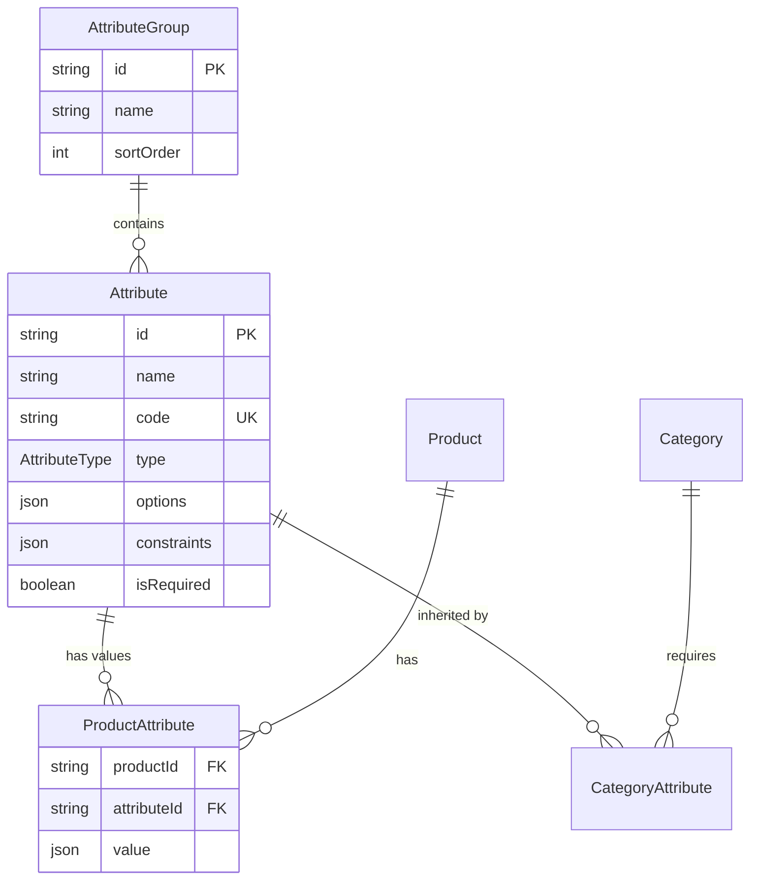
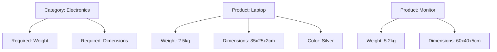

# Module 03: Flexible Attribute System

## Learning Objectives

By the end of this module, you will:
- Design custom attributes for product metadata
- Understand the five attribute types and their constraints
- Organize attributes into logical groups
- Apply category-level attribute inheritance

---

## Why Attributes Matter

Products often need metadata beyond the fixed schema fields. Consider:

| Need | Fixed Schema Solution | Problem |
|------|----------------------|---------|
| Product weight | Add `weight` column | Schema change required |
| Color options | Add `color` column | What about products without colors? |
| Warranty period | Add `warrantyMonths` | Not all products have warranties |
| Industry certifications | Add `certifications` column | Which certifications? How many? |

**Attributes solve this** by providing a flexible key-value system that:
- Extends data without schema changes
- Supports different data types
- Enables filtering and search
- Groups related information

---

## Attribute Architecture



---

## Attribute Types

The system supports five attribute types:

### 1. TEXT

**Purpose:** Free-form string values

**Constraints:**
```json
{
  "minLength": 0,
  "maxLength": 500,
  "pattern": "^[A-Z0-9-]+$"  // Optional regex
}
```

**Use Cases:**
- Description overrides
- Model numbers
- Serial number patterns
- Free-text notes

**Example:**
```json
{
  "name": "Model Number",
  "code": "model_number",
  "type": "TEXT",
  "constraints": { "maxLength": 50 }
}
```

### 2. NUMBER

**Purpose:** Numeric values (integers or decimals)

**Constraints:**
```json
{
  "min": 0,
  "max": 1000,
  "step": 0.1  // For decimal precision
}
```

**Use Cases:**
- Weight, dimensions
- Power consumption
- Performance metrics
- Minimum order quantities

**Example:**
```json
{
  "name": "Weight (kg)",
  "code": "weight_kg",
  "type": "NUMBER",
  "constraints": { "min": 0, "max": 100, "step": 0.01 }
}
```

### 3. BOOLEAN

**Purpose:** True/false flags

**Constraints:** None (inherently true/false)

**Use Cases:**
- Feature availability flags
- Certification status
- Compliance indicators

**Example:**
```json
{
  "name": "Energy Star Certified",
  "code": "energy_star",
  "type": "BOOLEAN"
}
```

### 4. SELECT

**Purpose:** Single choice from predefined options

**Options Structure:**
```json
{
  "options": [
    { "label": "Red", "value": "red" },
    { "label": "Blue", "value": "blue" },
    { "label": "Green", "value": "green" }
  ]
}
```

**Use Cases:**
- Color selection
- Size categories
- Condition (New/Refurbished)
- Region restrictions

**Example:**
```json
{
  "name": "Color",
  "code": "color",
  "type": "SELECT",
  "options": [
    { "label": "Silver", "value": "silver" },
    { "label": "Space Gray", "value": "space_gray" },
    { "label": "Gold", "value": "gold" }
  ]
}
```

### 5. DATE

**Purpose:** Calendar date values

**Constraints:**
```json
{
  "minDate": "2020-01-01",
  "maxDate": "2030-12-31"
}
```

**Use Cases:**
- Release date
- End-of-life date
- Certification expiry

**Example:**
```json
{
  "name": "Release Date",
  "code": "release_date",
  "type": "DATE",
  "constraints": { "minDate": "2020-01-01" }
}
```

---

## Attribute Groups

Groups organize related attributes for better UX.

```prisma
model AttributeGroup {
  id        String   @id @default(cuid())
  name      String
  sortOrder Int      @default(0)
  createdAt DateTime @default(now())
  updatedAt DateTime @updatedAt

  attributes Attribute[]
}
```

### Example Groups

| Group | Attributes |
|-------|------------|
| **Physical Specs** | Weight, Width, Height, Depth, Color |
| **Technical Specs** | Processor, RAM Type, Storage Type |
| **Compliance** | Energy Star, FCC, CE Mark, RoHS |
| **Marketing** | Release Date, Target Audience, Use Cases |

### Display Order

Groups and attributes both have `sortOrder` for controlling display:

```
Physical Specs (sortOrder: 1)
├── Weight (sortOrder: 1)
├── Width (sortOrder: 2)
├── Height (sortOrder: 3)
└── Depth (sortOrder: 4)

Technical Specs (sortOrder: 2)
├── Processor Type (sortOrder: 1)
├── RAM Type (sortOrder: 2)
└── Storage Interface (sortOrder: 3)
```

---

## Product Attributes (Values)

When an attribute value is assigned to a product:

```prisma
model ProductAttribute {
  id          String   @id @default(cuid())
  productId   String
  attributeId String
  value       Json     // Stores value based on type
  createdAt   DateTime @default(now())
  updatedAt   DateTime @updatedAt

  @@unique([productId, attributeId])  // One value per product per attribute
}
```

### Value Storage by Type

| Type | JSON Value | Example |
|------|------------|---------|
| TEXT | `"string value"` | `"ABC-12345"` |
| NUMBER | `123.45` | `2.5` |
| BOOLEAN | `true` or `false` | `true` |
| SELECT | `"option_value"` | `"silver"` |
| DATE | `"YYYY-MM-DD"` | `"2024-06-15"` |

---

## Category Attributes (Inheritance)

Categories can require certain attributes for all their products.

```prisma
model CategoryAttribute {
  id         String   @id @default(cuid())
  categoryId String
  attributeId String
  createdAt  DateTime @default(now())

  category  Category  @relation(...)
  attribute Attribute @relation(...)

  @@unique([categoryId, attributeId])
}
```

### How Inheritance Works



**When a product is in the "Electronics" category:**
- It MUST have "Weight" and "Dimensions" attributes (from category)
- It CAN have additional attributes like "Color"

---

## Data Model Deep Dive

### Complete Attribute Model

```prisma
model Attribute {
  id          String        @id @default(cuid())
  name        String        // Display name: "Weight (kg)"
  code        String        @unique  // System identifier: "weight_kg"
  type        AttributeType
  groupId     String?       // Optional group assignment
  options     Json?         // For SELECT: [{ label, value }]
  constraints Json?         // Type-specific validation rules
  isRequired  Boolean       @default(false)
  sortOrder   Int           @default(0)
  createdAt   DateTime      @default(now())
  updatedAt   DateTime      @updatedAt

  group              AttributeGroup?
  productAttributes  ProductAttribute[]
  categoryAttributes CategoryAttribute[]
}

enum AttributeType {
  TEXT
  NUMBER
  BOOLEAN
  SELECT
  DATE
}
```

### Why Code is Unique

The `code` field serves as a stable identifier:
- Used in API calls: `GET /products?filter[weight_kg_gt]=2`
- Used in rules: `condition: { field: "attributes.weight_kg", op: "gt", value: 5 }`
- Survives name changes: Rename "Weight (kg)" to "Weight (kilograms)" without breaking integrations

---

## Exercise 1: Create Attribute Groups

### Step 1: Navigate to Attributes

Go to `/attributes` in the PoC application.

### Step 2: Create Groups

Create these attribute groups:

| Name | Sort Order |
|------|------------|
| Physical Specifications | 1 |
| Technical Specifications | 2 |
| Compliance & Certifications | 3 |

---

## Exercise 2: Create Various Attribute Types

### Step 1: Physical Specifications Group

Create these attributes in the Physical Specifications group:

| Name | Code | Type | Constraints |
|------|------|------|-------------|
| Weight (kg) | weight_kg | NUMBER | min: 0, max: 100, step: 0.01 |
| Width (cm) | width_cm | NUMBER | min: 0, max: 500 |
| Height (cm) | height_cm | NUMBER | min: 0, max: 500 |
| Color | color | SELECT | Silver, Space Gray, Black, White |

### Step 2: Technical Specifications Group

| Name | Code | Type | Constraints |
|------|------|------|-------------|
| Processor Type | processor_type | SELECT | Intel i5, Intel i7, Intel i9, AMD Ryzen 5, AMD Ryzen 7 |
| RAM Type | ram_type | SELECT | DDR4, DDR5 |

### Step 3: Compliance Group

| Name | Code | Type | Required |
|------|------|------|----------|
| Energy Star Certified | energy_star | BOOLEAN | No |
| FCC Compliant | fcc_compliant | BOOLEAN | No |
| Release Date | release_date | DATE | No |

---

## Exercise 3: Assign Attributes to Products

### Step 1: Open a Product

Go to `/products` and edit one of your laptop components.

### Step 2: Set Attribute Values

For "RAM 32GB":
- Weight (kg): 0.01
- RAM Type: DDR5

For "Laptop Pro Bundle":
- Weight (kg): 2.5
- Width (cm): 35
- Height (cm): 2
- Color: Silver
- Processor Type: Intel i7

### Step 3: Verify Values

Reload the product and confirm values are saved correctly.

---

## Exercise 4: Category Attribute Inheritance

### Step 1: Assign Attributes to Category

Go to `/categories` and edit "Computers".

Add required attributes:
- Weight (kg)
- Width (cm)
- Height (cm)

### Step 2: Create New Product in Category

Create a new product:
- Name: "Desktop Basic"
- SKU: "DESKTOP-BASIC"
- Category: Hardware > Computers

### Step 3: Observe Required Attributes

When editing the product, the category-inherited attributes should be highlighted or enforced.

---

## Real-World Patterns

### E-commerce Filtering

```
Filter by:
□ Color
  ☑ Silver (23)
  ☐ Black (18)
  ☐ White (12)

□ Weight
  ☐ Under 1kg (8)
  ☑ 1-2kg (15)
  ☐ Over 2kg (30)

□ Energy Star
  ☑ Certified only (25)
```

### Product Comparison

| Attribute | Laptop A | Laptop B | Laptop C |
|-----------|----------|----------|----------|
| Weight | 1.2 kg | 1.8 kg | 2.1 kg |
| Processor | Intel i5 | Intel i7 | Intel i9 |
| Energy Star | Yes | Yes | No |
| Color | Silver | Space Gray | Black |

### Integration with Rules

```typescript
// Rule: Heavy products require special shipping
{
  condition: {
    field: "productAttributes.weight_kg",
    op: "gte",
    value: 20
  },
  action: {
    type: "REQUIRE_PRODUCT",
    productSku: "SHIPPING-FREIGHT"
  }
}
```

---

## Checkpoint Questions

1. **Why use attributes instead of adding columns to the Product table?**
   <details>
   <summary>Answer</summary>
   Attributes allow extending product data without schema migrations, support varying metadata across product types, and enable dynamic filtering/search capabilities.
   </details>

2. **What's the purpose of the `code` field being unique?**
   <details>
   <summary>Answer</summary>
   The code provides a stable identifier for API calls, rules, and integrations that survives display name changes.
   </details>

3. **How would you model a multi-select attribute (e.g., multiple colors)?**
   <details>
   <summary>Answer</summary>
   The current model uses SELECT for single choice. For multi-select, you could store an array in the value JSON, or create multiple ProductAttribute records for the same attribute.
   </details>

4. **What happens when a category requires an attribute that a product doesn't have?**
   <details>
   <summary>Answer</summary>
   The validation should flag the missing required attribute. The product should provide a value before being considered complete.
   </details>

5. **How would you store a NUMBER attribute value of 3.14159?**
   <details>
   <summary>Answer</summary>
   As JSON: `3.14159` (not a string). The value field is JSON type, so it stores the native number.
   </details>

---

## Key Takeaways

1. **Five types cover most needs** - TEXT, NUMBER, BOOLEAN, SELECT, DATE handle common metadata
2. **Groups organize for UX** - Logical groupings improve product editing experience
3. **Codes enable stability** - System identifiers survive name changes
4. **Category inheritance scales** - Set once at category, apply to all products
5. **JSON storage is flexible** - Type-specific values stored in a single field

---

## Code References

| File | Content |
|------|---------|
| [prisma/schema.prisma](../../prisma/schema.prisma) | Attribute, AttributeGroup, ProductAttribute models |
| [app/pages/attributes/](../../app/pages/attributes/) | Attribute management UI |
| [app/composables/useAttributes.ts](../../app/composables/useAttributes.ts) | Attribute business logic |

---

## Next Steps

With products and their attributes defined, the next module covers how to price them using Price Books.

**Next:** [Module 04: Price Book Architecture](04-price-books.md)
