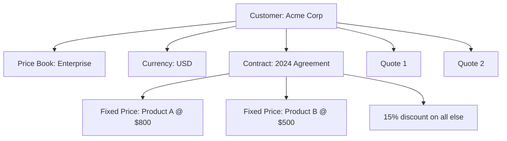
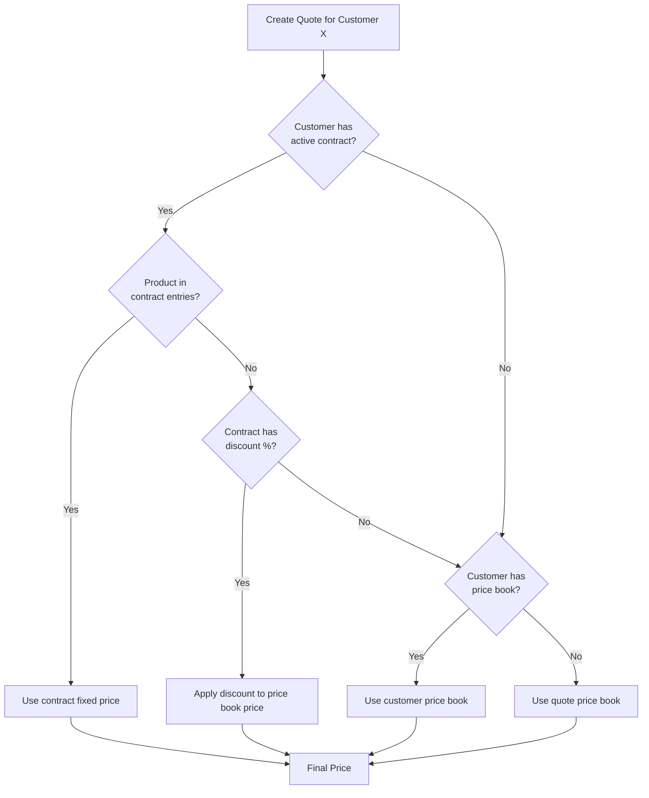
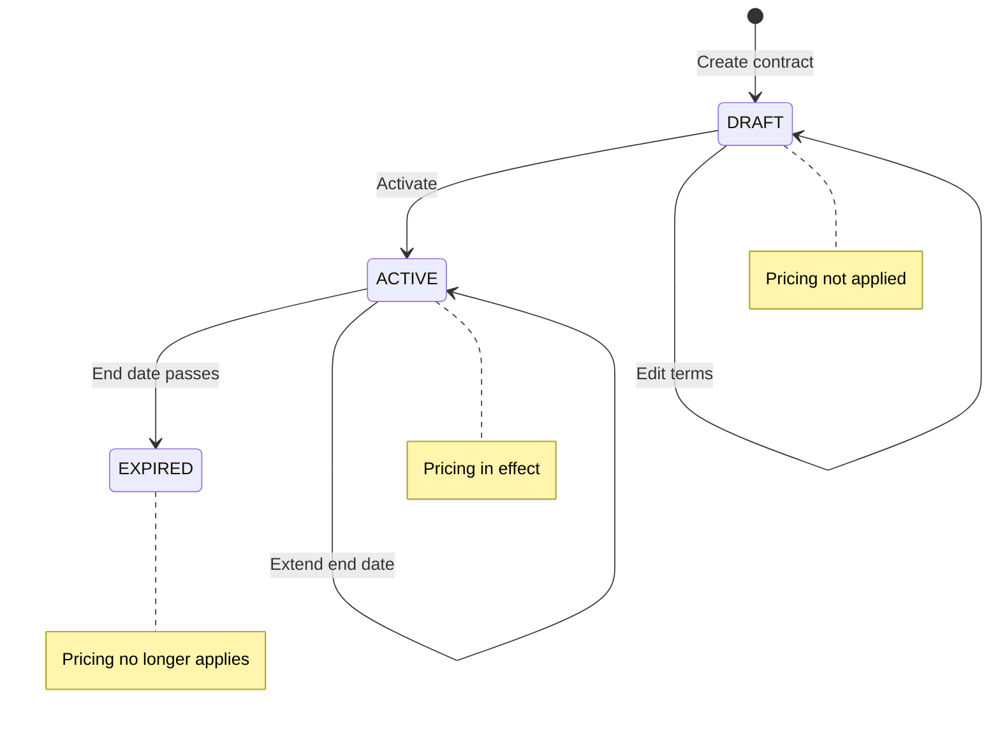
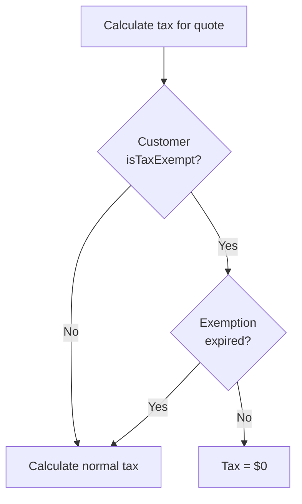
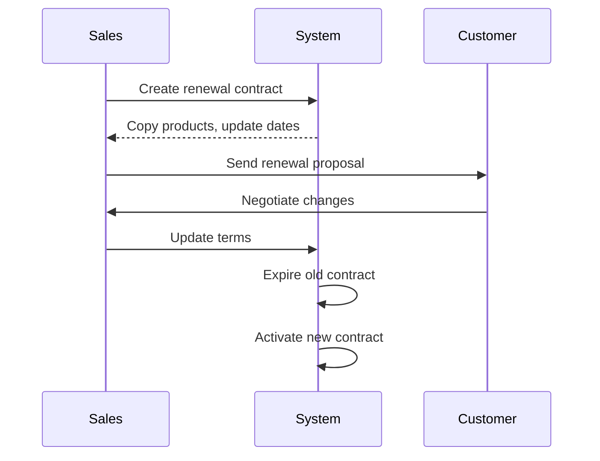

# Module 05: Customers & Contract Management

## Learning Objectives

By the end of this module, you will:
- Model customer relationships with price book and currency assignments
- Implement contract-based fixed pricing
- Apply contract percentage discounts
- Handle tax exemptions for eligible customers

---

## Customer-Centric Pricing

In B2B sales, pricing is often customer-specific. CPQ systems support this through:

1. **Price Book Assignment** - Customer gets specific price list
2. **Contracts** - Negotiated fixed prices for specific products
3. **Currency Preference** - Customer's preferred transaction currency
4. **Tax Exemptions** - Government, non-profit, reseller exemptions

---

## Customer Data Model

```prisma
model Customer {
  id                   String    @id @default(cuid())
  name                 String
  email                String?
  phone                String?
  company              String?
  // Address fields
  street               String?
  city                 String?
  state                String?
  postalCode           String?
  country              String?
  // Pricing assignments
  priceBookId          String?   // Assigned price book
  currencyId           String?   // Preferred currency
  // Tax exemption
  isTaxExempt          Boolean   @default(false)
  taxExemptReason      String?
  taxExemptCertificate String?
  taxExemptExpiry      DateTime?
  // Status
  isActive             Boolean   @default(true)
  createdAt            DateTime  @default(now())
  updatedAt            DateTime  @updatedAt

  priceBook PriceBook?
  currency  Currency?
  quotes    Quote[]
  contracts Contract[]
}
```

### Customer-Pricing Relationship



---

## Price Resolution with Customers

When creating a quote for a customer:



---

## Contract Model

Contracts represent negotiated pricing agreements.

```prisma
model Contract {
  id              String         @id @default(cuid())
  name            String
  customerId      String
  startDate       DateTime
  endDate         DateTime
  status          ContractStatus @default(DRAFT)
  discountPercent Decimal?       @db.Decimal(5, 2)
  createdAt       DateTime       @default(now())
  updatedAt       DateTime       @updatedAt

  customer     Customer
  priceEntries ContractPriceEntry[]

  @@index([customerId])
  @@index([status])
}

enum ContractStatus {
  DRAFT     // Being negotiated
  ACTIVE    // In effect
  EXPIRED   // Past end date
}
```

### Contract Pricing Mechanisms

Contracts offer two pricing mechanisms:

#### 1. Fixed Price Entries

Specific products have negotiated fixed prices:

```prisma
model ContractPriceEntry {
  id         String  @id @default(cuid())
  contractId String
  productId  String
  fixedPrice Decimal @db.Decimal(10, 2)

  @@unique([contractId, productId])
}
```

**Example:**
- Product "Enterprise License" normally $10,000
- Contract entry sets fixedPrice to $7,500
- Customer always pays $7,500 for this product

#### 2. Blanket Discount Percent

All products get a percentage discount:

```typescript
// Contract with 15% blanket discount
{
  discountPercent: 15.00
}

// Product priced at $1,000 in price book
// Contract price = $1,000 × (1 - 0.15) = $850
```

### Combining Both Mechanisms

When a contract has both:

1. **Fixed price entries** take precedence for those specific products
2. **Blanket discount** applies to all other products

**Example:**
```
Contract for Acme Corp:
- Fixed: Product A at $800 (list $1,000)
- Fixed: Product B at $500 (list $700)
- Blanket: 15% off everything else

Quote line items:
- Product A: $800 (fixed price)
- Product B: $500 (fixed price)
- Product C: $425 (list $500 × 0.85)
- Product D: $1,275 (list $1,500 × 0.85)
```

---

## Contract Status Lifecycle



### Status Rules

| Status | Pricing Applied? | Can Edit? |
|--------|------------------|-----------|
| DRAFT | No | Yes |
| ACTIVE | Yes (if date valid) | Limited |
| EXPIRED | No | No |

### Date Validation

A contract's pricing only applies when:
1. Status is `ACTIVE`
2. Current date is between `startDate` and `endDate`

```typescript
function isContractValid(contract: Contract): boolean {
  const now = new Date();
  return (
    contract.status === 'ACTIVE' &&
    now >= contract.startDate &&
    now <= contract.endDate
  );
}
```

---

## Tax Exemption Handling

Certain customers are exempt from sales tax:

### Exemption Fields

| Field | Purpose |
|-------|---------|
| `isTaxExempt` | Master flag |
| `taxExemptReason` | "Government", "Non-Profit", "Reseller" |
| `taxExemptCertificate` | Certificate number/URL |
| `taxExemptExpiry` | When exemption expires |

### Tax Exemption Flow



### Common Exemption Types

| Type | Certificate | Expiration |
|------|-------------|------------|
| Government | Not required | Never |
| Non-Profit | 501(c)(3) letter | 3 years |
| Reseller | Resale certificate | 1-4 years |
| Export | Export license | Per shipment |

---

## Exercise 1: Create Customers

### Step 1: Navigate to Customers

Go to `/customers` in the PoC application.

### Step 2: Create Retail Customer

- **Name:** "John Smith"
- **Email:** "john@example.com"
- **Company:** Leave blank
- **Price Book:** (none - will use default)
- **Tax Exempt:** No

### Step 3: Create Enterprise Customer

- **Name:** "Acme Corporation"
- **Email:** "purchasing@acme.com"
- **Company:** "Acme Corp"
- **Address:** 123 Business Ave, San Francisco, CA 94102
- **Price Book:** "Partner 2024" (from Module 04)
- **Tax Exempt:** No

### Step 4: Create Tax-Exempt Customer

- **Name:** "State University"
- **Email:** "procurement@stateuniv.edu"
- **Company:** "State University"
- **Price Book:** (none)
- **Tax Exempt:** Yes
- **Reason:** "Educational Institution"
- **Certificate:** "EDU-2024-12345"
- **Expiry:** December 31, 2025

---

## Exercise 2: Create a Contract

### Step 1: Navigate to Contracts

Go to `/contracts` in the PoC application.

### Step 2: Create Contract for Acme Corp

- **Name:** "Acme Corp 2024 Agreement"
- **Customer:** Acme Corporation
- **Start Date:** January 1, 2024
- **End Date:** December 31, 2024
- **Status:** DRAFT (start here)
- **Blanket Discount:** 15%

### Step 3: Add Fixed Price Entries

Add contract prices for specific products:

| Product | List Price | Contract Price | Savings |
|---------|------------|----------------|---------|
| RAM 64GB | $500 | $400 | $100 |
| SSD 1TB | $200 | $150 | $50 |
| Warranty 3Y | $199 | $149 | $50 |

### Step 4: Activate the Contract

Change status from DRAFT to ACTIVE.

---

## Exercise 3: Test Contract Pricing

### Step 1: Create Quote for Acme

1. Create a new quote
2. Select "Acme Corporation" as customer
3. Use any price book (contract overrides)

### Step 2: Add Products

Add these products and observe pricing:

| Product | Expected Price | Source |
|---------|----------------|--------|
| RAM 64GB | $400 | Contract fixed price |
| SSD 1TB | $150 | Contract fixed price |
| RAM 32GB | $136 | Partner price × 0.85 |
| SSD 512GB | $68 | Partner price × 0.85 |

### Step 3: Verify Contract Priority

Note that:
- Products with contract entries use fixed prices
- Other products use price book price minus blanket discount

---

## Exercise 4: Test Tax Exemption

### Step 1: Create Quote for Tax-Exempt Customer

1. Create a new quote
2. Select "State University" as customer
3. Add products with significant value

### Step 2: Observe Tax Calculation

- Tax amount should be $0
- Tax breakdown should indicate exemption

### Step 3: Compare with Taxable Customer

Create same quote for "John Smith" and compare the tax amount.

---

## Real-World Patterns

### Enterprise Contract Structure

```
Master Service Agreement (MSA)
├── Term: 3 years
├── Blanket Discount: 20%
├── Support SLA: Premium
│
└── Product Schedules (renewed annually)
    ├── Schedule A: Software Licenses
    │   └── Fixed prices for core products
    ├── Schedule B: Professional Services
    │   └── Fixed hourly rates
    └── Schedule C: Hardware
        └── Discount from list price
```

### Contract Renewal Flow



### Customer Hierarchy (Advanced)

In complex organizations:

```
Parent: Acme Holdings Inc.
├── Child: Acme Manufacturing
│   └── Uses manufacturing price book
├── Child: Acme Services
│   └── Uses services price book
└── Child: Acme International
    └── Uses EMEA price book + EUR currency
```

---

## Checkpoint Questions

1. **What's the difference between customer price book assignment and a contract?**
   <details>
   <summary>Answer</summary>
   Price book assignment gives the customer access to a specific price list. A contract provides negotiated fixed prices for specific products and/or a blanket discount that overrides the price book.
   </details>

2. **When does contract pricing apply to a quote?**
   <details>
   <summary>Answer</summary>
   When: (1) customer has a contract, (2) contract status is ACTIVE, (3) current date is between startDate and endDate.
   </details>

3. **If a contract has both fixed prices and a blanket discount, which applies?**
   <details>
   <summary>Answer</summary>
   Fixed price entries apply to those specific products. Blanket discount applies to all other products not in the fixed price entries.
   </details>

4. **What happens when a tax exemption expires?**
   <details>
   <summary>Answer</summary>
   The system should check taxExemptExpiry and calculate normal tax if the exemption has expired, even if isTaxExempt is still true.
   </details>

5. **Why index contracts by status in the database?**
   <details>
   <summary>Answer</summary>
   To efficiently query active contracts when resolving prices. The system frequently needs to find "all active contracts for customer X."
   </details>

---

## Key Takeaways

1. **Customers centralize B2B relationships** - Price book, currency, tax status
2. **Contracts override price books** - Fixed prices and blanket discounts
3. **Contract status controls applicability** - Only ACTIVE contracts with valid dates
4. **Tax exemptions require tracking** - Certificate and expiration management
5. **Price resolution has clear priority** - Contract → Customer Book → Quote Book → Default

---

## Code References

| File | Content |
|------|---------|
| [prisma/schema.prisma](../../prisma/schema.prisma) | Customer, Contract, ContractPriceEntry models |
| [app/pages/customers/](../../app/pages/customers/) | Customer management UI |
| [app/pages/contracts/](../../app/pages/contracts/) | Contract management UI |
| [app/composables/useCustomers.ts](../../app/composables/useCustomers.ts) | Customer business logic |
| [app/composables/useContracts.ts](../../app/composables/useContracts.ts) | Contract business logic |

---

## Next Steps

Now that you understand how customers and contracts affect pricing, the next module covers building quotes with line items and understanding the complete pricing calculation.

**Next:** [Module 06: Quote Building & Line Items](06-quote-building.md)
