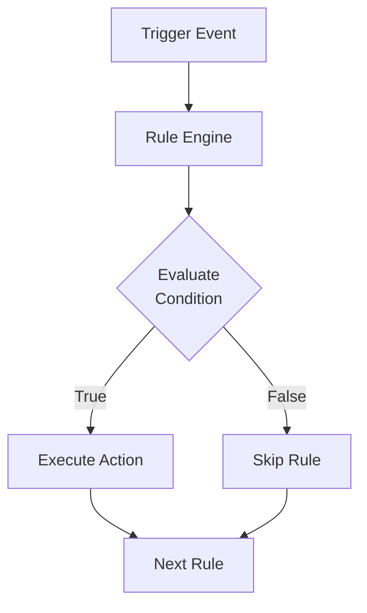

# Module 08: Rules Engine

## Learning Objectives

By the end of this module, you will:
- Design configuration validation rules
- Implement pricing adjustment rules
- Understand rule triggers and priority
- Create approval workflow triggers with rules

---

## Why Rules Matter

CPQ systems encode business logic that would otherwise live in:
- Sales rep memory ("GPU always needs 750W PSU")
- Spreadsheets ("Discount > 20% needs manager approval")
- Manual processes ("Add warranty when laptop ordered")

Rules automate and enforce this knowledge.

---

## Rule Architecture



---

## Rule Model

```prisma
model Rule {
  id          String      @id @default(cuid())
  name        String
  description String?
  type        RuleType
  trigger     RuleTrigger
  priority    Int         @default(100)
  condition   Json        // Condition expression
  action      Json        // Action to execute
  isActive    Boolean     @default(true)
  createdAt   DateTime    @default(now())
  updatedAt   DateTime    @updatedAt
}

enum RuleType {
  CONFIGURATION   // Product validity rules
  PRICING         // Price adjustments
}

enum RuleTrigger {
  ON_PRODUCT_ADD      // When product added to quote
  ON_QUANTITY_CHANGE  // When quantity modified
  ON_QUOTE_SAVE       // When quote is saved
  ON_FINALIZE         // When quote is submitted
}
```

---

## Rule Types

### CONFIGURATION Rules

Validate product combinations and configurations.

**Actions:**
- `REQUIRE_PRODUCT` - Another product must be added
- `EXCLUDE_PRODUCT` - Product cannot be added
- `REQUIRE_OPTION` - Bundle option is mandatory
- `EXCLUDE_OPTION` - Bundle option is prohibited
- `SHOW_WARNING` - Display warning message

**Examples:**
- "Gaming GPU requires 750W+ PSU"
- "Enterprise License includes Premium Support"
- "Cloud and On-Premise cannot be selected together"

### PRICING Rules

Modify pricing or trigger approval.

**Actions:**
- `APPLY_DISCOUNT` - Add discount percentage
- `APPLY_MARKUP` - Add markup percentage
- `SET_PRICE` - Override price
- `REQUIRE_APPROVAL` - Flag for manager review

**Examples:**
- "Bulk orders (100+) get automatic 15% discount"
- "Quotes over $50,000 require VP approval"
- "Government customers get special pricing"

---

## Rule Triggers

### ON_PRODUCT_ADD

Fires when a product is added to a quote.

**Use Cases:**
- Validate compatibility with existing products
- Auto-add required accessories
- Show upsell suggestions

### ON_QUANTITY_CHANGE

Fires when line item quantity is modified.

**Use Cases:**
- Volume-based rule evaluation
- Minimum quantity enforcement
- Inventory availability check

### ON_QUOTE_SAVE

Fires when quote is saved (draft updates).

**Use Cases:**
- Total value validations
- Margin calculations
- Consistency checks

### ON_FINALIZE

Fires when quote is submitted for approval/customer.

**Use Cases:**
- Final validation before sending
- Approval routing logic
- Audit trail creation

---

## Condition Expressions

Conditions use a JSON expression language:

```typescript
interface ConditionExpression {
  // Simple comparison
  field?: string;          // e.g., "product.sku", "lineItem.quantity"
  op?: ConditionOperator;  // Comparison operator
  value?: any;             // Value to compare against

  // Logical grouping
  operator?: 'and' | 'or' | 'not';
  conditions?: ConditionExpression[];
}

type ConditionOperator =
  | 'eq'       // equals
  | 'neq'      // not equals
  | 'gt'       // greater than
  | 'lt'       // less than
  | 'gte'      // greater than or equal
  | 'lte'      // less than or equal
  | 'contains' // string contains
  | 'in';      // value in array
```

### Example Conditions

**Simple comparison:**
```json
{
  "field": "product.sku",
  "op": "eq",
  "value": "GPU-GAMING"
}
```

**AND condition:**
```json
{
  "operator": "and",
  "conditions": [
    { "field": "product.type", "op": "eq", "value": "BUNDLE" },
    { "field": "lineItem.quantity", "op": "gte", "value": 10 }
  ]
}
```

**OR condition:**
```json
{
  "operator": "or",
  "conditions": [
    { "field": "product.categoryId", "op": "eq", "value": "cat_electronics" },
    { "field": "product.categoryId", "op": "eq", "value": "cat_computers" }
  ]
}
```

**Nested condition:**
```json
{
  "operator": "and",
  "conditions": [
    { "field": "quote.total", "op": "gt", "value": 10000 },
    {
      "operator": "or",
      "conditions": [
        { "field": "customer.type", "op": "eq", "value": "NEW" },
        { "field": "discountPercent", "op": "gt", "value": 20 }
      ]
    }
  ]
}
```

---

## Action Expressions

Actions define what happens when the rule fires:

```typescript
interface RuleAction {
  type: ActionType;
  // Type-specific properties
  productSku?: string;
  optionId?: string;
  message?: string;
  discountPercent?: number;
  markupPercent?: number;
  fixedPrice?: number;
  approvalReason?: string;
}

type ActionType =
  | 'REQUIRE_PRODUCT'
  | 'EXCLUDE_PRODUCT'
  | 'REQUIRE_OPTION'
  | 'EXCLUDE_OPTION'
  | 'SHOW_WARNING'
  | 'APPLY_DISCOUNT'
  | 'APPLY_MARKUP'
  | 'SET_PRICE'
  | 'REQUIRE_APPROVAL';
```

### Example Actions

**Require product:**
```json
{
  "type": "REQUIRE_PRODUCT",
  "productSku": "PSU-750W",
  "message": "Gaming GPU requires 750W Power Supply"
}
```

**Apply discount:**
```json
{
  "type": "APPLY_DISCOUNT",
  "discountPercent": 15,
  "message": "Bulk order discount applied"
}
```

**Require approval:**
```json
{
  "type": "REQUIRE_APPROVAL",
  "approvalReason": "Quote exceeds $50,000 threshold"
}
```

---

## Rule Priority

Rules are evaluated in priority order (lower = higher priority).

```prisma
priority    Int         @default(100)
```

**Why it matters:**
- Configuration rules should fire before pricing rules
- Stricter rules should evaluate before lenient ones
- Approval rules should be last (after all calculations)

**Typical Priority Scheme:**

| Priority Range | Rule Type |
|----------------|-----------|
| 1-20 | Critical configuration |
| 21-50 | Standard configuration |
| 51-80 | Pricing adjustments |
| 81-100 | Approval rules |

---

## Exercise 1: Create Configuration Rule

### Step 1: Navigate to Rules

Go to `/rules` in the PoC application.

### Step 2: Create "GPU Requires PSU" Rule

- **Name:** "Gaming GPU Requires 750W PSU"
- **Type:** CONFIGURATION
- **Trigger:** ON_PRODUCT_ADD
- **Priority:** 10

**Condition:**
```json
{
  "field": "product.sku",
  "op": "eq",
  "value": "GPU-GAMING"
}
```

**Action:**
```json
{
  "type": "REQUIRE_PRODUCT",
  "productSku": "PSU-750W",
  "message": "Gaming GPU requires 750W Power Supply"
}
```

### Step 3: Test the Rule

1. Create a quote
2. Add a product with SKU "GPU-GAMING"
3. Observe the warning/requirement message

---

## Exercise 2: Create Pricing Rule

### Step 1: Create "Large Order Discount" Rule

- **Name:** "Automatic Bulk Discount"
- **Type:** PRICING
- **Trigger:** ON_QUANTITY_CHANGE
- **Priority:** 60

**Condition:**
```json
{
  "field": "lineItem.quantity",
  "op": "gte",
  "value": 100
}
```

**Action:**
```json
{
  "type": "APPLY_DISCOUNT",
  "discountPercent": 15,
  "message": "Bulk order discount (100+ units)"
}
```

### Step 2: Test in Quote

1. Create a quote
2. Add any product with quantity 50
3. Increase quantity to 100
4. Observe discount application

---

## Exercise 3: Create Approval Rule

### Step 1: Create "High Value Approval" Rule

- **Name:** "Manager Approval for Large Quotes"
- **Type:** PRICING
- **Trigger:** ON_QUOTE_SAVE
- **Priority:** 90

**Condition:**
```json
{
  "field": "quote.total",
  "op": "gt",
  "value": 50000
}
```

**Action:**
```json
{
  "type": "REQUIRE_APPROVAL",
  "approvalReason": "Quote total exceeds $50,000"
}
```

### Step 2: Test the Rule

1. Create a quote with total under $50,000
2. Save - should not require approval
3. Add products to exceed $50,000
4. Save - should flag for approval

---

## Exercise 4: Complex Rule with AND Condition

### Step 1: Create "New Customer Large Order" Rule

- **Name:** "New Customer Special Approval"
- **Type:** PRICING
- **Trigger:** ON_FINALIZE
- **Priority:** 85

**Condition:**
```json
{
  "operator": "and",
  "conditions": [
    { "field": "customer.isNew", "op": "eq", "value": true },
    { "field": "quote.total", "op": "gt", "value": 25000 }
  ]
}
```

**Action:**
```json
{
  "type": "REQUIRE_APPROVAL",
  "approvalReason": "New customer order over $25,000 requires credit check"
}
```

---

## Real-World Rule Patterns

### Product Compatibility Matrix

```
When adding Product A:
├── Requires: Product B OR Product C
├── Excludes: Product D
└── Warning: "Consider adding Product E for best results"
```

### Approval Routing

```
Quote Value         Approver
< $10,000          Auto-approve
$10,000 - $50,000  Sales Manager
$50,000 - $100,000 Director
> $100,000         VP of Sales
```

### Pricing Guardrails

```
Margin Check:
├── If margin < 15%: Block quote
├── If margin < 25%: Require approval
├── If margin < 35%: Show warning
└── If margin >= 35%: Auto-approve
```

---

## Checkpoint Questions

1. **What's the difference between CONFIGURATION and PRICING rules?**
   <details>
   <summary>Answer</summary>
   CONFIGURATION validates product combinations (require/exclude products). PRICING modifies prices or triggers approval.
   </details>

2. **When would ON_FINALIZE trigger instead of ON_QUOTE_SAVE?**
   <details>
   <summary>Answer</summary>
   ON_QUOTE_SAVE fires on every save (draft updates). ON_FINALIZE fires only when submitting for approval/customer - used for final validation.
   </details>

3. **How do you create an "AND" condition between two checks?**
   <details>
   <summary>Answer</summary>
   Use `operator: "and"` with a `conditions` array containing the individual comparisons.
   </details>

4. **What does priority control in rule evaluation?**
   <details>
   <summary>Answer</summary>
   Lower priority numbers are evaluated first. This ensures configuration rules run before pricing, and pricing runs before approval rules.
   </details>

5. **Why would you use SHOW_WARNING instead of REQUIRE_PRODUCT?**
   <details>
   <summary>Answer</summary>
   SHOW_WARNING is advisory (user can proceed). REQUIRE_PRODUCT is mandatory (quote blocked until product added). Use warning for suggestions, require for hard constraints.
   </details>

---

## Key Takeaways

1. **Two rule types** - CONFIGURATION for validity, PRICING for adjustments
2. **Four triggers** - Product add, quantity change, save, finalize
3. **JSON conditions** - Flexible expression language with logical operators
4. **Priority controls order** - Critical rules first, approval rules last
5. **Actions drive behavior** - From warnings to hard blocks to price changes

---

## Code References

| File | Content |
|------|---------|
| [prisma/schema.prisma](../../prisma/schema.prisma) | Rule model and enums |
| [app/pages/rules/](../../app/pages/rules/) | Rules management UI |
| [app/composables/useRules.ts](../../app/composables/useRules.ts) | Rules composable |
| [server/services/ruleEngine.ts](../../server/services/ruleEngine.ts) | Rule evaluation logic |
| [server/services/configurationValidator.ts](../../server/services/configurationValidator.ts) | Configuration validation |

---

## Next Steps

Now that you understand the rules engine, the next module covers tax management - handling multi-jurisdiction taxation.

**Next:** [Module 09: Tax Management](09-tax-management.md)
