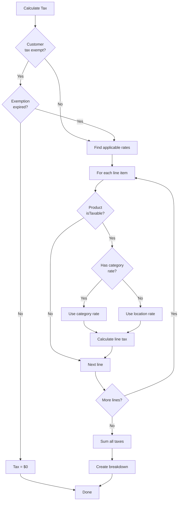

# Module 09: Tax Management

## Learning Objectives

By the end of this module, you will:
- Configure multi-jurisdiction tax rates
- Handle category-specific taxation
- Implement customer tax exemptions
- Calculate tax breakdowns on quotes

---

## Tax Complexity in CPQ

Tax calculation involves multiple factors:

| Factor | Complexity |
|--------|------------|
| **Location** | Different rates by country, state, city |
| **Product Type** | Some items tax-exempt (groceries, medicine) |
| **Customer Type** | Government, non-profit exemptions |
| **Service vs Goods** | Different rules in many jurisdictions |
| **Digital vs Physical** | Digital goods have special rules |

---

## Tax Rate Model

```prisma
model TaxRate {
  id         String    @id @default(cuid())
  name       String
  rate       Decimal   @db.Decimal(5, 4)  // e.g., 0.0825 for 8.25%
  country    String
  state      String?   // Optional for state/province
  categoryId String?   // Optional for category-specific rate
  validFrom  DateTime?
  validTo    DateTime?
  isActive   Boolean   @default(true)
  createdAt  DateTime  @default(now())
  updatedAt  DateTime  @updatedAt

  category Category?

  @@index([country, state])
  @@index([isActive])
}
```

### Key Fields

| Field | Purpose | Example |
|-------|---------|---------|
| `rate` | Tax rate as decimal | 0.0825 = 8.25% |
| `country` | ISO country code | "US", "GB", "DE" |
| `state` | State/province code | "CA", "NY", "TX" |
| `categoryId` | Category-specific rate | Software, Services |
| `validFrom/To` | Time-bounded rates | 2024 rates |

---

## Tax Calculation Flow



---

## Tax Rate Resolution

### Location-Based Lookup

```typescript
function findTaxRate(country: string, state?: string): TaxRate | null {
  // 1. Try exact match (country + state)
  let rate = taxRates.find(r =>
    r.country === country &&
    r.state === state &&
    r.isActive &&
    isWithinDates(r)
  );

  // 2. Fall back to country-only rate
  if (!rate) {
    rate = taxRates.find(r =>
      r.country === country &&
      !r.state &&
      r.isActive
    );
  }

  return rate;
}
```

### Category-Specific Rates

Some products have different tax treatment:

| Category | Tax Treatment | Example Rate |
|----------|---------------|--------------|
| General Merchandise | Standard | 8.25% |
| Groceries | Reduced/Exempt | 0% |
| Digital Services | Standard or Exempt | Varies |
| SaaS | Special rules | 0-8% |
| Professional Services | Often exempt | 0% |

```typescript
function getTaxRateForProduct(product: Product, location: Location): number {
  // Check for category-specific rate first
  if (product.categoryId) {
    const categoryRate = taxRates.find(r =>
      r.categoryId === product.categoryId &&
      r.country === location.country
    );
    if (categoryRate) return categoryRate.rate;
  }

  // Fall back to location rate
  const locationRate = findTaxRate(location.country, location.state);
  return locationRate?.rate ?? 0;
}
```

---

## Customer Tax Exemptions

From Module 05, customers can be tax exempt:

```prisma
model Customer {
  // ...
  isTaxExempt          Boolean   @default(false)
  taxExemptReason      String?
  taxExemptCertificate String?
  taxExemptExpiry      DateTime?
}
```

### Exemption Types

| Type | Certificate Required | Typical Expiry |
|------|---------------------|----------------|
| Government | No | Never |
| 501(c)(3) Non-Profit | Yes | 3 years |
| Resale Certificate | Yes | 1-4 years |
| Interstate Commerce | Yes | Per transaction |
| Diplomatic | Yes | Per posting |

### Exemption Validation

```typescript
function isExemptionValid(customer: Customer): boolean {
  if (!customer.isTaxExempt) return false;

  // Check expiration
  if (customer.taxExemptExpiry) {
    if (new Date() > customer.taxExemptExpiry) {
      return false;  // Expired
    }
  }

  return true;
}
```

---

## Tax Breakdown

Quotes store detailed tax information:

```prisma
model Quote {
  // ...
  taxAmount        Decimal     // Total tax
  taxBreakdown     Json?       // Detailed breakdown
}
```

### Breakdown Structure

```typescript
interface TaxBreakdownItem {
  name: string;       // "CA State Tax"
  rate: number;       // 0.0725
  amount: number;     // 145.00
  jurisdiction: string; // "California"
}

// Example breakdown
const taxBreakdown: TaxBreakdownItem[] = [
  { name: "CA State Tax", rate: 0.0725, amount: 145.00, jurisdiction: "California" },
  { name: "SF County Tax", rate: 0.0125, amount: 25.00, jurisdiction: "San Francisco" },
  { name: "SF City Tax", rate: 0.0125, amount: 25.00, jurisdiction: "San Francisco" }
];

// Total: $195.00 (9.75% combined)
```

---

## Exercise 1: Create Tax Rates

### Step 1: Navigate to Tax Rates

Go to `/tax-rates` in the PoC application.

### Step 2: Create US State Tax Rates

| Name | Country | State | Rate |
|------|---------|-------|------|
| California Sales Tax | US | CA | 7.25% |
| New York Sales Tax | US | NY | 8.00% |
| Texas Sales Tax | US | TX | 6.25% |
| Oregon (No Sales Tax) | US | OR | 0.00% |

### Step 3: Create International Rates

| Name | Country | Rate |
|------|---------|------|
| UK VAT | GB | 20.00% |
| German VAT | DE | 19.00% |
| Canada GST | CA | 5.00% |

---

## Exercise 2: Category-Specific Tax

### Step 1: Create Reduced Rate for Software

- **Name:** "Software - US Digital Goods"
- **Country:** US
- **State:** (blank - applies to all US)
- **Category:** Software (select your software category)
- **Rate:** 0.00% (many states exempt digital goods)

### Step 2: Test Category Rate

1. Create a quote for US customer
2. Add a software product
3. Add a hardware product
4. Observe: Software should have $0 tax

---

## Exercise 3: Tax-Exempt Customer

### Step 1: Create Tax-Exempt Customer

From Module 05, ensure you have:
- **Name:** "State University"
- **Tax Exempt:** Yes
- **Reason:** "Educational Institution"
- **Certificate:** "EDU-2024-12345"
- **Expiry:** December 31, 2025

### Step 2: Create Quote

1. Create quote for "State University"
2. Add taxable products
3. Observe: Tax amount = $0
4. Tax breakdown should show exemption

### Step 3: Test Expired Exemption

1. Edit customer, set expiry to past date
2. Create new quote
3. Observe: Normal tax calculated

---

## Exercise 4: Multi-Rate Calculation

### Step 1: Create Quote with CA Customer

1. Create customer with address in California
2. Create quote for this customer
3. Add products totaling $2,000

### Step 2: Verify Tax Calculation

```
Subtotal: $2,000.00
CA State Tax (7.25%): $145.00
Total: $2,145.00
```

### Step 3: Change to NY Customer

1. Edit customer address to New York
2. Recalculate quote
3. Observe: NY rate (8%) applied

```
Subtotal: $2,000.00
NY State Tax (8.00%): $160.00
Total: $2,160.00
```

---

## Real-World Tax Considerations

### Nexus Rules (US)

"Nexus" determines where you must collect tax:

| Nexus Type | Trigger |
|------------|---------|
| Physical Presence | Office, warehouse, employees |
| Economic Nexus | Sales volume threshold |
| Click-Through | Affiliate referrals |
| Marketplace | Selling on Amazon, etc. |

### International VAT

```
Value Added Tax (VAT) Rules:
├── B2C: Charge VAT at customer location rate
├── B2B (Same Country): Charge VAT
├── B2B (EU Cross-Border): Reverse charge (0%)
└── B2B (Non-EU): Export exempt (0%)
```

### Product Taxability Matrix

| Product Type | US | UK | DE |
|--------------|----|----|-----|
| Physical Goods | Taxable | 20% VAT | 19% VAT |
| SaaS | Varies by state | 20% VAT | 19% VAT |
| Professional Services | Often exempt | Varies | 19% VAT |
| Digital Downloads | Varies | 20% VAT | 19% VAT |

---

## Checkpoint Questions

1. **Why store tax rate as Decimal(5,4) instead of a simple percentage?**
   <details>
   <summary>Answer</summary>
   To maintain precision. 8.25% = 0.0825 with 4 decimal places handles rates like 8.875% (0.08875) without rounding errors.
   </details>

2. **How does category-specific tax rate override work?**
   <details>
   <summary>Answer</summary>
   If product's category has a specific tax rate, use it. Otherwise fall back to location-based rate. This allows different treatment for software vs hardware.
   </details>

3. **What should happen if a tax exemption has expired?**
   <details>
   <summary>Answer</summary>
   Calculate normal tax. The exemption is no longer valid even if isTaxExempt is still true.
   </details>

4. **Why store taxBreakdown as JSON instead of just taxAmount?**
   <details>
   <summary>Answer</summary>
   Transparency and compliance. Customers and auditors need to see which jurisdictions' taxes were charged and at what rates.
   </details>

5. **When would a product have isTaxable = false?**
   <details>
   <summary>Answer</summary>
   For inherently non-taxable items like gift cards, deposits, or certain financial products that should never have tax regardless of jurisdiction.
   </details>

---

## Key Takeaways

1. **Location determines base rate** - Country/state lookup with fallback
2. **Category can override** - Different rates for software, services, etc.
3. **Customer exemptions skip calculation** - Check validity and expiration
4. **Breakdown provides transparency** - Show each tax component
5. **Product taxability is a flag** - Some items never taxable

---

## Code References

| File | Content |
|------|---------|
| [prisma/schema.prisma](../../prisma/schema.prisma) | TaxRate model |
| [app/pages/tax-rates/](../../app/pages/tax-rates/) | Tax rate management UI |
| [app/composables/useTaxRates.ts](../../app/composables/useTaxRates.ts) | Tax rates composable |
| [server/services/taxEngine.ts](../../server/services/taxEngine.ts) | Tax calculation logic |

---

## Next Steps

Tax calculations often involve currency conversion for international transactions. The next module covers multi-currency support.

**Next:** [Module 10: Multi-Currency Support](10-multi-currency.md)
