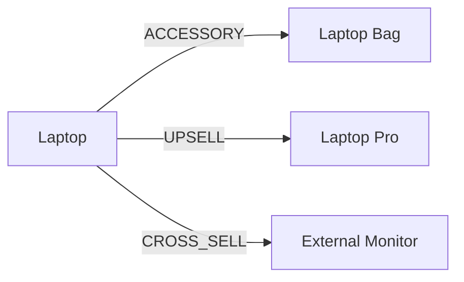
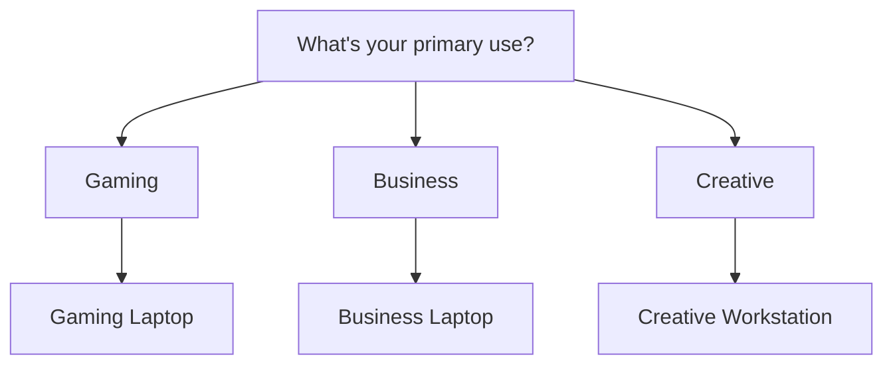

# Module 11: Guided Selling & Recommendations

## Learning Objectives

By the end of this module, you will:
- Design product affinity relationships
- Create needs-assessment questionnaires
- Implement recommendation scoring
- Track recommendation effectiveness

---

## What is Guided Selling?

Guided selling helps sales reps:
- Identify cross-sell and upsell opportunities
- Recommend compatible products
- Navigate complex product catalogs
- Understand customer needs through questions

---

## Two Recommendation Approaches

### 1. Affinity-Based (Rule-Driven)



Products are linked with relationship types.

### 2. Questionnaire-Based (Needs Discovery)



Questions map to product recommendations.

---

## Product Affinity Model

```prisma
model ProductAffinity {
  id                     String        @id @default(cuid())
  sourceProductId        String?
  targetProductId        String?
  sourceCategoryId       String?
  targetCategoryId       String?
  type                   AffinityType
  priority               Int           @default(100)
  conditions             Json?
  sourceBillingFrequency BillingFrequency?
  targetBillingFrequency BillingFrequency?
  isActive               Boolean       @default(true)
  createdAt              DateTime      @default(now())
  updatedAt              DateTime      @updatedAt

  @@index([sourceProductId])
  @@index([targetProductId])
  @@index([type])
}

enum AffinityType {
  CROSS_SELL          // Complementary product
  UPSELL              // Premium alternative
  ACCESSORY           // Add-on item
  REQUIRED            // Mandatory companion
  FREQUENTLY_BOUGHT   // Statistical correlation
  SUBSCRIPTION_ADDON  // Recurring add-on
}
```

### Affinity Types Explained

| Type | Relationship | Example |
|------|--------------|---------|
| `CROSS_SELL` | Complementary | Laptop → Monitor |
| `UPSELL` | Premium version | Basic Plan → Pro Plan |
| `ACCESSORY` | Add-on | Camera → Lens |
| `REQUIRED` | Mandatory | Software → License Key |
| `FREQUENTLY_BOUGHT` | Data-driven | "Customers also bought" |
| `SUBSCRIPTION_ADDON` | Recurring add-on | Platform → Support Plan |

### Product vs Category Affinities

**Product-to-Product:**
```json
{
  "sourceProductId": "prod_laptop",
  "targetProductId": "prod_bag",
  "type": "ACCESSORY"
}
```

**Category-to-Category:**
```json
{
  "sourceCategoryId": "cat_computers",
  "targetCategoryId": "cat_accessories",
  "type": "ACCESSORY"
}
```

Category affinities apply to ALL products in those categories.

---

## Questionnaire Model

```prisma
model Questionnaire {
  id          String   @id @default(cuid())
  name        String
  description String?
  isActive    Boolean  @default(true)
  createdAt   DateTime @default(now())
  updatedAt   DateTime @updatedAt

  questions Question[]
}

model Question {
  id              String       @id @default(cuid())
  questionnaireId String
  text            String
  type            QuestionType
  options         Json         // [{ label, value }]
  sortOrder       Int          @default(0)
  branchLogic     Json?        // { answerValue: nextQuestionId }
  createdAt       DateTime     @default(now())
  updatedAt       DateTime     @updatedAt

  questionnaire Questionnaire
  productMappings QuestionProductMapping[]
}

enum QuestionType {
  SINGLE_CHOICE    // Radio buttons
  MULTIPLE_CHOICE  // Checkboxes
  RANGE            // Slider
  YES_NO           // Boolean
}
```

### Branch Logic

Questions can conditionally lead to different follow-ups:

```json
{
  "branchLogic": {
    "gaming": "question_vr_support",
    "business": "question_security_needs",
    "creative": "question_color_accuracy"
  }
}
```

If user selects "gaming", jump to VR question; if "business", jump to security question.

---

## Question Product Mapping

Links answers to product recommendations:

```prisma
model QuestionProductMapping {
  id          String @id @default(cuid())
  questionId  String
  productId   String
  answerValue String     // Which answer triggers this
  score       Int @default(100)  // Relevance score

  question Question
  product  Product

  @@index([questionId])
  @@index([productId])
}
```

### Scoring System

Higher scores = more relevant:

```json
{
  "questionId": "q_usage",
  "answerValue": "gaming",
  "productId": "prod_gaming_laptop",
  "score": 100
}

{
  "questionId": "q_usage",
  "answerValue": "gaming",
  "productId": "prod_business_laptop",
  "score": 30
}
```

Gaming Laptop scores 100 for "gaming", Business Laptop scores 30.

---

## Recommendation Tracking

```prisma
model RecommendationLog {
  id        String               @id @default(cuid())
  quoteId   String
  productId String
  source    RecommendationSource
  action    RecommendationAction
  metadata  Json?
  createdAt DateTime             @default(now())

  @@index([quoteId])
  @@index([productId])
  @@index([createdAt])
}

enum RecommendationSource {
  RULE_BASED      // From affinity rules
  AI_GENERATED    // ML-based
  QUESTIONNAIRE   // From questionnaire
  MANUAL          // Sales rep added
}

enum RecommendationAction {
  SHOWN           // Displayed to user
  ACCEPTED        // Added to quote
  DISMISSED       // User declined
}
```

### Analytics Value

Tracking enables:
- Recommendation effectiveness analysis
- A/B testing different strategies
- Identifying high-performing affinities
- Training ML models

---

## Exercise 1: Create Product Affinities

### Step 1: Navigate to Affinities

Go to `/affinities` in the PoC application.

### Step 2: Create Cross-Sell Affinity

- **Source Product:** Laptop Pro Bundle
- **Target Product:** External Monitor
- **Type:** CROSS_SELL
- **Priority:** 50

### Step 3: Create Upsell Affinity

- **Source Product:** Basic Support
- **Target Product:** Premium Support
- **Type:** UPSELL
- **Priority:** 75

### Step 4: Create Accessory Affinity

- **Source Product:** Laptop Pro Bundle
- **Target Product:** Laptop Bag
- **Type:** ACCESSORY
- **Priority:** 100

---

## Exercise 2: Category-Level Affinity

### Step 1: Create Category Affinity

- **Source Category:** Computers
- **Target Category:** Accessories
- **Type:** ACCESSORY
- **Priority:** 150

### Step 2: Test in Quote

1. Create a quote
2. Add ANY computer product
3. Observe: ALL accessories are recommended

This single rule covers every computer-accessory pairing.

---

## Exercise 3: Create Questionnaire

### Step 1: Navigate to Questionnaires

Go to `/questionnaires` in the PoC application.

### Step 2: Create "Find Your Perfect Laptop"

- **Name:** "Find Your Perfect Laptop"
- **Description:** "Answer a few questions to find the right laptop"

### Step 3: Add Questions

**Question 1: Primary Use**
- **Text:** "What will you primarily use the laptop for?"
- **Type:** SINGLE_CHOICE
- **Options:**
  - { label: "Gaming", value: "gaming" }
  - { label: "Business/Office", value: "business" }
  - { label: "Creative Work", value: "creative" }
  - { label: "General Use", value: "general" }

**Question 2: Budget**
- **Text:** "What's your budget range?"
- **Type:** SINGLE_CHOICE
- **Options:**
  - { label: "Under $1,000", value: "budget" }
  - { label: "$1,000 - $2,000", value: "midrange" }
  - { label: "Over $2,000", value: "premium" }

**Question 3: Portability**
- **Text:** "How important is portability?"
- **Type:** SINGLE_CHOICE
- **Options:**
  - { label: "Very Important", value: "high" }
  - { label: "Somewhat Important", value: "medium" }
  - { label: "Not Important", value: "low" }

### Step 4: Add Product Mappings

Map answers to products with scores:

| Question | Answer | Product | Score |
|----------|--------|---------|-------|
| Primary Use | gaming | Gaming Laptop | 100 |
| Primary Use | gaming | Business Laptop | 20 |
| Primary Use | business | Business Laptop | 100 |
| Budget | premium | Laptop Pro Bundle | 100 |
| Portability | high | Ultrabook | 100 |

---

## Exercise 4: Test Recommendations

### Step 1: Create Quote

1. Create a new quote
2. Add "Laptop Pro Bundle"

### Step 2: View Recommendations

Look for recommendations panel showing:
- Cross-sell: External Monitor
- Accessory: Laptop Bag

### Step 3: Accept/Dismiss

1. Accept one recommendation (add to quote)
2. Dismiss another
3. Check that actions are logged

---

## Recommendation Logic

```typescript
async function getRecommendations(quoteLineItems: QuoteLineItem[]): Promise<Recommendation[]> {
  const recommendations: Recommendation[] = [];

  for (const lineItem of quoteLineItems) {
    // Get product-level affinities
    const productAffinities = await getAffinities({
      sourceProductId: lineItem.productId
    });

    // Get category-level affinities
    const product = await getProduct(lineItem.productId);
    const categoryAffinities = await getAffinities({
      sourceCategoryId: product.categoryId
    });

    // Merge and score
    const all = [...productAffinities, ...categoryAffinities];

    for (const affinity of all) {
      // Skip if product already in quote
      if (quoteLineItems.some(li => li.productId === affinity.targetProductId)) {
        continue;
      }

      recommendations.push({
        productId: affinity.targetProductId,
        type: affinity.type,
        priority: affinity.priority,
        source: 'RULE_BASED'
      });
    }
  }

  // Sort by priority (lower = higher priority)
  return recommendations.sort((a, b) => a.priority - b.priority);
}
```

---

## Real-World Patterns

### E-Commerce "Complete the Look"

```
Laptop (in cart)
├── Customers also bought:
│   ├── Laptop Bag (85% buy together)
│   ├── Mouse (72% buy together)
│   └── USB Hub (58% buy together)
└── Upgrade to:
    └── Laptop Pro (+$500, better specs)
```

### Sales Playbook Integration

```
When selling Enterprise License:
1. Ask: "Do you need training?"
   → Recommend: Training Package
2. Ask: "What's your SLA requirement?"
   → Recommend: Premium Support
3. Ask: "Multi-region deployment?"
   → Recommend: Global License Add-on
```

---

## Checkpoint Questions

1. **What's the difference between CROSS_SELL and UPSELL?**
   <details>
   <summary>Answer</summary>
   CROSS_SELL recommends complementary products (laptop → monitor). UPSELL recommends a premium version of what they're already buying (Basic → Pro).
   </details>

2. **Why use category-level affinities?**
   <details>
   <summary>Answer</summary>
   To avoid creating individual affinities for every product combination. One category affinity can cover hundreds of product pairs.
   </details>

3. **How does the scoring system work in questionnaires?**
   <details>
   <summary>Answer</summary>
   Each answer-to-product mapping has a score. Higher scores mean more relevant. Products are ranked by total score across all questions answered.
   </details>

4. **What's the purpose of RecommendationLog?**
   <details>
   <summary>Answer</summary>
   To track effectiveness of recommendations - which are shown, accepted, or dismissed. This data improves future recommendations.
   </details>

5. **How does branchLogic work in questionnaires?**
   <details>
   <summary>Answer</summary>
   Maps answer values to next question IDs, enabling conditional question flow. Different answers lead to different follow-up questions.
   </details>

---

## Key Takeaways

1. **Two recommendation approaches** - Affinity rules and questionnaires
2. **Six affinity types** - CROSS_SELL, UPSELL, ACCESSORY, REQUIRED, FREQUENTLY_BOUGHT, SUBSCRIPTION_ADDON
3. **Category affinities scale** - One rule covers many products
4. **Scoring ranks recommendations** - Higher scores = more relevant
5. **Tracking enables optimization** - Learn from accept/dismiss patterns

---

## Code References

| File | Content |
|------|---------|
| [prisma/schema.prisma](../../prisma/schema.prisma) | ProductAffinity, Questionnaire, Question models |
| [app/pages/affinities/](../../app/pages/affinities/) | Affinity management UI |
| [app/pages/questionnaires/](../../app/pages/questionnaires/) | Questionnaire builder |
| [app/composables/useAffinities.ts](../../app/composables/useAffinities.ts) | Affinities composable |
| [app/composables/useQuestionnaires.ts](../../app/composables/useQuestionnaires.ts) | Questionnaires composable |
| [server/services/recommendationEngine.ts](../../server/services/recommendationEngine.ts) | Recommendation logic |
| [server/services/guidedSellingEngine.ts](../../server/services/guidedSellingEngine.ts) | Guided selling logic |

---

## Next Steps

You now understand the full CPQ data model. The final module covers architecture and integration patterns for connecting CPQ to your existing systems.

**Next:** [Module 12: Architecture & Integration Patterns](12-architecture.md)
