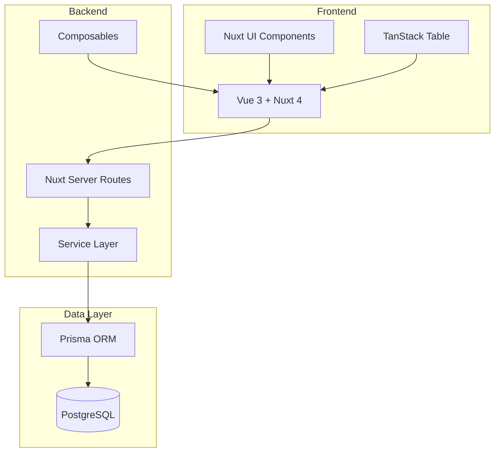
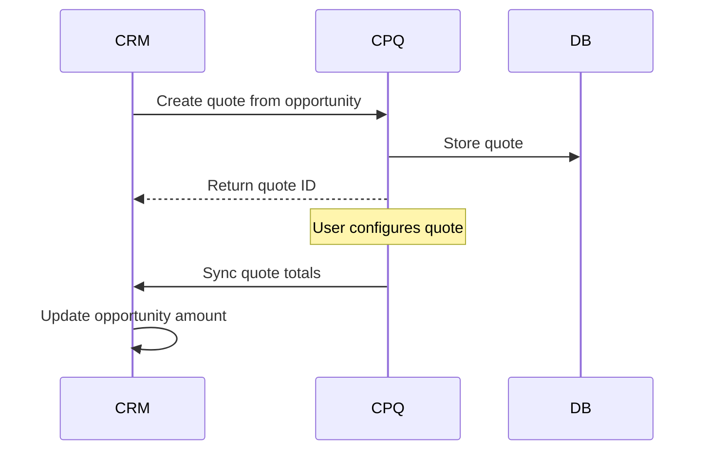
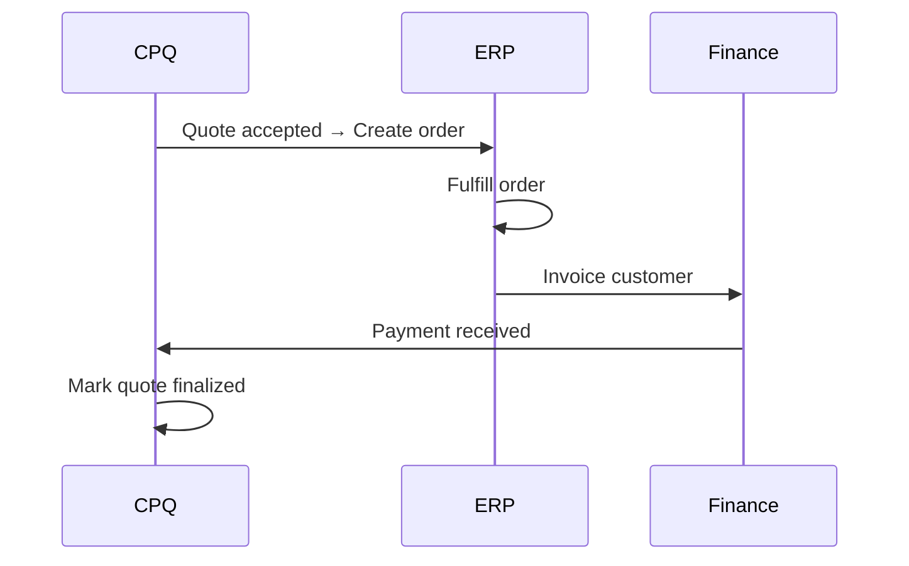
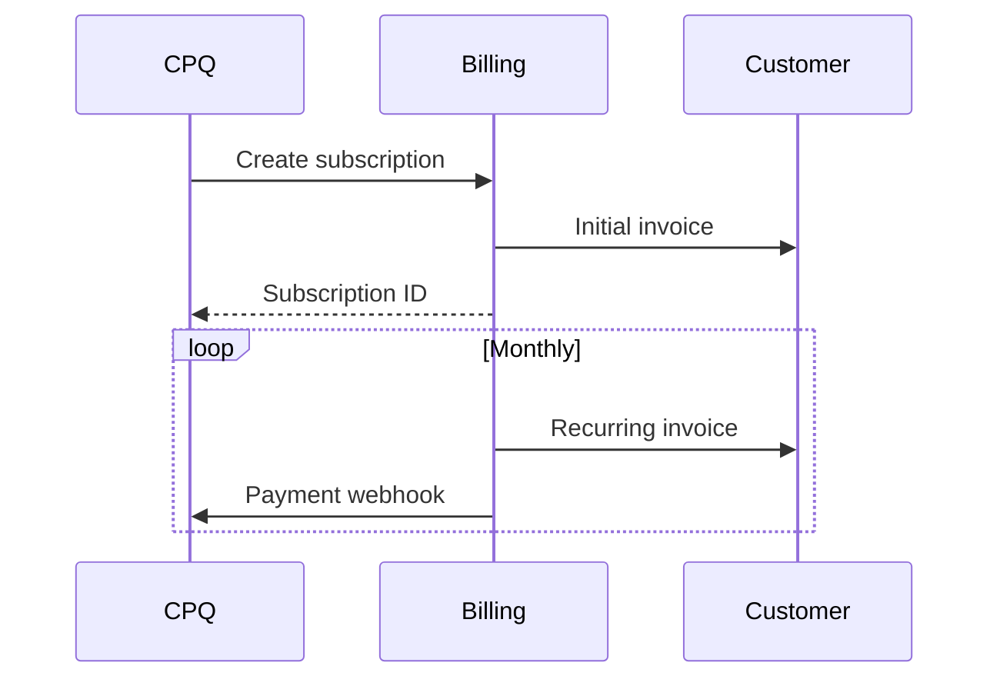
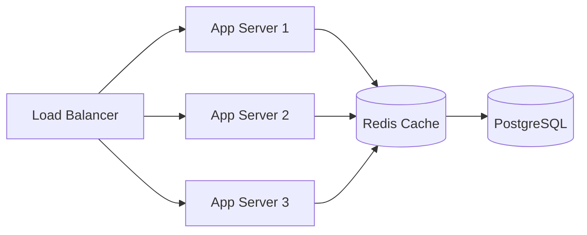

# Module 12: Architecture & Integration Patterns

## Learning Objectives

By the end of this module, you will:
- Understand the PoC's architectural patterns
- Design integrations with external systems
- Plan multi-tenancy approaches
- Evaluate patterns for production CPQ

---

## PoC Architecture Overview



---

## Data Model Summary

The PoC implements **31 models** organized into domains:

```
Product Domain
├── Product, ProductFeature, ProductOption
├── Category, ProductCategory
├── Attribute, AttributeGroup, ProductAttribute
└── UnitOfMeasure

Pricing Domain
├── PriceBook, PriceBookEntry, PriceTier
├── Currency, ExchangeRate
├── Discount, DiscountTier
└── TaxRate

Customer Domain
├── Customer
├── Contract, ContractPriceEntry
└── (Tax exemption fields)

Quote Domain
├── Quote, QuoteLineItem
├── AppliedDiscount
└── QuoteLayout

Rules Domain
└── Rule (condition/action JSON)

Guided Selling Domain
├── ProductAffinity
├── Questionnaire, Question
├── QuestionProductMapping
└── RecommendationLog
```

---

## Quote Layout System

For customizable quote presentation:

```prisma
model QuoteLayout {
  id            String  @id @default(cuid())
  entityId      String  @default("default")  // Multi-tenancy
  name          String
  description   String?
  isTemplate    Boolean @default(false)
  sections      Json    // QuoteLayoutSection[]
  summaryConfig Json    // SummaryConfig
  theme         Json    // QuoteTheme
  createdAt     DateTime @default(now())
  updatedAt     DateTime @updatedAt

  @@index([entityId])
  @@index([isTemplate])
}
```

### Section Structure

```typescript
interface QuoteLayoutSection {
  id: string;
  name: string;
  description?: string;
  columns: LayoutColumn[];
  filter?: SectionFilter;
  showSubtotal: boolean;
  sortOrder: number;
}

interface LayoutColumn {
  field: 'productName' | 'sku' | 'quantity' | 'unitPrice' | 'discount' | 'netPrice';
  label?: string;
  width?: string;
  align?: 'left' | 'center' | 'right';
}
```

---

## Multi-Tenancy Approach

### Entity-Based Isolation

```typescript
// Every query filters by entityId
const quotes = await prisma.quote.findMany({
  where: {
    entityId: currentTenant.id,
    // ... other filters
  }
});
```

### Data Isolation Strategies

| Strategy | Pros | Cons |
|----------|------|------|
| **Row-Level** | Simple, single DB | Query complexity |
| **Schema-Level** | Better isolation | Migration complexity |
| **Database-Level** | Full isolation | Infrastructure cost |

The PoC uses **row-level** with `entityId` fields.

---

## Integration Patterns

### 1. CRM Integration (Salesforce, HubSpot)



**Data Sync:**
- Customer records (bidirectional)
- Quote status (CPQ → CRM)
- Opportunity amount (CPQ → CRM)

### 2. ERP Integration (NetSuite, SAP)



**Data Sync:**
- Product catalog (ERP → CPQ)
- Pricing updates (ERP → CPQ)
- Orders (CPQ → ERP)

### 3. Billing Integration (Stripe, Chargebee)



**Data Sync:**
- Subscription creation (CPQ → Billing)
- Payment status (Billing → CPQ)
- Usage data (Billing → CPQ)

---

## API Design Patterns

### RESTful Endpoints

```
Products:
  GET    /api/products           List products
  GET    /api/products/:id       Get product
  POST   /api/products           Create product
  PUT    /api/products/:id       Update product
  DELETE /api/products/:id       Delete product

Quotes:
  GET    /api/quotes             List quotes
  GET    /api/quotes/:id         Get quote with lines
  POST   /api/quotes             Create quote
  PUT    /api/quotes/:id         Update quote
  POST   /api/quotes/:id/lines   Add line item
  POST   /api/quotes/:id/submit  Submit for approval
  POST   /api/quotes/:id/approve Approve quote
```

### Webhook Events

```typescript
enum WebhookEvent {
  QUOTE_CREATED = 'quote.created',
  QUOTE_SUBMITTED = 'quote.submitted',
  QUOTE_APPROVED = 'quote.approved',
  QUOTE_ACCEPTED = 'quote.accepted',
  QUOTE_FINALIZED = 'quote.finalized',
  PRODUCT_UPDATED = 'product.updated',
  PRICE_UPDATED = 'pricebook.entry.updated'
}

interface WebhookPayload {
  event: WebhookEvent;
  timestamp: string;
  data: {
    id: string;
    type: string;
    attributes: Record<string, any>;
  };
}
```

---

## Exercise 1: Design Integration Architecture

### Step 1: Map Your Systems

List your existing systems:
- CRM: ________________
- ERP: ________________
- Billing: ________________
- Other: ________________

### Step 2: Define Data Flows

For each system, identify:
1. What data CPQ needs FROM this system
2. What data CPQ sends TO this system
3. Sync frequency (real-time, batch, on-demand)

### Step 3: Document Integration Points

Create a table:

| System | Direction | Data | Trigger |
|--------|-----------|------|---------|
| CRM | CPQ → CRM | Quote totals | Quote save |
| CRM | CRM → CPQ | Customer data | Customer update |
| ERP | CPQ → ERP | Accepted quote | Quote accepted |

---

## Exercise 2: Quote Layout Customization

### Step 1: Navigate to Quote Layouts

Go to `/quote-layouts` in the PoC application.

### Step 2: Create Custom Template

Create a professional quote template:
- **Name:** "Professional Services"
- **Is Template:** Yes

### Step 3: Define Sections

Add sections:
1. **Professional Services** - Filter: billingFrequency = ONE_TIME
2. **Monthly Subscriptions** - Filter: billingFrequency = MONTHLY
3. **Annual Licenses** - Filter: billingFrequency = ANNUAL

### Step 4: Configure Columns

For each section:
- Product Name (left, 40%)
- Quantity (center, 15%)
- Unit Price (right, 15%)
- Discount (right, 15%)
- Net Price (right, 15%)

---

## Exercise 3: Design Webhook Integration

### Step 1: Define Events

List events your external systems need:
- [ ] Quote created
- [ ] Quote submitted
- [ ] Quote approved
- [ ] Quote accepted
- [ ] Other: ________________

### Step 2: Design Payload

For "Quote Accepted":

```json
{
  "event": "quote.accepted",
  "timestamp": "2024-06-15T14:30:00Z",
  "data": {
    "id": "quote_xyz",
    "type": "quote",
    "attributes": {
      "name": "Q-2024-00123",
      "customerId": "cust_abc",
      "total": 15000.00,
      "currency": "USD",
      "lineItems": [
        {
          "productId": "prod_123",
          "productSku": "ENT-LICENSE",
          "quantity": 10,
          "netPrice": 10000.00
        }
      ]
    }
  }
}
```

### Step 3: Define Retry Policy

```typescript
const retryPolicy = {
  maxAttempts: 5,
  initialDelay: 1000,  // 1 second
  maxDelay: 60000,     // 1 minute
  backoffMultiplier: 2
};
```

---

## Production Considerations

### Performance

| Area | Recommendation |
|------|----------------|
| Pricing | Cache price book lookups |
| Rules | Evaluate in priority order, stop early |
| Search | Index product SKU, name |
| Reports | Pre-aggregate base amounts |

### Security

| Area | Implementation |
|------|----------------|
| Authentication | JWT tokens, API keys |
| Authorization | Role-based access control |
| Data | Row-level security (entityId) |
| Audit | Log all modifications |

### Scalability



---

## Migration Path: PoC to Production

### Phase 1: Foundation
- [ ] Add authentication/authorization
- [ ] Implement audit logging
- [ ] Add data validation
- [ ] Set up monitoring

### Phase 2: Integration
- [ ] Build CRM connector
- [ ] Build ERP connector
- [ ] Implement webhooks
- [ ] Add API versioning

### Phase 3: Scale
- [ ] Add caching layer
- [ ] Implement background jobs
- [ ] Set up read replicas
- [ ] Add rate limiting

### Phase 4: Enterprise
- [ ] Multi-tenancy hardening
- [ ] Advanced approval workflows
- [ ] Document generation (PDF)
- [ ] E-signature integration

---

## Checkpoint Questions

1. **What does entityId enable in the data model?**
   <details>
   <summary>Answer</summary>
   Multi-tenancy through row-level isolation. Each tenant's data is segregated by entityId, allowing multiple organizations to share the same database.
   </details>

2. **Why use webhooks instead of polling?**
   <details>
   <summary>Answer</summary>
   Real-time notifications without constant API calls. External systems are notified immediately when events occur, reducing latency and server load.
   </details>

3. **What's the benefit of quote layout templates?**
   <details>
   <summary>Answer</summary>
   Reusable presentation formats. Create a template once, use for multiple quotes. Ensures consistent branding and formatting across proposals.
   </details>

4. **How would you handle CRM sync conflicts?**
   <details>
   <summary>Answer</summary>
   Define a source of truth for each data type. Use timestamps to determine newer data. Log conflicts for manual review. Consider last-write-wins or merge strategies.
   </details>

5. **What should the first production integration be?**
   <details>
   <summary>Answer</summary>
   Typically CRM, as it's the source of customer and opportunity data. Quote creation often starts from CRM context.
   </details>

---

## Key Takeaways

1. **31 models cover full CPQ scope** - Products, pricing, quotes, rules, guided selling
2. **entityId enables multi-tenancy** - Row-level data isolation
3. **Quote layouts provide flexibility** - Customizable presentation without code
4. **Integration follows standard patterns** - REST APIs, webhooks, batch sync
5. **Production requires additional layers** - Auth, caching, monitoring, auditing

---

## Code References

| File | Content |
|------|---------|
| [prisma/schema.prisma](../../prisma/schema.prisma) | Complete data model |
| [app/composables/](../../app/composables/) | Business logic composables |
| [server/api/](../../server/api/) | API endpoints |
| [server/services/](../../server/services/) | Backend services |
| [app/pages/quote-layouts/](../../app/pages/quote-layouts/) | Quote layout management |

---

## Next Steps

Congratulations on completing the CPQ course modules! The final step is the Capstone Project, where you'll apply everything you've learned.

**Next:** [Capstone Project](13-capstone.md)
